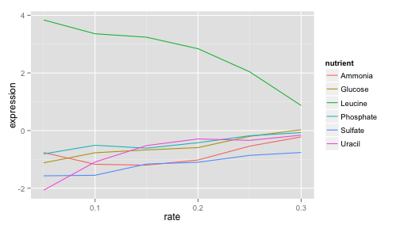

## Case study: gene expression in starvation

Through the process of gene regulation, a cell can control which genes are transcribed from DNA to RNA- what we call being "expressed". (If a gene is never turned into RNA, it may as well not be there at all). This provides a sort of "cellular switchboard" that can activate some systems and deactivate others, which can speed up or slow down growth, switch what nutrients are transported into or out of the cell, and respond to other stimuli. A gene expression microarray lets us measure how much of each gene is expressed in a particular condition. We can use this to figure out the function of a specific gene (based on when it turns on and off), or to get an overall picture of the cell's activity.

Brauer (2008) used microarrays to test the effect of starvation and growth rate on baker’s yeast (S. cerevisiae, a popular model organism for studying molecular genomics because of its simplicity). Basically, if you give yeast plenty of nutrients (a rich media), except that you sharply restrict its supply of one nutrient, you can control the growth rate to whatever level you desire (we do this with a tool called a chemostat). For example, you could limit the yeast's supply of glucose (sugar, which the cell metabolizes to get energy and carbon), of leucine (an essential amino acid), or of ammonium (a source of nitrogen).

"Starving" the yeast of these nutrients lets us find genes that:

- **Raise or lower their activity in response to growth rate.** Growth-rate dependent expression patterns can tell us a lot about cell cycle control, and how the cell responds to stress.
- **Respond differently when different nutrients are being limited.** These genes may be involved in the transport or metabolism of those nutrients.

### Featured R packages


```r
install.packages(c("readr", "tidyr", "dplyr"))
```

### Get the data and tidy it

The data, tidying code and examples are borrowed from [here](http://varianceexplained.org/r/tidy-genomics/) and [here](http://varianceexplained.org/r/tidy-genomics-broom/).


```r
require(readr)
original_data = read_delim("http://www.maths.usyd.edu.au/u/gartht/Brauer2008_DataSet1.tds", 
    delim = "\t")
## View(original_data)  # opens a spreadsheet view in RStudio
dim(original_data)
```

```
## [1] 5537   40
```

Fix the name column by splitting on `||`, remove white space and drop unecessary variables.  We also want to ensure that we have [tidy data](http://vita.had.co.nz/papers/tidy-data.pdf) -- each variable should be one column - the column headers are values not variable names.


```r
require(dplyr)
require(tidyr)

nutrient_names <- c(G = "Glucose", L = "Leucine", P = "Phosphate",
               S = "Sulfate", N = "Ammonia", U = "Uracil")


cleaned_data = original_data %>%
  separate(NAME, 
           c("name", "BP", "MF", "systematic_name", "number"), 
           sep = "\\|\\|") %>%
  mutate_each(funs(trimws), name:systematic_name) %>%
  select(-number, -GID, -YORF, -GWEIGHT)  %>%
  gather(sample, expression, G0.05:U0.3) %>%
  separate(sample, c("nutrient", "rate"), sep = 1, convert = TRUE) %>%
  mutate(nutrient = plyr::revalue(nutrient, nutrient_names)) %>%
  filter(!is.na(expression), systematic_name != "")
names(cleaned_data)
```

```
## [1] "name"            "BP"              "MF"              "systematic_name"
## [5] "nutrient"        "rate"            "expression"
```

The above code chunk is doing a lot of processing very sucinctly using the pipe operator (see the [`magrittr`](https://cran.r-project.org/web/packages/magrittr/vignettes/magrittr.html) package for details).  The `gather()` function **melts** the data - instead of one row per gene, we now have one row per gene per `sample`.  We've **gathered** 36 columns together into two variables (`expression` and `sample`) then **separated** `sample` out into two variables (`nutrient` and `rate`).  Note that `sample` never appears in the final output... the wonders of the pipe (`%>%`) operator.

### Visualise the data

Below is a classical approach using `ggplot2`.

Look at one gene **LEU1**:


```r
library(ggplot2)
cleaned_data %>%
  filter(name == "LEU1") %>%
  ggplot(aes(rate, expression, color = nutrient)) +
  geom_line()
```

 

**LEU1**'s expression is far higher (more “turned on”) when the cell is being starved of leucine than in any other condition, because in that case the cell has to synthesize its own leucine. And as the amount of leucine in the environment (the growth rate) increases, the cell can focus less on leucine production, and the expression of those genes go down. We’ve just gotten one snapshot of our gene’s regulatory network, and how it responds to external stimuli.

To look at all the genes in the **leucine biosynthesis** process subset using the `BP` variable, to filter for all genes in that process, and then facet to create sub-plots for each.


```r
cleaned_data %>%
  filter(BP == "leucine biosynthesis") %>%
  ggplot(aes(rate, expression, color = nutrient)) +
  geom_line() +
  facet_wrap(~name)
```

 

**LEU1**, **LEU2**, and **LEU4** all show a similar pattern, where starvation of leucine causes higher gene expression. **LEU4** also appears to respond to glucose starvation as well. 

We can do some basic model fitting, adding lines of best fit using  `geom_smooth(method = "lm", se = FALSE)`:


```r
cleaned_data %>%
  filter(BP == "leucine biosynthesis") %>%
  ggplot(aes(rate, expression, color = nutrient)) +
  geom_point() +
  geom_smooth(method = "lm", se = FALSE) +
  facet_wrap(~name)
```

 

This is great, but there are so many different genes and processes - how can we look at them all?  How do you deal with collaborators who are constantly harassing you asking for plots of different genes?  Shiny is the answer!

## Instructions

- Create a new shiny app in RStudio by going File > New Project > New Directory > Shiny Web Application > Give your project a name and hit create (open in a new window might be a good idea too).
- Create a new file in the shiny app directory called `global.R`
- Paste the following data processing code into `global.R`


```r
### Data preparation
require(readr)
require(dplyr)
require(tidyr)
require(ggplot2)
original_data = read_delim("http://www.maths.usyd.edu.au/u/gartht/Brauer2008_DataSet1.tds", delim = "\t")
nutrient_names <- c(G = "Glucose", L = "Leucine", P = "Phosphate",
               S = "Sulfate", N = "Ammonia", U = "Uracil")
cleaned_data = original_data %>%
  separate(NAME, 
           c("name", "BP", "MF", "systematic_name", "number"), 
           sep = "\\|\\|") %>%
  mutate_each(funs(trimws), name:systematic_name) %>%
  select(-number, -GID, -YORF, -GWEIGHT)  %>%
  gather(sample, expression, G0.05:U0.3) %>%
  separate(sample, c("nutrient", "rate"), sep = 1, convert = TRUE) %>%
  mutate(nutrient = plyr::revalue(nutrient, nutrient_names)) %>%
  filter(!is.na(expression), systematic_name != "")
```
- Whatever's in `global.R` will be read and executed before the shiny app loads.  If you want you can download the data set and include it in the same folder as `ui.R`, `server.R` and `global.R` then simplify the `read_delim()` function to refer to just `Brauer2008_DataSet1.tds` (without loading it over the internet every time).
- Run the app to make sure it's working in this basic form.
- Replace the default plot with the first plot we generated above showing results for the **LEU1** gene. Make sure this is working by running the app before proceeding any further.

- You want this in the `server.R` file


```r
output$plot1 = renderPlot({
  cleaned_data %>%
    filter(name == "LEU1") %>%
    ggplot(aes(rate, expression, color = nutrient)) +
    geom_line() + theme_bw(base_size = 14) + 
    facet_wrap(~name + systematic_name)
})
```

- And this in the mainPanel part of the `ui.R` function:


```r
plotOutput("plot1")
```

- We want to be able to explore different genes instead of just having the **LEU1** gene plotted.  To do this we need a drop down menu and then we need to feed the results of that drop down menu into the plot.  Add this code chunk to the sidebarPanel section in the `ui.R` file:


```r
selectizeInput(inputId = "gene",
               label = "Select gene",
               choices = sort(unique(cleaned_data$name)),
               selected = "LEU1",
               multiple = FALSE)
```
- Run to app again to see if it works.  You should get a menu showing up on the left hand side listing all the genes.  This is what the `selectizeInput` function does - it takes a bunch of `choices` and offers them to the user as a dropdown list if `multiple=FALSE` (or a bit fancier where you can select multiple values `multiple=TRUE`).
- Now we need to link the selected gene to the plot.  The selected gene will be accessible though `input$gene`.  To explain this, `input` is common to all shiny pachages, it is a named list that contains all the inputs that you define in shiny.  We specified the name `gene` using the `inputId` argument to the `selectizeInput` function.  In the `server.R` function update the plot function to the following:


```r
output$plot1 = renderPlot({
  filter(is.element(name, input$gene)) %>%
    ggplot(aes(rate, expression, color = nutrient)) +
    geom_line() + theme_bw(base_size = 14) + 
    facet_wrap(~name + systematic_name)
})
```

- What if we wanted to plot multiple genes?  Try changing `multiple=TRUE` in the selectize input and seeing what happens.  It probably won't work when multiple genes are selected.  We need to update out filtering in the `server.R` function to account for multiple gene options.  Something like `filter(is.element(name, input$gene))` should do the trick.

- What if we wanted to have the option of a line of best fit?  Add in a checkbox to the sidebarPanel so that your sidebarPanel function should now look like this:


```r
sidebarPanel(
  selectizeInput(inputId = "gene",
                 label = "Select gene(s)",
                 choices = sort(unique(cleaned_data$name)),
                 selected = "LEU1",
                 multiple = TRUE),
  checkboxInput(inputId = "line",
                label = "Add line of best fit?",
                value = FALSE)
)
```

- Think about how to incorporate this logical input into the `server.R` code.  When the checkbox is ticked `input$line` will return a value of `TRUE`.  When unticked, `input$line` returns a value of `FALSE`.  It makes sense to use an `if` statement to get two different behaviours.  In the `server.R` adapt your code to something like:


```r
output$plot1 = renderPlot({
  if(input$line){
    cleaned_data %>%
      filter(is.element(name, input$gene)) %>%
      ggplot(aes(rate, expression, color = nutrient)) +
      geom_point() + theme_bw(base_size = 14) + 
      geom_smooth(method = "lm", se = FALSE)  + 
      facet_wrap(~name)
  } else {
    cleaned_data %>%
      filter(is.element(name, input$gene)) %>%
      ggplot(aes(rate, expression, color = nutrient)) +
      geom_line() + theme_bw(base_size = 14) + 
      facet_wrap(~name + systematic_name)
  }
})
```

- OK so at this point, you should be able to plot multiple genes and toggle between the ploting just the raw data and fitting simple linear regression lines (with the raw observations in the background).
- What if we wanted to be able to select all the genes related to a particular biological process?  We'll need a new dropdown menu and a new plot. Do this by adapting the above code.  Optionally you can include it in a new tab using `tabsetPanel` in the `ui.R` file - you can see how this is done in the solutions, but this is probably more advanced than we really need for now.
- Once you're happy with your app, head over to [shinyapps.io](http://www.shinyapps.io/), create an account and follow the instructions to push your app to the web so you can share the link and show off your fine work to all your collaborators!


### Suggested solution

See [here](https://github.com/garthtarr/visR/tree/gh-pages/labs/01/myapp) for suggested solutions - though there's many ways to accomplish the same thing, so yours might not be exactly the same. Try not to cheat, unless you really have to.

## References

- Robinson D (2015). "Cleaning and visualizing genomic data: a case study in tidy analysis", blog post. http://varianceexplained.org/r/tidy-genomics/
- Brauer et al. (2008). Coordination of Growth Rate, Cell Cycle, Stress Response, and Metabolic Activity in Yeast,
