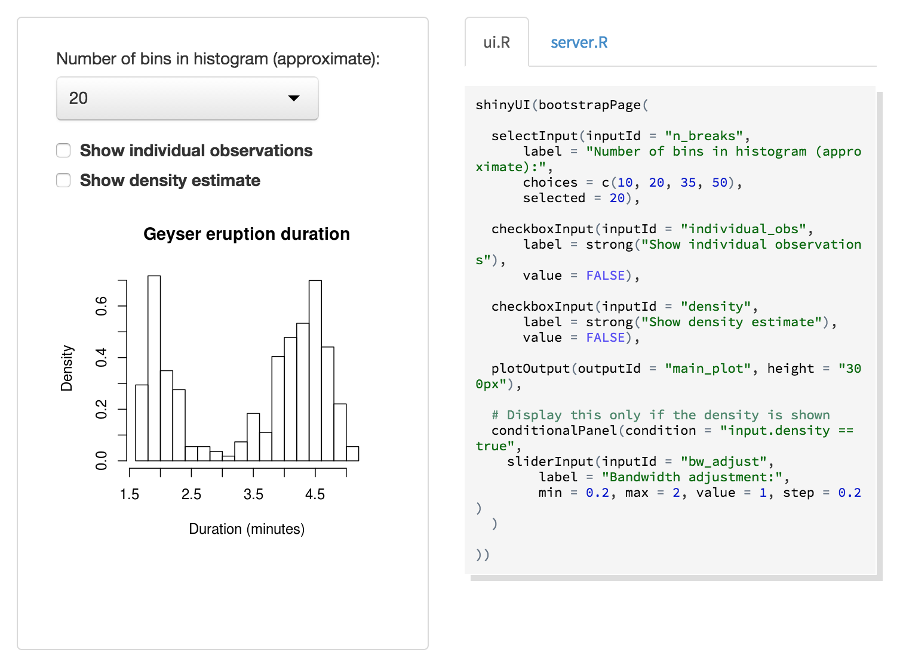
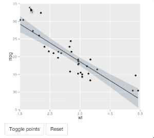
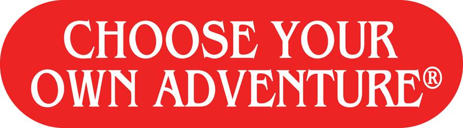

```{r Lec1, echo=FALSE, warning=FALSE, message=FALSE, cache=FALSE}
#library(knitcitations)
#cleanbib()
#newbib()
#bib <- read.bibtex('../../assets/msR.bib')
opts_chunk$set(tidy = TRUE, cache = FALSE) 
require(knitr)
```


## Outline

<br> 

- Importance of visualising data
- Interactive graphics in R
    - `googleVis`
    - `htmlwidgets`
    - `ggvis`
- Shiny
- Your turn

---

## Motivation – Recall Anscombe's quartet

```{r anscombe, results="asis", echo=FALSE, fig.height=8, fig.width=10, fig.align='center'}
require(stats); require(graphics)
##-- now some "magic" to do the 4 regressions in a loop:
ff <- y ~ x
mods <- setNames(as.list(1:4), paste0("lm", 1:4))
for(i in 1:4) {
  ff[2:3] <- lapply(paste0(c("y","x"), i), as.name)
  mods[[i]] <- lmi <- lm(ff, data = anscombe)
}
## Scatterplots
op1 <- par(mfrow = c(2, 2), mar = 0.1+c(4,4,0.1,0.1), 
           oma =  c(0, 0, 0, 0), cex = 1.5, bg = "transparent")
for(i in 1:4) {
  ff[2:3] <- lapply(paste0(c("y","x"), i), as.name)
  plot(ff, data = anscombe, col = "red", pch = 21, bg = "orange", cex = 1.2,
       xlim = c(3, 19), ylim = c(3, 13))
  abline(mods[[i]], col = "blue")
}
par(op1)
```

---

## An interactive future

It may not be long before presentations with static plots are as old fashioned as whipping out your overhead transparencies.


---

<iframe width="560" height="315" src="https://www.youtube.com/embed/aXV-yaFmQNk" frameborder="0" allowfullscreen></iframe>

--- 

## Gratuitous kittens

 

--- .segue

# We are living in the future

--- .segue

# We are living in the future

<div align="right"><font color="white" size=6>Why are our plots living in the past?</font></div>

--- .segue

# googleVis

---

## Overview of googleVis

```{r, eval=FALSE}
install.packages("googleVis")
require(googleVis)
demo(WorldBank, package="googleVis")
```

<br>

- [Markus Gesmann](http://www.magesblog.com/) created the [`googleVis`](https://github.com/mages/googleVis) package which accesses  the [Google Chart API](https://developers.google.com/chart/)  directly from R

- The functions of the package allow users to visualise data with the Google Chart Tools **without uploading their data to Google**

- The output of googleVis functions is **html code** that contains the data and references to JavaScript functions hosted by Google

<br>

Using the Google Visualisation API with R, 
  [The R Journal, 3(2):40-44, December 2011](http://journal.r-project.org/archive/2011-2/RJournal_2011-2_Gesmann+de~Castillo.pdf) and googleVis [package vignette](http://cran.r-project.org/web/packages/googleVis/vignettes/googleVis.pdf)

---

<a href="https://developers.google.com/chart">developers.google.com/chart <i class="fa fa-link"></i></a> 


---

## Key googleVis functions


| Function | Description |
| -------- | ----------- |
| `gvisAnnotatedTimeLine`	| Annotated Time Line  | 
| `gvisAnnotationChart`	| Annotation Chart  | 
| `gvisAreaChart`	 |  Area Chart  | 
| `gvisBarChart`	 |  Bar Chart  | 
| `gvisBubbleChart`	 |  Bubble Chart  | 
| `gvisCalendar`	 |  Calendar Chart  | 
| `gvisCandlestickChart`	 |  Candlestick chart  | 
| `gvisColumnChart`	 |  Column Chart  | 
| `gvisComboChart`	 |  Combo Chart  | 
| `gvisGauge`	 |  Gauge  | 
| `gvisGeoChart`	 |  Geo Chart  | 
| `gvisGeoMap`	 |  Geo Map  | 
| `gvisHistogram`	 |  Histogram Chart  | 
| `gvisIntensityMap`	 |  Intensity Map  | 
| `gvisLineChart`	 |  Line Chart  | 
| `gvisMap`	 |  Maps  | 
| `gvisMotionChart`	 |  Motion Chart  | 
| `gvisOrgChart`	 |  Org Chart  | 
| `gvisPieChart`	 |  Pie Chart  | 
| `gvisSankey`	 |  Sankey Chart  | 
| `gvisScatterChart`	 |  Scatter Chart  | 
| `gvisSteppedAreaChart`	 |  Stepped Area Chart  | 
| `gvisTable`	 |  Table Chart  | 
| `gvisTimeline`	 |  Timeline Chart  | 
| `gvisTreeMap`	 |  Tree Map |

--- 

## An application of googleVis: the mplot package

### Get it on GitHub <i class="fa fa-github"></i>

```{r eval=FALSE}
install.packages("devtools")
devtools::install_github("garthtarr/mplot")
require(mplot)
```

### ... or get it on CRAN

```{r eval=FALSE}
install.packages("mplot")
```

### Main functions

- `vis()` for **variable inclusion** and **model stability** plots
- `af()` for the **adaptive fence**
- `bglmnet()` for **bootstrapping glmnet**
- `mplot()` for an interactive **Shiny interface**

Tarr G, Mueller S and Welsh AH (2015). “mplot: An R package for graphical model stability and variable selection.” <a href="http://arxiv.org/abs/1509.07583">arXiv:1509.07583 [stat.ME]</a>.

---

### Examples from the `mplot` package

```{r,eval=FALSE,tidy=TRUE}
require(mplot)
lm.d = lm(y ~ ., data = diabetes)
vis.d = vis(lm.d, B = 200)
plot(vis.d, which="vip")
```
```{r,cache=FALSE,results='asis',echo=FALSE}
load("Hobart.RData")
plot(vis.d.with.RV,which="vip", width=800,tag="chart",
     height=450,fontSize=20,left=130,chartWidth="65%")
```

--- 

### Examples from the `mplot` package

```{r,eval=FALSE,tidy=TRUE}
plot(vis.d, which = "boot", highlight = "ltg")
```
```{r,cache=FALSE,results='asis',echo=FALSE}
plot(vis.d.no.RV,which="boot",highlight="ltg", width=800, tag = "chart", height=500,fontSize=20,left=130,chartWidth="60%")
```

--- 

### Examples from the `mplot` package

```{r,eval=FALSE,tidy=TRUE,echo=TRUE}
af.d = af(lm.d, B = 200, n.c = 100, c.max = 100)
plot(af.d)
```
```{r,cache=FALSE,results='asis',echo=FALSE}
plot(af.d, width=850, tag = "chart", height=500, fontSize=20, left=50, chartWidth="55%")
```

--- 

## Limitations of googleVis

<br>

- Requires **internet access** to work 
- some charts require **Flash**
- not very customisable

--- .segue

# HTML widgets

--- 

## JavaScript meets R

<q>
[`htmlwidgets`](http://www.htmlwidgets.org/) is a package that lets you _relatively_ easily link R with JavaScript.
</q>

Some examples:

- [`networkD3`](http://christophergandrud.github.io/networkD3/): force directed networks, Sankey diagrams, and Reingold-Tilford tree networks
- [`edgebundleR`](https://github.com/garthtarr/edgebundleR): hierarchical edge bundle plots
- [`pairsD3`](https://github.com/garthtarr/pairsD3): interactive scatter plot matrices
- [`dygraphs`](https://rstudio.github.io/dygraphs/): charting time-series data
- [`leaflet`](https://rstudio.github.io/leaflet/): dynamic maps
- [`DT`](https://rstudio.github.io/DT/): interactive HTML data tables
- [`rpivotTable`](https://github.com/smartinsightsfromdata/rpivotTable): build pivot tables to dynamically slice, dice and plot your data

---

<a href="http://hafen.github.io/htmlwidgetsgallery/">hafen.github.io/htmlwidgetsgallery <i class="fa fa-link"></i></a> 


--- 

## What's so great about htmlwidgets?

<br>

- most will work without internet access
- customisable (sort of)
- active community
    - some packages are backed by RStudio
    - Kent Russel ([<i class="fa fa-twitter"></i> @timelyportfolio](https://twitter.com/timelyportfolio)) has made one widget [each week this year](http://www.buildingwidgets.com/)
- if you're keen you can make your own... it's _relatively_ easy to adapt any of the multitude of [D3 examples](https://github.com/mbostock/d3/wiki/Gallery)

--- .segue

# ggvis

---

## pipes: a fundamental new operator in R


```{r, eval=FALSE, tidy = FALSE, message=FALSE, warning=FALSE}
install.packages("magrittr")
require(magrittr)
awesome_data =
  raw_interesting_data %>%
  transform(somehow) %>%
  filter(the_good_parts) %>%
  finalize
```

--- pipes: a fundamental new operator in R

```{r, eval = TRUE}
require(magrittr)
x = rnorm(10)
x %>% max
max(x)
x %>% sort
sort(x)
x %>% sort %>% round(1)
round(sort(x),1)
x %>% sort %>% round(1) %>% plot
plot(round(sort(x),1))
```

Similar to [JavaScript's chaining](http://alignedleft.com/tutorials/d3/chaining-methods):

```
d3.select("body")
    .append("p")
    .text("New paragraph!");
```

### Compund assignment `%<>%`

```{r, eval=TRUE}
x %<>% sort %>% round(1)
x
```

<br>

[<i class="fa fa-link"></i> Read more](https://cran.r-project.org/web/packages/magrittr/vignettes/magrittr.html)

---

## ggvis

- Web based incarnation of ggplot2 (svg or canvas)
- Enables simple interactivity (e.g. tooltips)
- Advanced interactivity requires an R instance in the background (e.g. using sliders to change parameters)

<br>

- Not as simple as changing `ggplot()` to `ggvis()`
- Under development - not quite production ready yet
- It can't facet (yet)
- Recently on twitter [@hadleywickham](https://twitter.com/hadleywickham) commented "goal is for 2016 to be the year of ggvis"

<br>

Read more: [ggvis.rstudio.com](http://ggvis.rstudio.com/)

--- .segue

# Honourable mentions

--- 

### `rCharts`: Interactive JS Charts from R

```{r,eval=FALSE}
devtools::install_github("ramnathv/rCharts")
```

- [rcharts.io](http://rcharts.io)
- Documentation is (currently) extremely limited

### `plotly`:  Interactive Graphics via Plotly's JS Graphing Library

```{r, eval=FALSE}
install.packages("plotly")
```

- [plot.ly/r](https://plot.ly/r)
- takes a ggplot 2 object and converts it to an interactive chart
- requires authentication

### `rggobi`: Interface between R and GGobi

To get started look at <a href="https://cran.r-project.org/doc/Rnews/Rnews_2008-2.pdf">Wickham, Lawrence, Lang, Swayne (2008). "An Introduction to rggobi", *R_News*, 8(2) 3-7</a>.

--- .segue

# Shiny: the democratisation of R

---

## What is Shiny?

<a href="http://shiny.rstudio.com/"></a>

---

## How did I get started with Shiny?

<br>

<q>
I wanted a way to **interactively explore** the results of a mega-simulation study from my PhD thesis.
</q>


---

## Graphical newtork example

Try loading it from GitHub:

```{r, eval = FALSE}
install.packages("huge")
shiny::runGitHub('robnetwork', 'garthtarr')
```

<br>

Otherwise it's also hosted here: <a href="https://garthtarr.shinyapps.io/robnetwork/">Shinyapps.io<i class="fa fa-link"></i></a>

--- 

## Why is Shiny awesome?

<br>

- No special HTML or JavaScript knowledge required
- Share the power of R with non R users 
- Empower your collaborators to **answer their own questions**

---


## Sharing your Shiny app

### Shinyapps.io

There's a button in Rstudio that lets you push it to their server. 

### GitHub <i class="fa fa-github"></i>

Host your app on GitHub and then use code like this:

```
shiny::runGitHub('robnetwork', 'garthtarr')
```

### Host your own RStudio/Shiny server (more complicated)

<br>

[<i class="fa fa-link"></i> More info](http://shiny.rstudio.com/articles/deployment-local.html)

---

### Shiny adds basic interactivity to static plots

<br>

- Interactivity with base and ggplot2 graphics (e.g. clicking and brushing)



<br>

[<i class="fa fa-link"></i> More info](http://shiny.rstudio.com/articles/plot-interaction.html)

---

## Teach yourself Shiny

- 2.5 hour video
- 7 very comprehensive lessons
- [shiny.rstudio.com/tutorial](http://shiny.rstudio.com/tutorial/)


--- 

## Time to get your hands dirty



1. [Play with a Shiny app](labs/02/index.html)
2. [Build a Shiny app](labs/01/index.html)


--- .codefont

## Session Info

```{r,tidy=TRUE}
sessionInfo()
```
