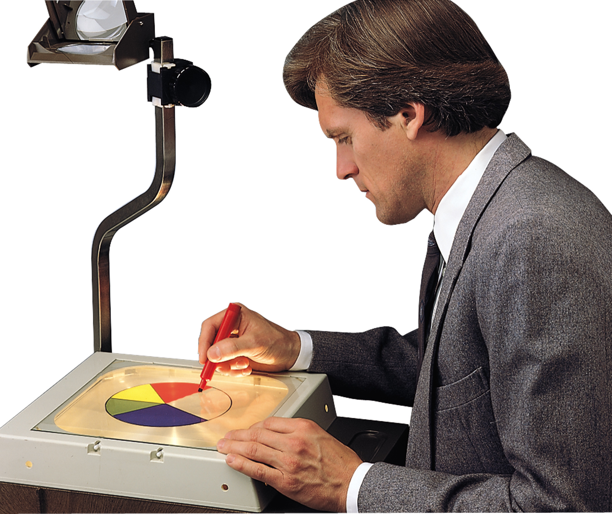
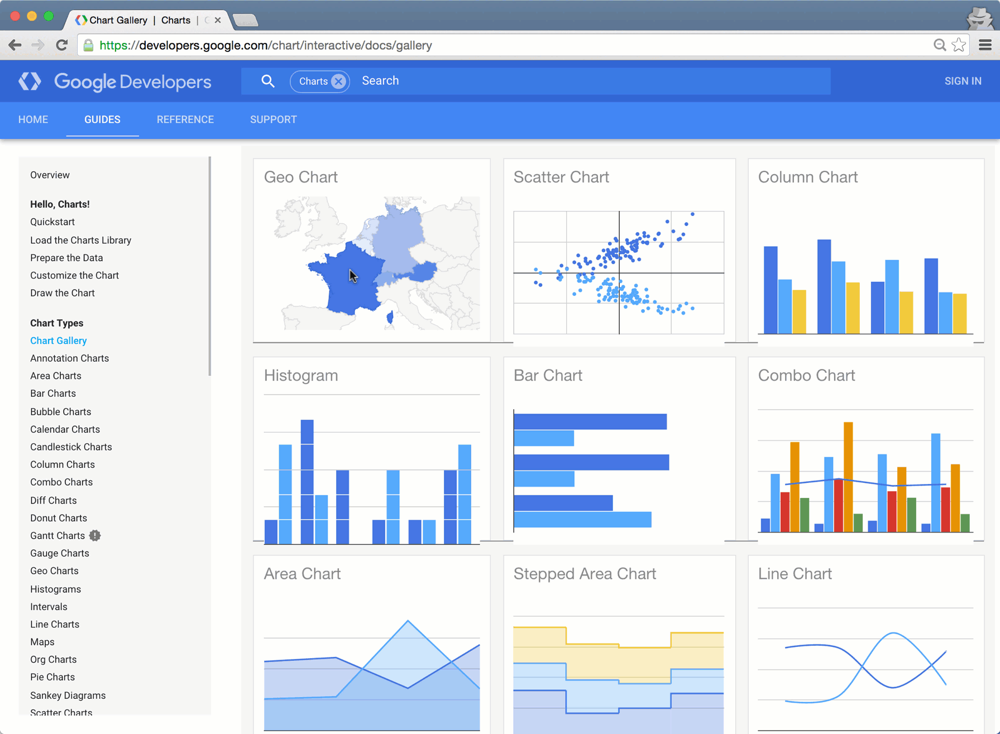

```{r Lec1, echo=FALSE, warning=FALSE, message=FALSE, cache=FALSE}
#library(knitcitations)
#cleanbib()
#newbib()
#bib <- read.bibtex('../../assets/msR.bib')
opts_chunk$set(tidy = TRUE, cache = FALSE) 
require(knitr)
```


## Outline

<br> 

- Importance of visualising data
- Key packages
    - googleVis
    - htmlwidgets
    - ggvis
- Shiny
- Your turn

---

## Motivation – Recall Anscombe's quartet

```{r anscombe, results="asis", echo=FALSE, fig.height=8, fig.width=10, fig.align='center'}
require(stats); require(graphics)
##-- now some "magic" to do the 4 regressions in a loop:
ff <- y ~ x
mods <- setNames(as.list(1:4), paste0("lm", 1:4))
for(i in 1:4) {
  ff[2:3] <- lapply(paste0(c("y","x"), i), as.name)
  mods[[i]] <- lmi <- lm(ff, data = anscombe)
}
## Scatterplots
op1 <- par(mfrow = c(2, 2), mar = 0.1+c(4,4,0.1,0.1), 
           oma =  c(0, 0, 0, 0), cex = 1.5, bg = "transparent")
for(i in 1:4) {
  ff[2:3] <- lapply(paste0(c("y","x"), i), as.name)
  plot(ff, data = anscombe, col = "red", pch = 21, bg = "orange", cex = 1.2,
       xlim = c(3, 19), ylim = c(3, 13))
  abline(mods[[i]], col = "blue")
}
par(op1)
```

---

## An interactive future

It may not be long before presentations with static plots are as old fashioned as whipping out your overhead transparencies.





--- .segue

# googleVis

---

## Overview of googleVis

- [Markus Gesmann](http://www.magesblog.com/) created the [`googleVis`](https://github.com/mages/googleVis) package which accesses  the [Google Chart API](https://developers.google.com/chart/)  directly from R

- The functions of the package allow users to visualise data with the Google Chart Tools **without uploading their data to Google**

- The output of googleVis functions is html code that contains the data and references to JavaScript functions hosted by Google

- **Limitation**: requires internet access to work and some charts require Flash.

See also: **Using the Google Visualisation API with R**, 
  [The R Journal, 3(2):40-44, December 2011](http://journal.r-project.org/archive/2011-2/RJournal_2011-2_Gesmann+de~Castillo.pdf) and googleVis [package vignette](http://cran.r-project.org/web/packages/googleVis/vignettes/googleVis.pdf)

---

<a href="https://developers.google.com/chart">developers.google.com/chart <i class="fa fa-link"></i></a> 





---

## Key googleVis functions


| Function | Description |
| -------- | ----------- |
| `gvisAnnotatedTimeLine`	| Annotated Time Line  | 
| `gvisAnnotationChart`	| Annotation Chart  | 
| `gvisAreaChart`	 |  Area Chart  | 
| `gvisBarChart`	 |  Bar Chart  | 
| `gvisBubbleChart`	 |  Bubble Chart  | 
| `gvisCalendar`	 |  Calendar Chart  | 
| `gvisCandlestickChart`	 |  Candlestick chart  | 
| `gvisColumnChart`	 |  Column Chart  | 
| `gvisComboChart`	 |  Combo Chart  | 
| `gvisGauge`	 |  Gauge  | 
| `gvisGeoChart`	 |  Geo Chart  | 
| `gvisGeoMap`	 |  Geo Map  | 
| `gvisHistogram`	 |  Histogram Chart  | 
| `gvisIntensityMap`	 |  Intensity Map  | 
| `gvisLineChart`	 |  Line Chart  | 
| `gvisMap`	 |  Maps  | 
| `gvisMotionChart`	 |  Motion Chart  | 
| `gvisOrgChart`	 |  Org Chart  | 
| `gvisPieChart`	 |  Pie Chart  | 
| `gvisSankey`	 |  Sankey Chart  | 
| `gvisScatterChart`	 |  Scatter Chart  | 
| `gvisSteppedAreaChart`	 |  Stepped Area Chart  | 
| `gvisTable`	 |  Table Chart  | 
| `gvisTimeline`	 |  Timeline Chart  | 
| `gvisTreeMap`	 |  Tree Map |

--- 

### Examples from the `mplot` package

```{r,eval=FALSE,tidy=TRUE}
require(mplot)
lm.d = lm(y ~ ., data = diabetes)
vis.d = vis(lm.d, B = 200)
plot(vis.d, which="vip")
```
```{r,cache=FALSE,results='asis',echo=FALSE}
load("Hobart.RData")
plot(vis.d.with.RV,which="vip", width=800,tag="chart",
     height=450,fontSize=20,left=130,chartWidth="65%")
```

--- 

### Examples from the `mplot` package

```{r,eval=FALSE,tidy=TRUE}
plot(vis.d, which = "boot", highlight = "ltg")
```
```{r,cache=FALSE,results='asis',echo=FALSE}
plot(vis.d.no.RV,which="boot",highlight="ltg", width=800, tag = "chart", height=500,fontSize=20,left=130,chartWidth="60%")
```

--- 

### Examples from the `mplot` package

```{r,eval=FALSE,tidy=TRUE,echo=TRUE}
af.d = af(lm.d, B = 200, n.c = 100, c.max = 100)
plot(af.d)
```
```{r,cache=FALSE,results='asis',echo=FALSE}
plot(af.d, width=850, tag = "chart", height=500, fontSize=20, left=50, chartWidth="55%")
```


--- .segue

# HTML widgets

--- 

## JavaScript meets R

<q>
[`htmlwidgets`](http://www.htmlwidgets.org/) is a package that lets you _relatively_ easily link R with JavaScript.
</q>

Some examples:

- [`networkD3`](http://christophergandrud.github.io/networkD3/): force directed networks, Sankey diagrams, and Reingold-Tilford tree networks
- [`edgebundleR`](https://github.com/garthtarr/edgebundleR): hierarchical edge bundle plots
- [`pairsD3`](https://github.com/garthtarr/pairsD3): interactive scatter plot matrices
- [`dygraphs`](https://rstudio.github.io/dygraphs/): charting time-series data
- [`leaflet`](https://rstudio.github.io/leaflet/): dynamic maps
- [`DT`](https://rstudio.github.io/DT/): interactive HTML data tables

---

<a href="http://hafen.github.io/htmlwidgetsgallery/">hafen.github.io/htmlwidgetsgallery <i class="fa fa-link"></i></a> 


--- .segue

# ggvis

---

## ggvis

- Web based incarnation of ggplot2 (svg or canvas)
- Interactivity (advanced interactivity requires an R instance in the background)
- Under development. Recently on twitter @hadleywickham commented "goal is for 2016 to be the year of ggvis"


http://ggvis.rstudio.com/

---


# Shiny: the democratisation of R


---


## What is Shiny?

<a href="http://shiny.rstudio.com/"></a>

## How did I get started?

I wanted a way to interactively explore the results of a mega-simulation study from my thesis.

[spark.rstudio.com/garthtarr/n50](http://spark.rstudio.com/garthtarr/n50/)


---

# Graphical Newtork Example

<div align="right"><a href="https://garthtarr.shinyapps.io/network/"><font color="white">Shinyapps.io </font><i class="fa fa-link fa-inverse"></i></a></div>
<div align="right"><a href="https://github.com/garthtarr/network"><font color="white">Github </font><i class="fa fa-github fa-inverse"></i></a></div>


---


## Sharing your shiny app

- Shinyapps.io

There's a button in Rstudio that lets you push it to their server. 


- Github

```
shiny::runGitHub('network', 'garthtarr')
```

- Host your own Rstudio server

<br>

More info: http://shiny.rstudio.com/articles/deployment-local.html


---

## Underlying technology
  <div class="columns-2">
### R packages
- leaps 
- bestglm 
- googleVis
- shiny
- parallel 
- mvoutlier

### Web
- [d3.js](http://d3js.org/)
- [Google Charts](https://developers.google.com/chart/)

### Package development
- RStudio makes setting up package structure easy
- Version control with Github
- Documentation with `roxygen2`
- Vignettes (and these slides) with markdown
- `devtools` is an essential package for building and loading R packages
- [R packages by Hadley Wickham](http://r-pkgs.had.co.nz/)
</div>

## Additional resources

- htmlwidgets package
    - Integrate javascript with R
    - http://www.htmlwidgets.org/
    - http://cran.rstudio.com/web/packages/htmlwidgets/index.html

- Shiny-phyloseq (Susan Holmes)
    - http://joey711.github.io/shiny-phyloseq
```
install.packages("shiny")
shiny::runGitHub("shiny-phyloseq","joey711")
```


--- .codefont

## References

```{r results="asis", echo=FALSE, cache=FALSE}
RefManageR::BibOptions(bib.style="authoryear")
bibliography()
```

--- .codefont

## Session Info

```{r,tidy=TRUE}
#sessionInfo()
```
