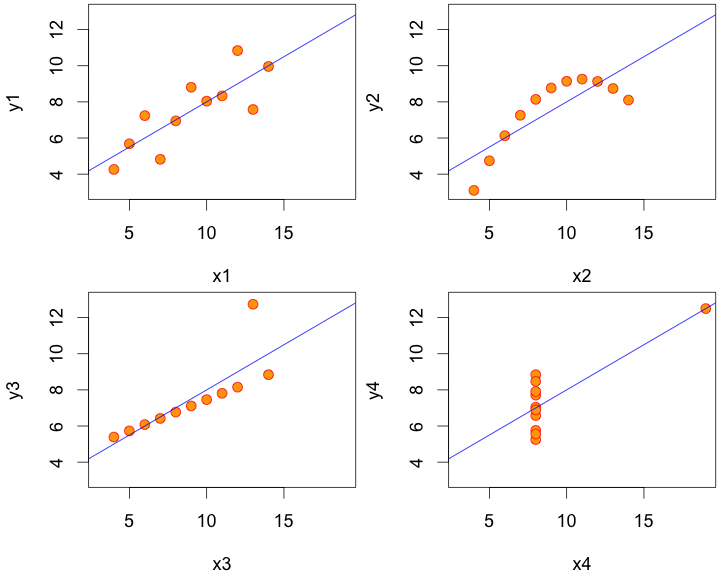

## Outline

<br> 

- Importance of visualising data
- Key packages
    - googleVis
    - htmlwidgets
    - ggvis
- Shiny
- Your turn

---

## Motivation – Recall Anscombe's quartet



---

## An interactive future

It may not be long before presentations with static plots are as old fashioned as whipping out your overhead transparencies.


--- .segue

# googleVis

---

## Overview of googleVis

- [Markus Gesmann](http://www.magesblog.com/) created the [`googleVis`](https://github.com/mages/googleVis) package which accesses  the [Google Chart API](https://developers.google.com/chart/)  directly from R

- The functions of the package allow users to visualise data with the Google Chart Tools **without uploading their data to Google**

- The output of googleVis functions is html code that contains the data and references to JavaScript functions hosted by Google

- **Limitation**: requires internet access to work and some charts require Flash.

See also: **Using the Google Visualisation API with R**, 
  [The R Journal, 3(2):40-44, December 2011](http://journal.r-project.org/archive/2011-2/RJournal_2011-2_Gesmann+de~Castillo.pdf) and googleVis [package vignette](http://cran.r-project.org/web/packages/googleVis/vignettes/googleVis.pdf)

---

<a href="https://developers.google.com/chart">developers.google.com/chart <i class="fa fa-link"></i></a> 


---

## Key googleVis functions


| Function | Description |
| -------- | ----------- |
| `gvisAnnotatedTimeLine`	| Annotated Time Line  | 
| `gvisAnnotationChart`	| Annotation Chart  | 
| `gvisAreaChart`	 |  Area Chart  | 
| `gvisBarChart`	 |  Bar Chart  | 
| `gvisBubbleChart`	 |  Bubble Chart  | 
| `gvisCalendar`	 |  Calendar Chart  | 
| `gvisCandlestickChart`	 |  Candlestick chart  | 
| `gvisColumnChart`	 |  Column Chart  | 
| `gvisComboChart`	 |  Combo Chart  | 
| `gvisGauge`	 |  Gauge  | 
| `gvisGeoChart`	 |  Geo Chart  | 
| `gvisGeoMap`	 |  Geo Map  | 
| `gvisHistogram`	 |  Histogram Chart  | 
| `gvisIntensityMap`	 |  Intensity Map  | 
| `gvisLineChart`	 |  Line Chart  | 
| `gvisMap`	 |  Maps  | 
| `gvisMotionChart`	 |  Motion Chart  | 
| `gvisOrgChart`	 |  Org Chart  | 
| `gvisPieChart`	 |  Pie Chart  | 
| `gvisSankey`	 |  Sankey Chart  | 
| `gvisScatterChart`	 |  Scatter Chart  | 
| `gvisSteppedAreaChart`	 |  Stepped Area Chart  | 
| `gvisTable`	 |  Table Chart  | 
| `gvisTimeline`	 |  Timeline Chart  | 
| `gvisTreeMap`	 |  Tree Map |

--- 

### Examples from the `mplot` package


```r
require(mplot)
lm.d = lm(y ~ ., data = diabetes)
vis.d = vis(lm.d, B = 200)
plot(vis.d, which = "vip")
```
<!-- LineChart generated in R 3.2.2 by googleVis 0.5.10 package -->
<!-- Sun Dec  6 21:27:07 2015 -->


<!-- jsHeader -->
<script type="text/javascript">
 
// jsData 
function gvisDataLineChartID20f961d3d725 () {
var data = new google.visualization.DataTable();
var datajson =
[
 [
 0,
null,
null,
null,
null,
1,
1,
1,
1,
1,
1,
1,
1,
1,
1,
1 
],
[
 0.01,
null,
null,
null,
null,
1,
1,
1,
1,
0.99,
0.985,
0.935,
0.97,
0.93,
0.885,
0.925 
],
[
 0.02,
null,
null,
null,
null,
1,
1,
1,
1,
0.985,
0.985,
0.9,
0.95,
0.895,
0.85,
0.89 
],
[
 0.03,
null,
null,
null,
null,
1,
1,
1,
1,
0.985,
0.985,
0.88,
0.935,
0.89,
0.815,
0.87 
],
[
 0.04,
null,
null,
null,
null,
1,
1,
1,
1,
0.985,
0.975,
0.865,
0.92,
0.89,
0.79,
0.85 
],
[
 0.05,
null,
null,
null,
null,
1,
1,
1,
1,
0.98,
0.97,
0.855,
0.91,
0.865,
0.78,
0.83 
],
[
 0.06,
null,
null,
null,
null,
1,
1,
1,
1,
0.98,
0.965,
0.82,
0.89,
0.855,
0.77,
0.815 
],
[
 0.07,
null,
null,
null,
null,
1,
1,
1,
1,
0.98,
0.96,
0.81,
0.88,
0.84,
0.765,
0.8 
],
[
 0.08,
null,
null,
null,
null,
1,
1,
1,
1,
0.98,
0.96,
0.8,
0.88,
0.835,
0.76,
0.77 
],
[
 0.09,
null,
null,
null,
null,
1,
1,
1,
1,
0.98,
0.96,
0.785,
0.875,
0.835,
0.74,
0.75 
],
[
 0.1,
null,
null,
null,
null,
1,
1,
1,
1,
0.98,
0.96,
0.76,
0.855,
0.82,
0.705,
0.745 
],
[
 0.11,
null,
null,
null,
null,
1,
1,
1,
1,
0.98,
0.955,
0.755,
0.845,
0.805,
0.695,
0.725 
],
[
 0.12,
null,
null,
null,
null,
1,
1,
1,
1,
0.98,
0.955,
0.745,
0.84,
0.8,
0.69,
0.72 
],
[
 0.13,
null,
null,
null,
null,
1,
1,
1,
1,
0.98,
0.96,
0.74,
0.835,
0.8,
0.67,
0.715 
],
[
 0.14,
null,
null,
null,
null,
1,
1,
1,
1,
0.98,
0.96,
0.735,
0.835,
0.8,
0.67,
0.695 
],
[
 0.15,
null,
null,
null,
null,
1,
1,
1,
1,
0.98,
0.945,
0.73,
0.835,
0.795,
0.66,
0.69 
],
[
 0.16,
null,
null,
null,
null,
1,
1,
1,
1,
0.98,
0.945,
0.715,
0.825,
0.79,
0.655,
0.68 
],
[
 0.17,
null,
null,
null,
null,
1,
1,
1,
1,
0.98,
0.945,
0.71,
0.82,
0.785,
0.655,
0.665 
],
[
 0.18,
null,
null,
null,
null,
1,
1,
1,
1,
0.975,
0.935,
0.695,
0.81,
0.785,
0.64,
0.645 
],
[
 0.19,
null,
null,
null,
null,
1,
1,
1,
1,
0.975,
0.935,
0.695,
0.805,
0.785,
0.63,
0.63 
],
[
 0.2,
null,
null,
null,
null,
1,
1,
1,
1,
0.975,
0.935,
0.685,
0.785,
0.78,
0.625,
0.61 
],
[
 0.21,
null,
null,
null,
null,
1,
1,
1,
1,
0.975,
0.935,
0.67,
0.78,
0.78,
0.615,
0.6 
],
[
 0.22,
null,
null,
null,
null,
1,
1,
1,
1,
0.975,
0.935,
0.665,
0.77,
0.77,
0.615,
0.595 
],
[
 0.23,
null,
null,
null,
null,
1,
1,
1,
1,
0.975,
0.93,
0.645,
0.76,
0.77,
0.61,
0.59 
],
[
 0.24,
null,
null,
null,
null,
1,
1,
1,
1,
0.975,
0.93,
0.635,
0.755,
0.765,
0.605,
0.585 
],
[
 0.25,
null,
null,
null,
null,
1,
1,
1,
1,
0.975,
0.93,
0.62,
0.755,
0.765,
0.605,
0.58 
],
[
 0.26,
null,
null,
null,
null,
1,
1,
1,
1,
0.975,
0.93,
0.62,
0.75,
0.76,
0.6,
0.575 
],
[
 0.27,
null,
null,
null,
null,
1,
1,
1,
1,
0.975,
0.93,
0.62,
0.745,
0.76,
0.575,
0.565 
],
[
 0.28,
null,
null,
null,
null,
1,
1,
1,
1,
0.975,
0.93,
0.61,
0.74,
0.75,
0.57,
0.55 
],
[
 0.29,
null,
null,
null,
null,
1,
1,
1,
1,
0.975,
0.93,
0.605,
0.73,
0.75,
0.56,
0.545 
],
[
 0.3,
null,
null,
null,
null,
1,
1,
1,
1,
0.97,
0.925,
0.595,
0.725,
0.745,
0.55,
0.53 
],
[
 0.31,
null,
null,
null,
null,
1,
1,
1,
1,
0.97,
0.925,
0.595,
0.72,
0.74,
0.545,
0.53 
],
[
 0.32,
null,
null,
null,
null,
1,
1,
1,
1,
0.97,
0.925,
0.595,
0.72,
0.74,
0.54,
0.52 
],
[
 0.33,
null,
null,
null,
null,
1,
1,
1,
1,
0.965,
0.92,
0.59,
0.715,
0.73,
0.53,
0.52 
],
[
 0.34,
null,
null,
null,
null,
1,
1,
1,
1,
0.965,
0.92,
0.59,
0.71,
0.73,
0.52,
0.515 
],
[
 0.35,
null,
null,
null,
null,
1,
1,
1,
1,
0.965,
0.92,
0.59,
0.71,
0.725,
0.515,
0.515 
],
[
 0.36,
null,
null,
null,
null,
1,
1,
1,
1,
0.965,
0.92,
0.59,
0.705,
0.725,
0.51,
0.495 
],
[
 0.37,
null,
null,
null,
null,
1,
1,
1,
1,
0.965,
0.92,
0.59,
0.705,
0.725,
0.51,
0.495 
],
[
 0.38,
null,
null,
null,
null,
1,
1,
1,
1,
0.965,
0.91,
0.58,
0.7,
0.72,
0.5,
0.485 
],
[
 0.39,
null,
null,
null,
null,
1,
1,
1,
1,
0.965,
0.905,
0.575,
0.7,
0.72,
0.5,
0.475 
],
[
 0.4,
null,
null,
null,
null,
1,
1,
1,
1,
0.965,
0.905,
0.575,
0.69,
0.72,
0.5,
0.47 
],
[
 0.41,
null,
null,
null,
null,
1,
1,
1,
1,
0.965,
0.905,
0.575,
0.69,
0.71,
0.49,
0.47 
],
[
 0.42,
null,
null,
null,
null,
1,
1,
1,
1,
0.965,
0.905,
0.575,
0.685,
0.7,
0.485,
0.46 
],
[
 0.43,
null,
null,
null,
null,
1,
1,
1,
1,
0.965,
0.905,
0.575,
0.685,
0.695,
0.48,
0.455 
],
[
 0.44,
null,
null,
null,
null,
1,
1,
1,
1,
0.965,
0.905,
0.57,
0.685,
0.685,
0.475,
0.455 
],
[
 0.45,
null,
null,
null,
null,
1,
1,
1,
1,
0.96,
0.9,
0.575,
0.675,
0.685,
0.47,
0.455 
],
[
 0.46,
null,
null,
null,
null,
1,
1,
1,
1,
0.96,
0.9,
0.57,
0.67,
0.675,
0.47,
0.45 
],
[
 0.47,
null,
null,
null,
null,
1,
1,
1,
1,
0.965,
0.895,
0.565,
0.67,
0.675,
0.47,
0.45 
],
[
 0.48,
null,
null,
null,
null,
1,
1,
1,
1,
0.965,
0.895,
0.565,
0.67,
0.66,
0.465,
0.45 
],
[
 0.49,
null,
null,
null,
null,
1,
1,
1,
1,
0.965,
0.895,
0.555,
0.67,
0.655,
0.465,
0.45 
],
[
 0.5,
null,
null,
null,
null,
1,
1,
1,
1,
0.965,
0.895,
0.55,
0.67,
0.645,
0.46,
0.45 
],
[
 0.51,
null,
null,
null,
null,
1,
1,
1,
1,
0.965,
0.895,
0.545,
0.665,
0.645,
0.455,
0.45 
],
[
 0.52,
null,
null,
null,
null,
1,
1,
1,
1,
0.965,
0.895,
0.545,
0.665,
0.64,
0.45,
0.44 
],
[
 0.53,
null,
null,
null,
null,
1,
1,
1,
1,
0.965,
0.895,
0.54,
0.655,
0.64,
0.45,
0.44 
],
[
 0.54,
null,
null,
null,
null,
1,
1,
1,
1,
0.965,
0.895,
0.54,
0.655,
0.64,
0.435,
0.43 
],
[
 0.55,
null,
null,
null,
null,
1,
1,
1,
1,
0.965,
0.895,
0.54,
0.655,
0.63,
0.43,
0.43 
],
[
 0.56,
null,
null,
null,
null,
1,
1,
1,
1,
0.965,
0.895,
0.535,
0.65,
0.62,
0.425,
0.43 
],
[
 0.57,
null,
null,
null,
null,
1,
1,
1,
1,
0.965,
0.89,
0.525,
0.65,
0.62,
0.425,
0.425 
],
[
 0.58,
null,
null,
null,
null,
1,
1,
1,
1,
0.965,
0.89,
0.52,
0.65,
0.62,
0.425,
0.425 
],
[
 0.59,
null,
null,
null,
null,
1,
1,
1,
1,
0.965,
0.885,
0.52,
0.65,
0.615,
0.425,
0.42 
],
[
 0.6,
null,
null,
null,
null,
1,
1,
1,
1,
0.965,
0.885,
0.51,
0.65,
0.605,
0.42,
0.42 
],
[
 0.61,
null,
null,
null,
null,
1,
1,
1,
1,
0.965,
0.885,
0.51,
0.64,
0.6,
0.42,
0.415 
],
[
 0.62,
null,
null,
null,
null,
1,
1,
1,
1,
0.965,
0.88,
0.51,
0.635,
0.6,
0.42,
0.405 
],
[
 0.63,
null,
null,
null,
null,
1,
1,
1,
1,
0.965,
0.88,
0.5,
0.62,
0.59,
0.42,
0.405 
],
[
 0.64,
null,
null,
null,
null,
1,
1,
1,
1,
0.965,
0.88,
0.5,
0.62,
0.59,
0.415,
0.4 
],
[
 0.65,
null,
null,
null,
null,
1,
1,
1,
1,
0.965,
0.88,
0.5,
0.62,
0.59,
0.415,
0.39 
],
[
 0.66,
null,
null,
null,
null,
1,
1,
1,
1,
0.965,
0.88,
0.5,
0.61,
0.59,
0.415,
0.385 
],
[
 0.67,
null,
null,
null,
null,
1,
1,
1,
1,
0.965,
0.875,
0.485,
0.61,
0.59,
0.415,
0.385 
],
[
 0.68,
null,
null,
null,
null,
1,
1,
1,
1,
0.965,
0.875,
0.48,
0.6,
0.585,
0.41,
0.385 
],
[
 0.69,
null,
null,
null,
null,
1,
1,
1,
1,
0.965,
0.875,
0.48,
0.595,
0.585,
0.4,
0.38 
],
[
 0.7,
null,
null,
null,
null,
1,
1,
1,
1,
0.965,
0.875,
0.48,
0.59,
0.585,
0.395,
0.38 
],
[
 0.71,
null,
null,
null,
null,
1,
1,
1,
1,
0.965,
0.875,
0.48,
0.59,
0.585,
0.39,
0.38 
],
[
 0.72,
null,
null,
null,
null,
1,
1,
1,
1,
0.965,
0.875,
0.48,
0.59,
0.58,
0.385,
0.375 
],
[
 0.73,
null,
null,
null,
null,
1,
1,
1,
1,
0.965,
0.87,
0.475,
0.59,
0.575,
0.38,
0.365 
],
[
 0.74,
null,
null,
null,
null,
1,
1,
1,
1,
0.965,
0.87,
0.475,
0.585,
0.57,
0.38,
0.365 
],
[
 0.75,
null,
null,
null,
null,
1,
1,
1,
1,
0.965,
0.865,
0.46,
0.58,
0.57,
0.38,
0.365 
],
[
 0.76,
null,
null,
null,
null,
1,
1,
1,
1,
0.965,
0.865,
0.46,
0.58,
0.565,
0.38,
0.355 
],
[
 0.77,
null,
null,
null,
null,
1,
1,
1,
1,
0.965,
0.865,
0.455,
0.575,
0.565,
0.375,
0.355 
],
[
 0.78,
null,
null,
null,
null,
1,
1,
1,
1,
0.965,
0.86,
0.46,
0.57,
0.565,
0.375,
0.355 
],
[
 0.79,
null,
null,
null,
null,
1,
1,
1,
1,
0.965,
0.86,
0.46,
0.57,
0.565,
0.37,
0.355 
],
[
 0.8,
null,
null,
null,
null,
1,
1,
1,
1,
0.965,
0.855,
0.46,
0.56,
0.56,
0.37,
0.345 
],
[
 0.81,
null,
null,
null,
null,
1,
1,
1,
1,
0.965,
0.85,
0.45,
0.545,
0.555,
0.37,
0.34 
],
[
 0.82,
null,
null,
null,
null,
1,
1,
1,
1,
0.965,
0.85,
0.445,
0.545,
0.55,
0.37,
0.335 
],
[
 0.83,
null,
null,
null,
null,
1,
1,
1,
1,
0.965,
0.85,
0.445,
0.545,
0.55,
0.37,
0.335 
],
[
 0.84,
null,
null,
null,
null,
1,
1,
1,
1,
0.965,
0.85,
0.445,
0.545,
0.545,
0.365,
0.33 
],
[
 0.85,
null,
null,
null,
null,
1,
1,
1,
1,
0.965,
0.85,
0.445,
0.545,
0.545,
0.36,
0.325 
],
[
 0.86,
null,
null,
null,
null,
1,
1,
1,
1,
0.965,
0.845,
0.445,
0.545,
0.545,
0.36,
0.325 
],
[
 0.87,
null,
null,
null,
null,
1,
1,
1,
1,
0.965,
0.84,
0.45,
0.54,
0.54,
0.355,
0.315 
],
[
 0.88,
null,
null,
null,
null,
1,
1,
1,
1,
0.965,
0.84,
0.45,
0.54,
0.54,
0.35,
0.315 
],
[
 0.89,
null,
null,
null,
null,
1,
1,
1,
1,
0.965,
0.83,
0.45,
0.535,
0.54,
0.34,
0.31 
],
[
 0.9,
null,
null,
null,
null,
1,
1,
1,
1,
0.965,
0.83,
0.445,
0.535,
0.535,
0.335,
0.305 
],
[
 0.91,
null,
null,
null,
null,
1,
1,
1,
1,
0.965,
0.825,
0.44,
0.535,
0.535,
0.33,
0.3 
],
[
 0.92,
null,
null,
null,
null,
1,
1,
1,
1,
0.965,
0.825,
0.44,
0.525,
0.53,
0.325,
0.3 
],
[
 0.93,
null,
null,
null,
null,
1,
1,
1,
1,
0.965,
0.82,
0.43,
0.525,
0.53,
0.325,
0.3 
],
[
 0.94,
null,
null,
null,
null,
1,
1,
1,
1,
0.965,
0.81,
0.43,
0.525,
0.525,
0.325,
0.295 
],
[
 0.95,
null,
null,
null,
null,
1,
1,
1,
1,
0.965,
0.81,
0.43,
0.525,
0.525,
0.325,
0.295 
],
[
 0.96,
null,
null,
null,
null,
1,
1,
1,
1,
0.965,
0.805,
0.43,
0.525,
0.525,
0.325,
0.29 
],
[
 0.97,
null,
null,
null,
null,
1,
1,
1,
1,
0.97,
0.8,
0.425,
0.525,
0.52,
0.325,
0.28 
],
[
 0.98,
null,
null,
null,
null,
1,
1,
1,
1,
0.97,
0.8,
0.425,
0.52,
0.52,
0.325,
0.28 
],
[
 0.99,
null,
null,
null,
null,
1,
1,
1,
1,
0.97,
0.8,
0.42,
0.52,
0.52,
0.315,
0.28 
],
[
 1,
null,
null,
null,
null,
1,
1,
1,
1,
0.97,
0.8,
0.42,
0.52,
0.52,
0.315,
0.28 
],
[
 1.01,
null,
null,
null,
null,
1,
1,
1,
1,
0.97,
0.8,
0.42,
0.52,
0.52,
0.31,
0.28 
],
[
 1.02,
null,
null,
null,
null,
1,
1,
1,
1,
0.965,
0.8,
0.42,
0.52,
0.51,
0.31,
0.28 
],
[
 1.03,
null,
null,
null,
null,
1,
1,
1,
1,
0.965,
0.8,
0.415,
0.515,
0.505,
0.3,
0.28 
],
[
 1.04,
null,
null,
null,
null,
1,
1,
1,
1,
0.965,
0.8,
0.41,
0.51,
0.5,
0.3,
0.28 
],
[
 1.05,
null,
null,
null,
null,
1,
1,
1,
1,
0.965,
0.8,
0.405,
0.505,
0.495,
0.295,
0.275 
],
[
 1.06,
null,
null,
null,
null,
1,
1,
1,
1,
0.96,
0.79,
0.405,
0.5,
0.495,
0.295,
0.265 
],
[
 1.07,
null,
null,
null,
null,
1,
1,
1,
1,
0.96,
0.79,
0.405,
0.5,
0.485,
0.29,
0.265 
],
[
 1.08,
null,
null,
null,
null,
1,
1,
1,
1,
0.96,
0.79,
0.4,
0.5,
0.485,
0.29,
0.265 
],
[
 1.09,
null,
null,
null,
null,
1,
1,
1,
1,
0.96,
0.785,
0.395,
0.495,
0.485,
0.29,
0.26 
],
[
 1.1,
null,
null,
null,
null,
1,
1,
1,
1,
0.96,
0.78,
0.39,
0.495,
0.48,
0.285,
0.26 
],
[
 1.11,
null,
null,
null,
null,
1,
1,
1,
1,
0.96,
0.78,
0.39,
0.495,
0.475,
0.285,
0.255 
],
[
 1.12,
null,
null,
null,
null,
1,
1,
1,
1,
0.96,
0.78,
0.39,
0.495,
0.475,
0.285,
0.255 
],
[
 1.13,
null,
null,
null,
null,
1,
1,
1,
1,
0.96,
0.78,
0.385,
0.485,
0.47,
0.285,
0.255 
],
[
 1.14,
null,
null,
null,
null,
1,
1,
1,
1,
0.955,
0.77,
0.38,
0.48,
0.465,
0.285,
0.255 
],
[
 1.15,
null,
null,
null,
null,
1,
1,
1,
1,
0.955,
0.77,
0.38,
0.48,
0.465,
0.285,
0.25 
],
[
 1.16,
null,
null,
null,
null,
1,
1,
1,
1,
0.955,
0.77,
0.375,
0.475,
0.46,
0.285,
0.25 
],
[
 1.17,
null,
null,
null,
null,
1,
1,
1,
1,
0.955,
0.77,
0.37,
0.475,
0.46,
0.28,
0.24 
],
[
 1.18,
null,
null,
null,
null,
1,
1,
1,
1,
0.955,
0.77,
0.37,
0.475,
0.46,
0.275,
0.24 
],
[
 1.19,
null,
null,
null,
null,
1,
1,
1,
1,
0.955,
0.77,
0.365,
0.47,
0.46,
0.275,
0.24 
],
[
 1.2,
null,
null,
null,
null,
1,
1,
1,
1,
0.955,
0.77,
0.36,
0.465,
0.46,
0.275,
0.24 
],
[
 1.21,
null,
null,
null,
null,
1,
1,
1,
1,
0.955,
0.765,
0.355,
0.465,
0.46,
0.275,
0.24 
],
[
 1.22,
null,
null,
null,
null,
1,
1,
1,
1,
0.955,
0.765,
0.355,
0.465,
0.445,
0.275,
0.235 
],
[
 1.23,
null,
null,
null,
null,
1,
1,
1,
1,
0.955,
0.765,
0.35,
0.46,
0.445,
0.275,
0.235 
],
[
 1.24,
null,
null,
null,
null,
1,
1,
1,
1,
0.955,
0.765,
0.345,
0.46,
0.445,
0.275,
0.235 
],
[
 1.25,
null,
null,
null,
null,
1,
1,
1,
1,
0.955,
0.765,
0.34,
0.455,
0.44,
0.275,
0.235 
],
[
 1.26,
null,
null,
null,
null,
1,
1,
1,
1,
0.955,
0.765,
0.335,
0.44,
0.44,
0.275,
0.23 
],
[
 1.27,
null,
null,
null,
null,
1,
1,
1,
1,
0.955,
0.76,
0.335,
0.435,
0.44,
0.265,
0.23 
],
[
 1.28,
null,
null,
null,
null,
1,
1,
1,
1,
0.955,
0.76,
0.335,
0.435,
0.435,
0.265,
0.23 
],
[
 1.29,
null,
null,
null,
null,
1,
1,
1,
1,
0.955,
0.76,
0.335,
0.43,
0.435,
0.255,
0.23 
],
[
 1.3,
null,
null,
null,
null,
1,
1,
1,
1,
0.955,
0.755,
0.33,
0.425,
0.435,
0.25,
0.22 
],
[
 1.31,
null,
null,
null,
null,
1,
1,
1,
1,
0.955,
0.75,
0.33,
0.425,
0.435,
0.25,
0.22 
],
[
 1.32,
null,
null,
null,
null,
1,
1,
1,
1,
0.955,
0.745,
0.325,
0.415,
0.43,
0.245,
0.215 
],
[
 1.33,
null,
null,
null,
null,
1,
1,
1,
1,
0.955,
0.745,
0.325,
0.41,
0.43,
0.245,
0.21 
],
[
 1.34,
null,
null,
null,
null,
1,
1,
1,
1,
0.955,
0.74,
0.32,
0.41,
0.43,
0.245,
0.21 
],
[
 1.35,
null,
null,
null,
null,
1,
1,
1,
1,
0.955,
0.74,
0.315,
0.405,
0.43,
0.245,
0.21 
],
[
 1.36,
null,
null,
null,
null,
1,
1,
1,
1,
0.955,
0.74,
0.315,
0.405,
0.43,
0.245,
0.21 
],
[
 1.37,
null,
null,
null,
null,
1,
1,
1,
1,
0.955,
0.74,
0.31,
0.405,
0.425,
0.245,
0.21 
],
[
 1.38,
null,
null,
null,
null,
1,
1,
1,
1,
0.955,
0.74,
0.31,
0.405,
0.42,
0.245,
0.205 
],
[
 1.39,
null,
null,
null,
null,
1,
1,
1,
1,
0.955,
0.74,
0.31,
0.405,
0.42,
0.245,
0.205 
],
[
 1.4,
null,
null,
null,
null,
1,
1,
1,
1,
0.955,
0.74,
0.31,
0.405,
0.42,
0.245,
0.205 
],
[
 1.41,
null,
null,
null,
null,
1,
1,
1,
1,
0.955,
0.74,
0.31,
0.405,
0.415,
0.245,
0.205 
],
[
 1.42,
null,
null,
null,
null,
1,
1,
1,
1,
0.955,
0.74,
0.305,
0.4,
0.41,
0.24,
0.205 
],
[
 1.43,
null,
null,
null,
null,
1,
1,
1,
1,
0.955,
0.74,
0.305,
0.4,
0.41,
0.24,
0.205 
],
[
 1.44,
null,
null,
null,
null,
1,
1,
1,
1,
0.955,
0.735,
0.3,
0.4,
0.41,
0.235,
0.205 
],
[
 1.45,
null,
null,
null,
null,
1,
1,
1,
1,
0.955,
0.735,
0.3,
0.4,
0.41,
0.235,
0.205 
],
[
 1.46,
null,
null,
null,
null,
1,
1,
1,
1,
0.955,
0.735,
0.3,
0.4,
0.405,
0.235,
0.2 
],
[
 1.47,
null,
null,
null,
null,
1,
1,
1,
1,
0.955,
0.735,
0.3,
0.4,
0.405,
0.235,
0.2 
],
[
 1.48,
null,
null,
null,
null,
1,
1,
1,
1,
0.955,
0.735,
0.295,
0.395,
0.405,
0.235,
0.2 
],
[
 1.49,
null,
null,
null,
null,
1,
1,
1,
1,
0.955,
0.735,
0.295,
0.395,
0.405,
0.235,
0.195 
],
[
 1.5,
null,
null,
null,
null,
1,
1,
1,
1,
0.955,
0.73,
0.295,
0.395,
0.405,
0.235,
0.19 
],
[
 1.51,
null,
null,
null,
null,
1,
1,
1,
1,
0.955,
0.73,
0.29,
0.39,
0.405,
0.235,
0.19 
],
[
 1.52,
null,
null,
null,
null,
1,
1,
1,
1,
0.955,
0.73,
0.29,
0.39,
0.405,
0.235,
0.19 
],
[
 1.53,
null,
null,
null,
null,
1,
1,
1,
1,
0.955,
0.73,
0.29,
0.39,
0.405,
0.235,
0.19 
],
[
 1.54,
null,
null,
null,
null,
1,
1,
1,
1,
0.955,
0.73,
0.275,
0.38,
0.41,
0.235,
0.185 
],
[
 1.55,
null,
null,
null,
null,
1,
1,
1,
1,
0.955,
0.73,
0.275,
0.38,
0.41,
0.235,
0.185 
],
[
 1.56,
null,
null,
null,
null,
1,
1,
1,
1,
0.955,
0.73,
0.275,
0.38,
0.41,
0.235,
0.185 
],
[
 1.57,
null,
null,
null,
null,
1,
1,
1,
1,
0.955,
0.73,
0.275,
0.38,
0.41,
0.235,
0.185 
],
[
 1.58,
null,
null,
null,
null,
1,
1,
1,
1,
0.955,
0.73,
0.275,
0.375,
0.405,
0.235,
0.18 
],
[
 1.59,
null,
null,
null,
null,
1,
1,
1,
1,
0.955,
0.73,
0.275,
0.37,
0.405,
0.235,
0.175 
],
[
 1.6,
null,
null,
null,
null,
1,
1,
1,
1,
0.955,
0.73,
0.275,
0.37,
0.395,
0.235,
0.175 
],
[
 1.61,
null,
null,
null,
null,
1,
1,
1,
1,
0.955,
0.73,
0.275,
0.37,
0.39,
0.235,
0.175 
],
[
 1.62,
null,
null,
null,
null,
1,
1,
1,
1,
0.955,
0.73,
0.27,
0.365,
0.39,
0.24,
0.175 
],
[
 1.63,
null,
null,
null,
null,
1,
1,
1,
1,
0.955,
0.73,
0.27,
0.365,
0.38,
0.24,
0.175 
],
[
 1.64,
null,
null,
null,
null,
1,
1,
1,
1,
0.955,
0.73,
0.265,
0.365,
0.38,
0.24,
0.175 
],
[
 1.65,
null,
null,
null,
null,
1,
1,
1,
1,
0.955,
0.73,
0.265,
0.365,
0.38,
0.24,
0.175 
],
[
 1.66,
null,
null,
null,
null,
1,
1,
1,
1,
0.95,
0.73,
0.265,
0.365,
0.38,
0.225,
0.175 
],
[
 1.67,
null,
null,
null,
null,
1,
1,
1,
1,
0.95,
0.73,
0.265,
0.365,
0.38,
0.225,
0.175 
],
[
 1.68,
null,
null,
null,
null,
1,
1,
1,
1,
0.95,
0.73,
0.265,
0.365,
0.38,
0.225,
0.17 
],
[
 1.69,
null,
null,
null,
null,
1,
1,
1,
1,
0.95,
0.73,
0.265,
0.365,
0.38,
0.225,
0.165 
],
[
 1.7,
null,
null,
null,
null,
1,
1,
1,
1,
0.95,
0.73,
0.265,
0.365,
0.38,
0.225,
0.165 
],
[
 1.71,
null,
null,
null,
null,
1,
1,
1,
1,
0.95,
0.73,
0.265,
0.365,
0.38,
0.225,
0.165 
],
[
 1.72,
null,
null,
null,
null,
1,
1,
1,
1,
0.945,
0.73,
0.265,
0.365,
0.38,
0.225,
0.16 
],
[
 1.73,
null,
null,
null,
null,
1,
1,
1,
1,
0.945,
0.73,
0.265,
0.365,
0.38,
0.22,
0.155 
],
[
 1.74,
null,
null,
null,
null,
1,
1,
1,
1,
0.945,
0.73,
0.265,
0.365,
0.38,
0.215,
0.155 
],
[
 1.75,
null,
null,
null,
null,
1,
1,
1,
1,
0.945,
0.73,
0.265,
0.365,
0.375,
0.205,
0.155 
],
[
 1.76,
null,
null,
null,
null,
1,
1,
1,
1,
0.945,
0.73,
0.265,
0.365,
0.375,
0.205,
0.155 
],
[
 1.77,
null,
null,
null,
null,
1,
1,
1,
1,
0.945,
0.73,
0.26,
0.365,
0.375,
0.205,
0.15 
],
[
 1.78,
null,
null,
null,
null,
1,
1,
1,
1,
0.945,
0.73,
0.26,
0.365,
0.37,
0.205,
0.145 
],
[
 1.79,
null,
null,
null,
null,
1,
1,
1,
1,
0.945,
0.73,
0.26,
0.365,
0.365,
0.205,
0.145 
],
[
 1.8,
null,
null,
null,
null,
1,
1,
1,
1,
0.945,
0.73,
0.26,
0.36,
0.365,
0.205,
0.145 
],
[
 1.81,
null,
null,
null,
null,
1,
1,
1,
1,
0.945,
0.73,
0.255,
0.36,
0.365,
0.205,
0.145 
],
[
 1.82,
null,
null,
null,
null,
1,
1,
1,
1,
0.945,
0.73,
0.255,
0.36,
0.365,
0.205,
0.145 
],
[
 1.83,
null,
null,
null,
null,
1,
1,
1,
1,
0.945,
0.73,
0.255,
0.36,
0.36,
0.205,
0.145 
],
[
 1.84,
null,
null,
null,
null,
1,
1,
1,
1,
0.945,
0.725,
0.25,
0.355,
0.36,
0.205,
0.145 
],
[
 1.85,
null,
null,
null,
null,
1,
1,
1,
1,
0.945,
0.725,
0.25,
0.35,
0.36,
0.205,
0.145 
],
[
 1.86,
null,
null,
null,
null,
1,
1,
1,
1,
0.945,
0.725,
0.25,
0.35,
0.355,
0.205,
0.145 
],
[
 1.87,
null,
null,
null,
null,
1,
1,
1,
1,
0.945,
0.725,
0.25,
0.35,
0.355,
0.205,
0.145 
],
[
 1.88,
null,
null,
null,
null,
1,
1,
1,
1,
0.945,
0.72,
0.245,
0.35,
0.35,
0.2,
0.14 
],
[
 1.89,
null,
null,
null,
null,
1,
1,
1,
1,
0.945,
0.72,
0.245,
0.345,
0.35,
0.2,
0.135 
],
[
 1.9,
null,
null,
null,
null,
1,
1,
1,
1,
0.945,
0.72,
0.245,
0.345,
0.35,
0.2,
0.135 
],
[
 1.91,
null,
null,
null,
null,
1,
1,
1,
1,
0.945,
0.72,
0.245,
0.345,
0.34,
0.2,
0.135 
],
[
 1.92,
null,
null,
null,
null,
1,
1,
1,
1,
0.945,
0.72,
0.245,
0.345,
0.34,
0.195,
0.135 
],
[
 1.93,
null,
null,
null,
null,
1,
1,
1,
1,
0.945,
0.72,
0.245,
0.345,
0.34,
0.195,
0.135 
],
[
 1.94,
null,
null,
null,
null,
1,
1,
1,
1,
0.945,
0.72,
0.245,
0.345,
0.34,
0.19,
0.135 
],
[
 1.95,
null,
null,
null,
null,
1,
1,
1,
1,
0.945,
0.72,
0.245,
0.345,
0.34,
0.19,
0.135 
],
[
 1.96,
null,
null,
null,
null,
1,
1,
1,
1,
0.945,
0.72,
0.245,
0.345,
0.34,
0.19,
0.135 
],
[
 1.97,
null,
null,
null,
null,
1,
1,
1,
1,
0.945,
0.72,
0.245,
0.345,
0.34,
0.19,
0.135 
],
[
 1.98,
null,
null,
null,
null,
1,
1,
1,
1,
0.945,
0.72,
0.245,
0.345,
0.34,
0.19,
0.135 
],
[
 1.99,
null,
null,
null,
null,
1,
1,
1,
1,
0.94,
0.72,
0.25,
0.335,
0.335,
0.185,
0.13 
],
[
 2,
null,
null,
null,
null,
1,
1,
1,
1,
0.94,
0.72,
0.25,
0.335,
0.335,
0.185,
0.13 
],
[
 2.01,
null,
null,
null,
null,
1,
1,
1,
1,
0.94,
0.72,
0.25,
0.335,
0.335,
0.185,
0.13 
],
[
 2.02,
null,
null,
null,
null,
1,
1,
1,
1,
0.935,
0.71,
0.255,
0.335,
0.335,
0.185,
0.13 
],
[
 2.03,
null,
null,
null,
null,
1,
1,
1,
1,
0.935,
0.71,
0.25,
0.33,
0.33,
0.185,
0.13 
],
[
 2.04,
null,
null,
null,
null,
1,
1,
1,
1,
0.935,
0.71,
0.25,
0.33,
0.325,
0.185,
0.13 
],
[
 2.05,
null,
null,
null,
null,
1,
1,
1,
1,
0.935,
0.71,
0.25,
0.33,
0.325,
0.185,
0.125 
],
[
 2.06,
null,
null,
null,
null,
1,
1,
1,
1,
0.935,
0.705,
0.245,
0.33,
0.325,
0.18,
0.125 
],
[
 2.07,
null,
null,
null,
null,
1,
1,
1,
1,
0.935,
0.705,
0.245,
0.33,
0.32,
0.18,
0.125 
],
[
 2.08,
null,
null,
null,
null,
1,
1,
1,
1,
0.935,
0.705,
0.245,
0.33,
0.32,
0.18,
0.125 
],
[
 2.09,
null,
null,
null,
null,
1,
1,
1,
1,
0.935,
0.705,
0.245,
0.33,
0.32,
0.18,
0.125 
],
[
 2.1,
null,
null,
null,
null,
1,
1,
1,
1,
0.935,
0.705,
0.245,
0.33,
0.32,
0.18,
0.125 
],
[
 2.11,
null,
null,
null,
null,
1,
1,
1,
1,
0.935,
0.705,
0.245,
0.33,
0.315,
0.18,
0.125 
],
[
 2.12,
null,
null,
null,
null,
1,
1,
1,
1,
0.935,
0.705,
0.245,
0.33,
0.31,
0.18,
0.125 
],
[
 2.13,
null,
null,
null,
null,
1,
1,
1,
1,
0.935,
0.705,
0.245,
0.33,
0.31,
0.18,
0.125 
],
[
 2.14,
null,
null,
null,
null,
1,
1,
1,
0.995,
0.935,
0.705,
0.245,
0.33,
0.305,
0.175,
0.12 
],
[
 2.15,
null,
null,
null,
null,
1,
1,
1,
0.995,
0.935,
0.705,
0.245,
0.33,
0.305,
0.175,
0.12 
],
[
 2.16,
null,
null,
null,
null,
1,
1,
1,
0.995,
0.935,
0.705,
0.245,
0.33,
0.305,
0.17,
0.12 
],
[
 2.17,
null,
null,
null,
null,
1,
1,
1,
0.995,
0.935,
0.7,
0.245,
0.33,
0.3,
0.17,
0.115 
],
[
 2.18,
null,
null,
null,
null,
1,
1,
1,
0.995,
0.93,
0.695,
0.245,
0.325,
0.3,
0.17,
0.115 
],
[
 2.19,
null,
null,
null,
null,
1,
1,
1,
0.995,
0.925,
0.695,
0.245,
0.325,
0.3,
0.17,
0.115 
],
[
 2.2,
null,
null,
null,
null,
1,
1,
1,
0.995,
0.925,
0.695,
0.245,
0.325,
0.3,
0.17,
0.11 
],
[
 2.21,
null,
null,
null,
null,
1,
1,
1,
0.995,
0.92,
0.69,
0.25,
0.325,
0.3,
0.17,
0.11 
],
[
 2.22,
null,
null,
null,
null,
1,
1,
1,
0.995,
0.92,
0.69,
0.25,
0.325,
0.3,
0.17,
0.11 
],
[
 2.23,
null,
null,
null,
null,
1,
1,
1,
0.995,
0.92,
0.69,
0.25,
0.325,
0.3,
0.17,
0.11 
],
[
 2.24,
null,
null,
null,
null,
1,
1,
1,
0.995,
0.92,
0.69,
0.25,
0.325,
0.3,
0.17,
0.11 
],
[
 2.25,
null,
null,
null,
null,
1,
1,
1,
0.995,
0.92,
0.69,
0.25,
0.325,
0.3,
0.17,
0.11 
],
[
 2.26,
null,
null,
null,
null,
1,
1,
1,
0.995,
0.92,
0.69,
0.245,
0.32,
0.295,
0.17,
0.11 
],
[
 2.27,
null,
null,
null,
null,
1,
1,
1,
0.995,
0.92,
0.69,
0.245,
0.32,
0.295,
0.17,
0.11 
],
[
 2.28,
null,
null,
null,
null,
1,
1,
1,
0.995,
0.92,
0.685,
0.245,
0.32,
0.29,
0.17,
0.105 
],
[
 2.29,
null,
null,
null,
null,
1,
1,
1,
0.995,
0.92,
0.685,
0.245,
0.32,
0.29,
0.17,
0.105 
],
[
 2.3,
null,
null,
null,
null,
1,
1,
1,
0.995,
0.92,
0.685,
0.245,
0.315,
0.29,
0.17,
0.105 
],
[
 2.31,
null,
null,
null,
null,
1,
1,
1,
0.995,
0.92,
0.685,
0.245,
0.31,
0.29,
0.17,
0.105 
],
[
 2.32,
null,
null,
null,
null,
1,
1,
1,
0.995,
0.92,
0.685,
0.245,
0.31,
0.29,
0.17,
0.105 
],
[
 2.33,
null,
null,
null,
null,
1,
1,
1,
0.995,
0.92,
0.685,
0.245,
0.31,
0.285,
0.17,
0.105 
],
[
 2.34,
null,
null,
null,
null,
1,
1,
1,
0.99,
0.92,
0.685,
0.245,
0.31,
0.285,
0.17,
0.105 
],
[
 2.35,
null,
null,
null,
null,
1,
1,
1,
0.99,
0.92,
0.685,
0.245,
0.31,
0.285,
0.17,
0.105 
],
[
 2.36,
null,
null,
null,
null,
1,
1,
1,
0.99,
0.92,
0.685,
0.24,
0.31,
0.285,
0.17,
0.105 
],
[
 2.37,
null,
null,
null,
null,
1,
1,
1,
0.99,
0.915,
0.685,
0.24,
0.31,
0.285,
0.17,
0.105 
],
[
 2.38,
null,
null,
null,
null,
1,
1,
1,
0.99,
0.915,
0.685,
0.24,
0.31,
0.285,
0.17,
0.105 
],
[
 2.39,
null,
null,
null,
null,
1,
1,
1,
0.99,
0.915,
0.685,
0.24,
0.31,
0.285,
0.17,
0.105 
],
[
 2.4,
null,
null,
null,
null,
1,
1,
1,
0.99,
0.915,
0.685,
0.24,
0.31,
0.285,
0.17,
0.105 
],
[
 2.41,
null,
null,
null,
null,
1,
1,
1,
0.99,
0.915,
0.685,
0.24,
0.31,
0.285,
0.17,
0.105 
],
[
 2.42,
null,
null,
null,
null,
1,
1,
1,
0.99,
0.915,
0.685,
0.24,
0.31,
0.28,
0.17,
0.105 
],
[
 2.43,
null,
null,
null,
null,
1,
1,
1,
0.99,
0.915,
0.685,
0.24,
0.31,
0.28,
0.17,
0.105 
],
[
 2.44,
null,
null,
null,
null,
1,
1,
1,
0.99,
0.915,
0.685,
0.24,
0.31,
0.28,
0.17,
0.105 
],
[
 2.45,
null,
null,
null,
null,
1,
1,
1,
0.99,
0.915,
0.685,
0.24,
0.31,
0.27,
0.17,
0.105 
],
[
 2.46,
null,
null,
null,
null,
1,
1,
1,
0.99,
0.915,
0.685,
0.24,
0.31,
0.27,
0.17,
0.105 
],
[
 2.47,
null,
null,
null,
null,
1,
1,
1,
0.99,
0.91,
0.685,
0.24,
0.31,
0.265,
0.17,
0.105 
],
[
 2.48,
null,
null,
null,
null,
1,
1,
1,
0.99,
0.91,
0.685,
0.24,
0.31,
0.265,
0.165,
0.105 
],
[
 2.49,
null,
null,
null,
null,
1,
1,
1,
0.99,
0.91,
0.685,
0.24,
0.31,
0.26,
0.165,
0.105 
],
[
 2.5,
null,
null,
null,
null,
1,
1,
1,
0.99,
0.91,
0.685,
0.235,
0.31,
0.26,
0.165,
0.105 
],
[
 2.51,
null,
null,
null,
null,
1,
1,
1,
0.99,
0.91,
0.685,
0.235,
0.31,
0.26,
0.165,
0.1 
],
[
 2.52,
null,
null,
null,
null,
1,
1,
1,
0.99,
0.91,
0.68,
0.23,
0.31,
0.26,
0.165,
0.1 
],
[
 2.53,
null,
null,
null,
null,
1,
1,
1,
0.99,
0.91,
0.68,
0.23,
0.31,
0.255,
0.165,
0.1 
],
[
 2.54,
null,
null,
null,
null,
1,
1,
1,
0.99,
0.91,
0.68,
0.23,
0.31,
0.255,
0.165,
0.1 
],
[
 2.55,
null,
null,
null,
null,
1,
1,
1,
0.99,
0.905,
0.675,
0.235,
0.305,
0.255,
0.165,
0.1 
],
[
 2.56,
null,
null,
null,
null,
1,
1,
1,
0.99,
0.905,
0.675,
0.235,
0.305,
0.255,
0.165,
0.1 
],
[
 2.57,
null,
null,
null,
null,
1,
1,
1,
0.99,
0.905,
0.67,
0.23,
0.305,
0.255,
0.165,
0.1 
],
[
 2.58,
null,
null,
null,
null,
1,
1,
1,
0.99,
0.905,
0.67,
0.23,
0.305,
0.25,
0.165,
0.1 
],
[
 2.59,
null,
null,
null,
null,
1,
1,
1,
0.99,
0.905,
0.67,
0.23,
0.305,
0.25,
0.165,
0.1 
],
[
 2.6,
null,
null,
null,
null,
1,
1,
1,
0.99,
0.905,
0.67,
0.23,
0.3,
0.25,
0.165,
0.1 
],
[
 2.61,
null,
null,
null,
null,
1,
1,
1,
0.99,
0.905,
0.67,
0.23,
0.3,
0.25,
0.165,
0.1 
],
[
 2.62,
null,
null,
null,
null,
1,
1,
1,
0.99,
0.905,
0.67,
0.23,
0.3,
0.245,
0.165,
0.1 
],
[
 2.63,
null,
null,
null,
null,
1,
1,
1,
0.99,
0.905,
0.67,
0.23,
0.3,
0.245,
0.165,
0.095 
],
[
 2.64,
null,
null,
null,
null,
1,
1,
1,
0.99,
0.905,
0.67,
0.23,
0.3,
0.245,
0.165,
0.095 
],
[
 2.65,
null,
null,
null,
null,
1,
1,
1,
0.99,
0.905,
0.67,
0.23,
0.3,
0.245,
0.165,
0.09 
],
[
 2.66,
null,
null,
null,
null,
1,
1,
1,
0.99,
0.905,
0.67,
0.23,
0.3,
0.245,
0.165,
0.085 
],
[
 2.67,
null,
null,
null,
null,
1,
1,
1,
0.99,
0.905,
0.665,
0.23,
0.305,
0.24,
0.165,
0.075 
],
[
 2.68,
null,
null,
null,
null,
1,
1,
1,
0.99,
0.905,
0.66,
0.225,
0.305,
0.24,
0.165,
0.075 
],
[
 2.69,
null,
null,
null,
null,
1,
1,
1,
0.99,
0.905,
0.66,
0.225,
0.305,
0.24,
0.165,
0.075 
],
[
 2.7,
null,
null,
null,
null,
1,
1,
1,
0.99,
0.905,
0.66,
0.225,
0.305,
0.24,
0.165,
0.065 
],
[
 2.71,
null,
null,
null,
null,
1,
1,
1,
0.99,
0.905,
0.66,
0.225,
0.305,
0.24,
0.16,
0.065 
],
[
 2.72,
null,
null,
null,
null,
1,
1,
1,
0.99,
0.905,
0.66,
0.225,
0.305,
0.24,
0.16,
0.065 
],
[
 2.73,
null,
null,
null,
null,
1,
1,
1,
0.99,
0.905,
0.66,
0.225,
0.305,
0.24,
0.16,
0.065 
],
[
 2.74,
null,
null,
null,
null,
1,
1,
1,
0.99,
0.905,
0.66,
0.225,
0.305,
0.24,
0.155,
0.06 
],
[
 2.75,
null,
null,
null,
null,
1,
1,
1,
0.985,
0.905,
0.66,
0.225,
0.305,
0.24,
0.155,
0.06 
],
[
 2.76,
null,
null,
null,
null,
1,
1,
1,
0.985,
0.905,
0.66,
0.225,
0.305,
0.24,
0.155,
0.06 
],
[
 2.77,
null,
null,
null,
null,
1,
1,
1,
0.985,
0.905,
0.66,
0.225,
0.305,
0.24,
0.155,
0.06 
],
[
 2.78,
null,
null,
null,
null,
1,
1,
1,
0.985,
0.905,
0.66,
0.225,
0.305,
0.24,
0.155,
0.06 
],
[
 2.79,
null,
null,
null,
null,
1,
1,
1,
0.985,
0.905,
0.66,
0.225,
0.305,
0.24,
0.155,
0.06 
],
[
 2.8,
null,
null,
null,
null,
1,
1,
1,
0.985,
0.905,
0.66,
0.225,
0.305,
0.24,
0.15,
0.06 
],
[
 2.81,
null,
null,
null,
null,
1,
1,
1,
0.985,
0.905,
0.66,
0.225,
0.305,
0.24,
0.15,
0.055 
],
[
 2.82,
null,
null,
null,
null,
1,
1,
1,
0.985,
0.905,
0.66,
0.225,
0.305,
0.24,
0.15,
0.055 
],
[
 2.83,
null,
null,
null,
null,
1,
1,
1,
0.985,
0.905,
0.66,
0.225,
0.305,
0.235,
0.15,
0.05 
],
[
 2.84,
null,
null,
null,
null,
1,
1,
1,
0.985,
0.9,
0.655,
0.23,
0.3,
0.235,
0.15,
0.05 
],
[
 2.85,
null,
null,
null,
null,
1,
1,
1,
0.985,
0.9,
0.655,
0.23,
0.3,
0.235,
0.15,
0.05 
],
[
 2.86,
null,
null,
null,
null,
1,
1,
1,
0.985,
0.9,
0.655,
0.23,
0.3,
0.235,
0.15,
0.05 
],
[
 2.87,
null,
null,
null,
null,
1,
1,
1,
0.985,
0.9,
0.655,
0.23,
0.3,
0.235,
0.145,
0.05 
],
[
 2.88,
null,
null,
null,
null,
1,
1,
1,
0.985,
0.9,
0.655,
0.23,
0.3,
0.23,
0.145,
0.05 
],
[
 2.89,
null,
null,
null,
null,
1,
1,
1,
0.985,
0.9,
0.655,
0.23,
0.3,
0.23,
0.145,
0.05 
],
[
 2.9,
null,
null,
null,
null,
1,
1,
1,
0.985,
0.9,
0.655,
0.23,
0.3,
0.23,
0.145,
0.05 
],
[
 2.91,
null,
null,
null,
null,
1,
1,
1,
0.985,
0.9,
0.655,
0.23,
0.3,
0.23,
0.145,
0.05 
],
[
 2.92,
null,
null,
null,
null,
1,
1,
1,
0.985,
0.9,
0.655,
0.23,
0.3,
0.23,
0.145,
0.05 
],
[
 2.93,
null,
null,
null,
null,
1,
1,
1,
0.985,
0.9,
0.655,
0.23,
0.3,
0.23,
0.145,
0.05 
],
[
 2.94,
null,
null,
null,
null,
1,
1,
1,
0.985,
0.9,
0.655,
0.23,
0.3,
0.23,
0.145,
0.05 
],
[
 2.95,
null,
null,
null,
null,
1,
1,
1,
0.985,
0.9,
0.655,
0.23,
0.3,
0.23,
0.145,
0.05 
],
[
 2.96,
null,
null,
null,
null,
1,
1,
1,
0.985,
0.9,
0.655,
0.23,
0.3,
0.23,
0.145,
0.05 
],
[
 2.97,
null,
null,
null,
null,
1,
1,
1,
0.985,
0.9,
0.655,
0.23,
0.3,
0.23,
0.14,
0.05 
],
[
 2.98,
null,
null,
null,
null,
1,
1,
1,
0.985,
0.9,
0.655,
0.23,
0.3,
0.23,
0.14,
0.05 
],
[
 2.99,
null,
null,
null,
null,
1,
1,
1,
0.985,
0.9,
0.655,
0.23,
0.3,
0.23,
0.14,
0.05 
],
[
 3,
null,
null,
null,
null,
1,
1,
1,
0.985,
0.9,
0.655,
0.23,
0.3,
0.23,
0.14,
0.05 
],
[
 3.01,
null,
null,
null,
null,
1,
1,
1,
0.985,
0.9,
0.655,
0.23,
0.3,
0.225,
0.14,
0.05 
],
[
 3.02,
null,
null,
null,
null,
1,
1,
1,
0.985,
0.9,
0.655,
0.225,
0.295,
0.225,
0.14,
0.05 
],
[
 3.03,
null,
null,
null,
null,
1,
1,
1,
0.985,
0.9,
0.655,
0.225,
0.295,
0.22,
0.135,
0.05 
],
[
 3.04,
null,
null,
null,
null,
1,
1,
1,
0.985,
0.9,
0.655,
0.225,
0.295,
0.22,
0.135,
0.05 
],
[
 3.05,
null,
null,
null,
null,
1,
1,
1,
0.985,
0.9,
0.655,
0.225,
0.295,
0.22,
0.135,
0.05 
],
[
 3.06,
null,
null,
null,
null,
1,
1,
1,
0.985,
0.9,
0.655,
0.225,
0.29,
0.22,
0.135,
0.05 
],
[
 3.07,
null,
null,
null,
null,
1,
1,
1,
0.985,
0.9,
0.65,
0.215,
0.285,
0.22,
0.135,
0.05 
],
[
 3.08,
null,
null,
null,
null,
1,
1,
1,
0.985,
0.9,
0.645,
0.21,
0.285,
0.22,
0.13,
0.05 
],
[
 3.09,
null,
null,
null,
null,
1,
1,
1,
0.98,
0.9,
0.645,
0.205,
0.285,
0.22,
0.13,
0.05 
],
[
 3.1,
null,
null,
null,
null,
1,
1,
1,
0.98,
0.9,
0.645,
0.205,
0.285,
0.21,
0.13,
0.05 
],
[
 3.11,
null,
null,
null,
null,
1,
1,
1,
0.98,
0.9,
0.645,
0.205,
0.285,
0.205,
0.13,
0.05 
],
[
 3.12,
null,
null,
null,
null,
1,
1,
1,
0.98,
0.895,
0.64,
0.21,
0.28,
0.2,
0.13,
0.05 
],
[
 3.13,
null,
null,
null,
null,
1,
1,
1,
0.98,
0.895,
0.64,
0.21,
0.28,
0.195,
0.13,
0.045 
],
[
 3.14,
null,
null,
null,
null,
1,
1,
1,
0.98,
0.895,
0.64,
0.21,
0.28,
0.195,
0.13,
0.045 
],
[
 3.15,
null,
null,
null,
null,
1,
1,
1,
0.975,
0.89,
0.635,
0.215,
0.28,
0.195,
0.13,
0.04 
],
[
 3.16,
null,
null,
null,
null,
1,
1,
1,
0.975,
0.89,
0.635,
0.215,
0.28,
0.195,
0.13,
0.04 
],
[
 3.17,
null,
null,
null,
null,
1,
1,
1,
0.975,
0.89,
0.635,
0.215,
0.28,
0.195,
0.13,
0.04 
],
[
 3.18,
null,
null,
null,
null,
1,
1,
1,
0.975,
0.89,
0.635,
0.21,
0.275,
0.195,
0.13,
0.04 
],
[
 3.19,
null,
null,
null,
null,
1,
1,
1,
0.975,
0.89,
0.635,
0.21,
0.275,
0.195,
0.13,
0.04 
],
[
 3.2,
null,
null,
null,
null,
1,
1,
1,
0.975,
0.89,
0.635,
0.21,
0.275,
0.195,
0.13,
0.04 
],
[
 3.21,
null,
null,
null,
null,
1,
1,
1,
0.975,
0.885,
0.63,
0.215,
0.275,
0.19,
0.13,
0.035 
],
[
 3.22,
null,
null,
null,
null,
1,
1,
1,
0.975,
0.885,
0.63,
0.215,
0.275,
0.19,
0.125,
0.035 
],
[
 3.23,
null,
null,
null,
null,
1,
1,
1,
0.975,
0.88,
0.63,
0.215,
0.275,
0.19,
0.125,
0.035 
],
[
 3.24,
null,
null,
null,
null,
1,
1,
1,
0.975,
0.88,
0.63,
0.215,
0.275,
0.19,
0.12,
0.035 
],
[
 3.25,
null,
null,
null,
null,
1,
1,
1,
0.975,
0.88,
0.63,
0.215,
0.275,
0.19,
0.12,
0.035 
],
[
 3.26,
null,
null,
null,
null,
1,
1,
1,
0.975,
0.88,
0.63,
0.215,
0.275,
0.185,
0.12,
0.035 
],
[
 3.27,
null,
null,
null,
null,
1,
1,
1,
0.975,
0.88,
0.63,
0.215,
0.275,
0.185,
0.12,
0.035 
],
[
 3.28,
null,
null,
null,
null,
1,
1,
1,
0.975,
0.88,
0.63,
0.215,
0.275,
0.185,
0.12,
0.035 
],
[
 3.29,
null,
null,
null,
null,
1,
1,
1,
0.975,
0.88,
0.63,
0.215,
0.275,
0.18,
0.12,
0.035 
],
[
 3.3,
null,
null,
null,
null,
1,
1,
1,
0.97,
0.875,
0.625,
0.22,
0.275,
0.18,
0.12,
0.035 
],
[
 3.31,
null,
null,
null,
null,
1,
1,
1,
0.97,
0.875,
0.625,
0.22,
0.275,
0.18,
0.12,
0.035 
],
[
 3.32,
null,
null,
null,
null,
1,
1,
1,
0.97,
0.875,
0.625,
0.22,
0.275,
0.18,
0.12,
0.035 
],
[
 3.33,
null,
null,
null,
null,
1,
1,
1,
0.97,
0.875,
0.625,
0.22,
0.275,
0.18,
0.12,
0.035 
],
[
 3.34,
null,
null,
null,
null,
1,
1,
1,
0.97,
0.875,
0.625,
0.22,
0.275,
0.18,
0.12,
0.035 
],
[
 3.35,
null,
null,
null,
null,
1,
1,
1,
0.97,
0.875,
0.625,
0.22,
0.275,
0.175,
0.12,
0.035 
],
[
 3.36,
null,
null,
null,
null,
1,
1,
1,
0.97,
0.875,
0.625,
0.22,
0.275,
0.17,
0.12,
0.035 
],
[
 3.37,
null,
null,
null,
null,
1,
1,
1,
0.97,
0.875,
0.625,
0.22,
0.275,
0.17,
0.12,
0.035 
],
[
 3.38,
null,
null,
null,
null,
1,
1,
1,
0.97,
0.875,
0.625,
0.22,
0.275,
0.17,
0.12,
0.035 
],
[
 3.39,
null,
null,
null,
null,
1,
1,
1,
0.97,
0.875,
0.625,
0.22,
0.275,
0.165,
0.12,
0.035 
],
[
 3.4,
null,
null,
null,
null,
1,
1,
1,
0.97,
0.875,
0.625,
0.22,
0.275,
0.165,
0.115,
0.035 
],
[
 3.41,
null,
null,
null,
null,
1,
1,
1,
0.97,
0.875,
0.625,
0.22,
0.275,
0.165,
0.11,
0.035 
],
[
 3.42,
null,
null,
null,
null,
1,
1,
1,
0.97,
0.875,
0.625,
0.22,
0.275,
0.165,
0.11,
0.035 
],
[
 3.43,
null,
null,
null,
null,
1,
1,
1,
0.97,
0.875,
0.625,
0.22,
0.275,
0.165,
0.11,
0.035 
],
[
 3.44,
null,
null,
null,
null,
1,
1,
1,
0.97,
0.875,
0.625,
0.22,
0.275,
0.165,
0.11,
0.03 
],
[
 3.45,
null,
null,
null,
null,
1,
1,
1,
0.97,
0.875,
0.625,
0.22,
0.275,
0.165,
0.11,
0.03 
],
[
 3.46,
null,
null,
null,
null,
1,
1,
1,
0.97,
0.875,
0.625,
0.22,
0.275,
0.165,
0.11,
0.03 
],
[
 3.47,
null,
null,
null,
null,
1,
1,
1,
0.97,
0.875,
0.625,
0.22,
0.275,
0.165,
0.11,
0.03 
],
[
 3.48,
null,
null,
null,
null,
1,
1,
1,
0.97,
0.875,
0.625,
0.22,
0.275,
0.165,
0.11,
0.03 
],
[
 3.49,
null,
null,
null,
null,
1,
1,
1,
0.97,
0.875,
0.625,
0.22,
0.275,
0.165,
0.11,
0.03 
],
[
 3.5,
null,
null,
null,
null,
1,
1,
1,
0.97,
0.875,
0.625,
0.22,
0.275,
0.165,
0.11,
0.03 
],
[
 3.51,
null,
null,
null,
null,
1,
1,
1,
0.97,
0.87,
0.62,
0.225,
0.275,
0.165,
0.11,
0.03 
],
[
 3.52,
null,
null,
null,
null,
1,
1,
1,
0.97,
0.87,
0.62,
0.225,
0.275,
0.16,
0.11,
0.03 
],
[
 3.53,
null,
null,
null,
null,
1,
1,
1,
0.97,
0.87,
0.62,
0.225,
0.275,
0.16,
0.11,
0.03 
],
[
 3.54,
null,
null,
null,
null,
1,
1,
1,
0.97,
0.87,
0.62,
0.225,
0.275,
0.16,
0.11,
0.03 
],
[
 3.55,
null,
null,
null,
null,
1,
1,
1,
0.97,
0.87,
0.62,
0.225,
0.275,
0.16,
0.11,
0.03 
],
[
 3.56,
null,
null,
null,
null,
1,
1,
1,
0.97,
0.87,
0.62,
0.22,
0.275,
0.16,
0.105,
0.03 
],
[
 3.57,
null,
null,
null,
null,
1,
1,
1,
0.97,
0.87,
0.62,
0.22,
0.275,
0.16,
0.105,
0.03 
],
[
 3.58,
null,
null,
null,
null,
1,
1,
1,
0.97,
0.87,
0.615,
0.22,
0.275,
0.16,
0.105,
0.03 
],
[
 3.59,
null,
null,
null,
null,
1,
1,
1,
0.97,
0.87,
0.615,
0.22,
0.275,
0.16,
0.105,
0.03 
],
[
 3.6,
null,
null,
null,
null,
1,
1,
1,
0.97,
0.87,
0.615,
0.215,
0.27,
0.16,
0.105,
0.03 
],
[
 3.61,
null,
null,
null,
null,
1,
1,
1,
0.97,
0.865,
0.61,
0.215,
0.265,
0.155,
0.105,
0.03 
],
[
 3.62,
null,
null,
null,
null,
1,
1,
1,
0.97,
0.86,
0.605,
0.22,
0.265,
0.155,
0.105,
0.03 
],
[
 3.63,
null,
null,
null,
null,
1,
1,
1,
0.97,
0.86,
0.605,
0.22,
0.265,
0.155,
0.105,
0.03 
],
[
 3.64,
null,
null,
null,
null,
1,
1,
1,
0.97,
0.86,
0.605,
0.22,
0.265,
0.155,
0.105,
0.03 
],
[
 3.65,
null,
null,
null,
null,
1,
1,
1,
0.97,
0.86,
0.6,
0.21,
0.26,
0.155,
0.105,
0.03 
],
[
 3.66,
null,
null,
null,
null,
1,
1,
1,
0.97,
0.86,
0.6,
0.21,
0.26,
0.155,
0.105,
0.03 
],
[
 3.67,
null,
null,
null,
null,
1,
1,
1,
0.97,
0.86,
0.6,
0.21,
0.26,
0.155,
0.105,
0.03 
],
[
 3.68,
null,
null,
null,
null,
1,
1,
1,
0.97,
0.86,
0.6,
0.21,
0.26,
0.155,
0.105,
0.03 
],
[
 3.69,
null,
null,
null,
null,
1,
1,
1,
0.97,
0.86,
0.6,
0.21,
0.26,
0.155,
0.105,
0.03 
],
[
 3.7,
null,
null,
null,
null,
1,
1,
1,
0.97,
0.86,
0.6,
0.21,
0.26,
0.155,
0.105,
0.03 
],
[
 3.71,
null,
null,
null,
null,
1,
1,
1,
0.97,
0.86,
0.595,
0.205,
0.26,
0.155,
0.105,
0.03 
],
[
 3.72,
null,
null,
null,
null,
1,
1,
1,
0.97,
0.86,
0.595,
0.205,
0.26,
0.155,
0.105,
0.03 
],
[
 3.73,
null,
null,
null,
null,
1,
1,
1,
0.97,
0.86,
0.595,
0.205,
0.26,
0.155,
0.105,
0.03 
],
[
 3.74,
null,
null,
null,
null,
1,
1,
1,
0.97,
0.86,
0.595,
0.205,
0.26,
0.155,
0.105,
0.03 
],
[
 3.75,
null,
null,
null,
null,
1,
1,
1,
0.97,
0.86,
0.595,
0.205,
0.26,
0.155,
0.105,
0.03 
],
[
 3.76,
null,
null,
null,
null,
1,
1,
1,
0.965,
0.86,
0.595,
0.205,
0.255,
0.155,
0.105,
0.03 
],
[
 3.77,
null,
null,
null,
null,
1,
1,
1,
0.965,
0.86,
0.595,
0.205,
0.255,
0.155,
0.1,
0.03 
],
[
 3.78,
null,
null,
null,
null,
1,
1,
1,
0.965,
0.855,
0.595,
0.21,
0.25,
0.155,
0.1,
0.03 
],
[
 3.79,
null,
null,
null,
null,
1,
1,
1,
0.96,
0.855,
0.59,
0.215,
0.25,
0.15,
0.1,
0.03 
],
[
 3.8,
null,
null,
null,
null,
1,
1,
1,
0.96,
0.855,
0.59,
0.215,
0.25,
0.15,
0.1,
0.03 
],
[
 3.81,
null,
null,
null,
null,
1,
1,
1,
0.96,
0.855,
0.59,
0.215,
0.25,
0.15,
0.1,
0.03 
],
[
 3.82,
null,
null,
null,
null,
1,
1,
1,
0.96,
0.855,
0.59,
0.215,
0.25,
0.145,
0.1,
0.03 
],
[
 3.83,
null,
null,
null,
null,
1,
1,
1,
0.96,
0.855,
0.59,
0.215,
0.25,
0.14,
0.1,
0.03 
],
[
 3.84,
null,
null,
null,
null,
1,
1,
1,
0.96,
0.855,
0.59,
0.215,
0.25,
0.14,
0.1,
0.03 
],
[
 3.85,
null,
null,
null,
null,
1,
1,
1,
0.96,
0.85,
0.585,
0.22,
0.25,
0.14,
0.095,
0.03 
],
[
 3.86,
null,
null,
null,
null,
1,
1,
1,
0.96,
0.85,
0.585,
0.22,
0.25,
0.14,
0.095,
0.03 
],
[
 3.87,
null,
null,
null,
null,
1,
1,
1,
0.96,
0.85,
0.58,
0.22,
0.25,
0.14,
0.095,
0.025 
],
[
 3.88,
null,
null,
null,
null,
1,
1,
1,
0.96,
0.845,
0.58,
0.225,
0.245,
0.14,
0.095,
0.025 
],
[
 3.89,
null,
null,
null,
null,
1,
1,
1,
0.96,
0.845,
0.58,
0.225,
0.245,
0.14,
0.095,
0.025 
],
[
 3.9,
null,
null,
null,
null,
1,
1,
1,
0.96,
0.845,
0.58,
0.225,
0.24,
0.14,
0.095,
0.025 
],
[
 3.91,
null,
null,
null,
null,
1,
1,
1,
0.96,
0.845,
0.58,
0.225,
0.24,
0.14,
0.095,
0.025 
],
[
 3.92,
null,
null,
null,
null,
1,
1,
1,
0.955,
0.845,
0.58,
0.22,
0.235,
0.14,
0.085,
0.025 
],
[
 3.93,
null,
null,
null,
null,
1,
1,
1,
0.955,
0.845,
0.58,
0.22,
0.235,
0.14,
0.085,
0.025 
],
[
 3.94,
null,
null,
null,
null,
1,
1,
1,
0.955,
0.845,
0.58,
0.215,
0.235,
0.14,
0.085,
0.025 
],
[
 3.95,
null,
null,
null,
null,
1,
1,
1,
0.955,
0.845,
0.58,
0.215,
0.235,
0.14,
0.085,
0.025 
],
[
 3.96,
null,
null,
null,
null,
1,
1,
1,
0.955,
0.845,
0.58,
0.215,
0.235,
0.14,
0.085,
0.02 
],
[
 3.97,
null,
null,
null,
null,
1,
1,
1,
0.955,
0.845,
0.58,
0.215,
0.235,
0.14,
0.085,
0.02 
],
[
 3.98,
null,
null,
null,
null,
1,
1,
1,
0.955,
0.835,
0.575,
0.22,
0.235,
0.14,
0.085,
0.02 
],
[
 3.99,
null,
null,
null,
null,
1,
1,
1,
0.955,
0.835,
0.575,
0.22,
0.235,
0.14,
0.085,
0.02 
],
[
 4,
null,
null,
null,
null,
1,
1,
1,
0.955,
0.835,
0.575,
0.22,
0.235,
0.14,
0.085,
0.02 
],
[
 4.01,
null,
null,
null,
null,
1,
1,
1,
0.955,
0.835,
0.575,
0.22,
0.235,
0.14,
0.085,
0.02 
],
[
 4.02,
null,
null,
null,
null,
1,
1,
1,
0.955,
0.835,
0.575,
0.22,
0.235,
0.14,
0.085,
0.02 
],
[
 4.03,
null,
null,
null,
null,
1,
1,
1,
0.955,
0.83,
0.57,
0.225,
0.235,
0.14,
0.085,
0.02 
],
[
 4.04,
null,
null,
null,
null,
1,
1,
1,
0.955,
0.83,
0.57,
0.225,
0.235,
0.14,
0.085,
0.02 
],
[
 4.05,
null,
null,
null,
null,
1,
1,
1,
0.955,
0.83,
0.57,
0.225,
0.235,
0.135,
0.085,
0.02 
],
[
 4.06,
null,
null,
null,
null,
1,
1,
1,
0.955,
0.83,
0.57,
0.225,
0.235,
0.135,
0.085,
0.02 
],
[
 4.07,
null,
null,
null,
null,
1,
1,
1,
0.955,
0.83,
0.57,
0.225,
0.235,
0.13,
0.085,
0.02 
],
[
 4.08,
null,
null,
null,
null,
1,
1,
1,
0.955,
0.83,
0.57,
0.225,
0.235,
0.13,
0.085,
0.02 
],
[
 4.09,
null,
null,
null,
null,
1,
1,
1,
0.955,
0.825,
0.565,
0.23,
0.235,
0.13,
0.085,
0.02 
],
[
 4.1,
null,
null,
null,
null,
1,
1,
1,
0.955,
0.825,
0.565,
0.23,
0.23,
0.13,
0.085,
0.02 
],
[
 4.11,
null,
null,
null,
null,
1,
1,
1,
0.955,
0.825,
0.565,
0.23,
0.23,
0.13,
0.085,
0.02 
],
[
 4.12,
null,
null,
null,
null,
1,
1,
1,
0.955,
0.825,
0.565,
0.23,
0.23,
0.13,
0.085,
0.02 
],
[
 4.13,
null,
null,
null,
null,
1,
1,
1,
0.955,
0.825,
0.56,
0.23,
0.23,
0.13,
0.085,
0.02 
],
[
 4.14,
null,
null,
null,
null,
1,
1,
1,
0.955,
0.825,
0.56,
0.23,
0.23,
0.13,
0.085,
0.02 
],
[
 4.15,
null,
null,
null,
null,
1,
1,
1,
0.955,
0.825,
0.555,
0.225,
0.23,
0.13,
0.085,
0.02 
],
[
 4.16,
null,
null,
null,
null,
1,
1,
1,
0.95,
0.825,
0.55,
0.225,
0.23,
0.12,
0.085,
0.02 
],
[
 4.17,
null,
null,
null,
null,
1,
1,
1,
0.95,
0.825,
0.55,
0.225,
0.23,
0.115,
0.08,
0.02 
],
[
 4.18,
null,
null,
null,
null,
1,
1,
1,
0.95,
0.825,
0.55,
0.225,
0.23,
0.115,
0.08,
0.02 
],
[
 4.19,
null,
null,
null,
null,
1,
1,
1,
0.95,
0.825,
0.55,
0.225,
0.23,
0.115,
0.08,
0.02 
],
[
 4.2,
null,
null,
null,
null,
1,
1,
1,
0.95,
0.825,
0.55,
0.225,
0.23,
0.115,
0.08,
0.02 
],
[
 4.21,
null,
null,
null,
null,
1,
1,
1,
0.95,
0.825,
0.55,
0.225,
0.23,
0.115,
0.08,
0.02 
],
[
 4.22,
null,
null,
null,
null,
1,
1,
1,
0.95,
0.82,
0.545,
0.23,
0.23,
0.115,
0.08,
0.02 
],
[
 4.23,
null,
null,
null,
null,
1,
1,
1,
0.95,
0.82,
0.545,
0.23,
0.23,
0.115,
0.08,
0.02 
],
[
 4.24,
null,
null,
null,
null,
1,
1,
1,
0.95,
0.82,
0.545,
0.23,
0.23,
0.115,
0.08,
0.02 
],
[
 4.25,
null,
null,
null,
null,
1,
1,
1,
0.945,
0.815,
0.54,
0.235,
0.23,
0.115,
0.08,
0.02 
],
[
 4.26,
null,
null,
null,
null,
1,
1,
1,
0.945,
0.815,
0.54,
0.235,
0.23,
0.115,
0.08,
0.02 
],
[
 4.27,
null,
null,
null,
null,
1,
1,
1,
0.945,
0.815,
0.54,
0.23,
0.23,
0.115,
0.08,
0.02 
],
[
 4.28,
null,
null,
null,
null,
1,
1,
1,
0.945,
0.815,
0.54,
0.23,
0.23,
0.115,
0.08,
0.02 
],
[
 4.29,
null,
null,
null,
null,
1,
1,
1,
0.945,
0.815,
0.54,
0.23,
0.23,
0.115,
0.08,
0.02 
],
[
 4.3,
null,
null,
null,
null,
1,
1,
1,
0.945,
0.815,
0.54,
0.23,
0.23,
0.115,
0.075,
0.02 
],
[
 4.31,
null,
null,
null,
null,
1,
1,
1,
0.945,
0.81,
0.535,
0.23,
0.23,
0.115,
0.075,
0.02 
],
[
 4.32,
null,
null,
null,
null,
1,
1,
1,
0.94,
0.81,
0.535,
0.23,
0.23,
0.115,
0.075,
0.02 
],
[
 4.33,
null,
null,
null,
null,
1,
1,
1,
0.94,
0.81,
0.535,
0.23,
0.23,
0.115,
0.075,
0.02 
],
[
 4.34,
null,
null,
null,
null,
1,
1,
1,
0.94,
0.81,
0.535,
0.23,
0.23,
0.115,
0.075,
0.02 
],
[
 4.35,
null,
null,
null,
null,
1,
1,
1,
0.94,
0.8,
0.53,
0.235,
0.23,
0.115,
0.075,
0.02 
],
[
 4.36,
null,
null,
null,
null,
1,
1,
1,
0.94,
0.8,
0.53,
0.235,
0.23,
0.115,
0.075,
0.02 
],
[
 4.37,
null,
null,
null,
null,
1,
1,
1,
0.94,
0.8,
0.525,
0.235,
0.235,
0.11,
0.075,
0.02 
],
[
 4.38,
null,
null,
null,
null,
1,
1,
1,
0.94,
0.8,
0.525,
0.235,
0.235,
0.11,
0.075,
0.02 
],
[
 4.39,
null,
null,
null,
null,
1,
1,
1,
0.94,
0.8,
0.525,
0.235,
0.235,
0.11,
0.07,
0.02 
],
[
 4.4,
null,
null,
null,
null,
1,
1,
1,
0.94,
0.8,
0.525,
0.235,
0.235,
0.11,
0.07,
0.02 
],
[
 4.41,
null,
null,
null,
null,
1,
1,
1,
0.94,
0.8,
0.525,
0.235,
0.235,
0.11,
0.07,
0.02 
],
[
 4.42,
null,
null,
null,
null,
1,
1,
1,
0.94,
0.795,
0.525,
0.24,
0.23,
0.105,
0.07,
0.02 
],
[
 4.43,
null,
null,
null,
null,
1,
1,
1,
0.94,
0.795,
0.525,
0.24,
0.23,
0.105,
0.07,
0.02 
],
[
 4.44,
null,
null,
null,
null,
1,
1,
1,
0.94,
0.79,
0.525,
0.245,
0.225,
0.1,
0.07,
0.02 
],
[
 4.45,
null,
null,
null,
null,
1,
1,
1,
0.94,
0.79,
0.525,
0.245,
0.225,
0.1,
0.07,
0.02 
],
[
 4.46,
null,
null,
null,
null,
1,
1,
1,
0.94,
0.79,
0.525,
0.245,
0.225,
0.1,
0.07,
0.02 
],
[
 4.47,
null,
null,
null,
null,
1,
1,
1,
0.94,
0.79,
0.525,
0.245,
0.225,
0.095,
0.07,
0.02 
],
[
 4.48,
null,
null,
null,
null,
1,
1,
1,
0.94,
0.79,
0.525,
0.245,
0.225,
0.095,
0.07,
0.02 
],
[
 4.49,
null,
null,
null,
null,
1,
1,
1,
0.94,
0.79,
0.525,
0.245,
0.225,
0.095,
0.07,
0.02 
],
[
 4.5,
null,
null,
null,
null,
1,
1,
1,
0.94,
0.79,
0.525,
0.245,
0.225,
0.095,
0.07,
0.02 
],
[
 4.51,
null,
null,
null,
null,
1,
1,
1,
0.94,
0.79,
0.525,
0.245,
0.225,
0.095,
0.07,
0.02 
],
[
 4.52,
null,
null,
null,
null,
1,
1,
1,
0.94,
0.79,
0.525,
0.245,
0.225,
0.095,
0.07,
0.02 
],
[
 4.53,
null,
null,
null,
null,
1,
1,
1,
0.94,
0.79,
0.525,
0.245,
0.225,
0.095,
0.07,
0.02 
],
[
 4.54,
null,
null,
null,
null,
1,
1,
1,
0.94,
0.79,
0.525,
0.245,
0.225,
0.095,
0.07,
0.02 
],
[
 4.55,
null,
null,
null,
null,
1,
1,
1,
0.94,
0.79,
0.525,
0.245,
0.225,
0.095,
0.07,
0.02 
],
[
 4.56,
null,
null,
null,
null,
1,
1,
1,
0.94,
0.79,
0.525,
0.245,
0.225,
0.095,
0.07,
0.02 
],
[
 4.57,
null,
null,
null,
null,
1,
1,
1,
0.94,
0.79,
0.525,
0.24,
0.22,
0.095,
0.07,
0.02 
],
[
 4.58,
null,
null,
null,
null,
1,
1,
1,
0.94,
0.79,
0.525,
0.24,
0.22,
0.095,
0.07,
0.02 
],
[
 4.59,
null,
null,
null,
null,
1,
1,
1,
0.94,
0.79,
0.52,
0.24,
0.22,
0.095,
0.07,
0.02 
],
[
 4.6,
null,
null,
null,
null,
1,
1,
1,
0.94,
0.79,
0.52,
0.24,
0.22,
0.095,
0.07,
0.015 
],
[
 4.61,
null,
null,
null,
null,
1,
1,
1,
0.94,
0.79,
0.52,
0.24,
0.22,
0.095,
0.07,
0.015 
],
[
 4.62,
null,
null,
null,
null,
1,
1,
1,
0.94,
0.79,
0.52,
0.24,
0.22,
0.095,
0.07,
0.015 
],
[
 4.63,
null,
null,
null,
null,
1,
1,
1,
0.94,
0.78,
0.51,
0.25,
0.22,
0.095,
0.07,
0.015 
],
[
 4.64,
null,
null,
null,
null,
1,
1,
1,
0.94,
0.78,
0.51,
0.25,
0.22,
0.095,
0.07,
0.015 
],
[
 4.65,
null,
null,
null,
null,
1,
1,
1,
0.94,
0.78,
0.51,
0.25,
0.22,
0.095,
0.07,
0.015 
],
[
 4.66,
null,
null,
null,
null,
1,
1,
1,
0.94,
0.78,
0.51,
0.25,
0.22,
0.095,
0.07,
0.015 
],
[
 4.67,
null,
null,
null,
null,
1,
1,
1,
0.94,
0.78,
0.51,
0.25,
0.22,
0.095,
0.07,
0.015 
],
[
 4.68,
null,
null,
null,
null,
1,
1,
1,
0.94,
0.78,
0.51,
0.25,
0.22,
0.095,
0.07,
0.015 
],
[
 4.69,
null,
null,
null,
null,
1,
1,
1,
0.94,
0.78,
0.51,
0.25,
0.22,
0.095,
0.07,
0.015 
],
[
 4.7,
null,
null,
null,
null,
1,
1,
1,
0.94,
0.77,
0.51,
0.255,
0.215,
0.095,
0.07,
0.015 
],
[
 4.71,
null,
null,
null,
null,
1,
1,
1,
0.94,
0.77,
0.51,
0.255,
0.215,
0.095,
0.07,
0.015 
],
[
 4.72,
null,
null,
null,
null,
1,
1,
1,
0.935,
0.765,
0.505,
0.255,
0.215,
0.095,
0.07,
0.015 
],
[
 4.73,
null,
null,
null,
null,
1,
1,
1,
0.935,
0.76,
0.5,
0.26,
0.215,
0.09,
0.07,
0.015 
],
[
 4.74,
null,
null,
null,
null,
1,
1,
1,
0.935,
0.76,
0.5,
0.26,
0.215,
0.09,
0.07,
0.015 
],
[
 4.75,
null,
null,
null,
null,
1,
1,
1,
0.935,
0.76,
0.5,
0.26,
0.215,
0.085,
0.07,
0.015 
],
[
 4.76,
null,
null,
null,
null,
1,
1,
1,
0.935,
0.76,
0.5,
0.26,
0.215,
0.085,
0.07,
0.015 
],
[
 4.77,
null,
null,
null,
null,
1,
1,
1,
0.935,
0.76,
0.5,
0.26,
0.215,
0.085,
0.07,
0.015 
],
[
 4.78,
null,
null,
null,
null,
1,
1,
1,
0.935,
0.755,
0.495,
0.265,
0.215,
0.085,
0.07,
0.015 
],
[
 4.79,
null,
null,
null,
null,
1,
1,
1,
0.935,
0.755,
0.495,
0.265,
0.215,
0.085,
0.07,
0.015 
],
[
 4.8,
null,
null,
null,
null,
1,
1,
1,
0.935,
0.755,
0.495,
0.265,
0.215,
0.085,
0.07,
0.015 
],
[
 4.81,
null,
null,
null,
null,
1,
1,
1,
0.935,
0.755,
0.495,
0.265,
0.215,
0.085,
0.07,
0.015 
],
[
 4.82,
null,
null,
null,
null,
1,
1,
1,
0.935,
0.755,
0.495,
0.265,
0.215,
0.085,
0.07,
0.015 
],
[
 4.83,
null,
null,
null,
null,
1,
1,
1,
0.935,
0.755,
0.495,
0.265,
0.215,
0.085,
0.065,
0.015 
],
[
 4.84,
null,
null,
null,
null,
1,
1,
1,
0.935,
0.755,
0.495,
0.265,
0.215,
0.085,
0.065,
0.015 
],
[
 4.85,
null,
null,
null,
null,
1,
1,
1,
0.935,
0.755,
0.495,
0.265,
0.215,
0.085,
0.065,
0.01 
],
[
 4.86,
null,
null,
null,
null,
1,
1,
1,
0.935,
0.755,
0.495,
0.265,
0.215,
0.085,
0.065,
0.01 
],
[
 4.87,
null,
null,
null,
null,
1,
1,
1,
0.935,
0.755,
0.495,
0.265,
0.215,
0.085,
0.065,
0.01 
],
[
 4.88,
null,
null,
null,
null,
1,
1,
1,
0.935,
0.75,
0.49,
0.27,
0.215,
0.08,
0.065,
0.01 
],
[
 4.89,
null,
null,
null,
null,
1,
1,
1,
0.935,
0.75,
0.49,
0.27,
0.215,
0.08,
0.065,
0.01 
],
[
 4.9,
null,
null,
null,
null,
1,
1,
1,
0.935,
0.75,
0.49,
0.27,
0.215,
0.08,
0.065,
0.01 
],
[
 4.91,
null,
null,
null,
null,
1,
1,
1,
0.935,
0.75,
0.49,
0.27,
0.215,
0.075,
0.065,
0.01 
],
[
 4.92,
null,
null,
null,
null,
1,
1,
1,
0.935,
0.75,
0.49,
0.27,
0.215,
0.075,
0.065,
0.01 
],
[
 4.93,
null,
null,
null,
null,
1,
1,
1,
0.935,
0.75,
0.49,
0.27,
0.215,
0.075,
0.065,
0.01 
],
[
 4.94,
null,
null,
null,
null,
1,
1,
1,
0.935,
0.75,
0.49,
0.27,
0.215,
0.075,
0.065,
0.01 
],
[
 4.95,
null,
null,
null,
null,
1,
1,
1,
0.935,
0.745,
0.485,
0.275,
0.215,
0.075,
0.065,
0.01 
],
[
 4.96,
null,
null,
null,
null,
1,
1,
1,
0.935,
0.745,
0.485,
0.275,
0.215,
0.075,
0.065,
0.01 
],
[
 4.97,
null,
null,
null,
null,
1,
1,
1,
0.935,
0.745,
0.485,
0.275,
0.215,
0.075,
0.065,
0.01 
],
[
 4.98,
null,
null,
null,
null,
1,
1,
1,
0.935,
0.745,
0.485,
0.275,
0.215,
0.075,
0.065,
0.01 
],
[
 4.99,
null,
null,
null,
null,
1,
1,
1,
0.93,
0.745,
0.485,
0.275,
0.215,
0.075,
0.065,
0.01 
],
[
 5,
null,
null,
null,
null,
1,
1,
1,
0.93,
0.74,
0.485,
0.28,
0.21,
0.075,
0.065,
0.01 
],
[
 5.01,
null,
null,
null,
null,
1,
1,
1,
0.93,
0.735,
0.48,
0.285,
0.21,
0.075,
0.065,
0.01 
],
[
 5.02,
null,
null,
null,
null,
1,
1,
1,
0.93,
0.735,
0.48,
0.285,
0.21,
0.075,
0.065,
0.01 
],
[
 5.03,
null,
null,
null,
null,
1,
1,
1,
0.93,
0.73,
0.475,
0.285,
0.21,
0.075,
0.065,
0.01 
],
[
 5.04,
null,
null,
null,
null,
1,
1,
1,
0.93,
0.73,
0.475,
0.285,
0.21,
0.075,
0.065,
0.01 
],
[
 5.05,
null,
null,
null,
null,
1,
1,
1,
0.93,
0.73,
0.475,
0.285,
0.21,
0.075,
0.065,
0.01 
],
[
 5.06,
null,
null,
null,
null,
1,
1,
1,
0.93,
0.725,
0.475,
0.285,
0.205,
0.075,
0.065,
0.01 
],
[
 5.07,
null,
null,
null,
null,
1,
1,
1,
0.93,
0.72,
0.475,
0.29,
0.2,
0.075,
0.065,
0.01 
],
[
 5.08,
null,
null,
null,
null,
1,
1,
1,
0.93,
0.72,
0.475,
0.29,
0.2,
0.075,
0.065,
0.01 
],
[
 5.09,
null,
null,
null,
null,
1,
1,
1,
0.93,
0.72,
0.475,
0.29,
0.2,
0.075,
0.065,
0.01 
],
[
 5.1,
null,
null,
null,
null,
1,
1,
1,
0.93,
0.72,
0.475,
0.29,
0.2,
0.075,
0.065,
0.01 
],
[
 5.11,
null,
null,
null,
null,
1,
1,
1,
0.93,
0.72,
0.475,
0.29,
0.2,
0.075,
0.065,
0.01 
],
[
 5.12,
null,
null,
null,
null,
1,
1,
1,
0.93,
0.72,
0.475,
0.29,
0.2,
0.07,
0.065,
0.01 
],
[
 5.13,
null,
null,
null,
null,
1,
1,
1,
0.93,
0.72,
0.475,
0.29,
0.2,
0.07,
0.06,
0.01 
],
[
 5.14,
null,
null,
null,
null,
1,
1,
1,
0.93,
0.72,
0.475,
0.29,
0.2,
0.07,
0.06,
0.01 
],
[
 5.15,
null,
null,
null,
null,
1,
1,
1,
0.93,
0.715,
0.475,
0.295,
0.195,
0.07,
0.06,
0.01 
],
[
 5.16,
null,
null,
null,
null,
1,
1,
1,
0.93,
0.715,
0.475,
0.295,
0.195,
0.07,
0.06,
0.01 
],
[
 5.17,
null,
null,
null,
null,
1,
1,
1,
0.93,
0.715,
0.475,
0.295,
0.195,
0.07,
0.055,
0.01 
],
[
 5.18,
null,
null,
null,
null,
1,
1,
1,
0.93,
0.715,
0.475,
0.295,
0.195,
0.07,
0.055,
0.01 
],
[
 5.19,
null,
null,
null,
null,
1,
1,
1,
0.93,
0.715,
0.475,
0.295,
0.195,
0.07,
0.055,
0.01 
],
[
 5.2,
null,
null,
null,
null,
1,
1,
1,
0.93,
0.71,
0.47,
0.3,
0.195,
0.07,
0.055,
0.01 
],
[
 5.21,
null,
null,
null,
null,
1,
1,
1,
0.93,
0.71,
0.47,
0.3,
0.195,
0.07,
0.055,
0.01 
],
[
 5.22,
null,
null,
null,
null,
1,
1,
1,
0.93,
0.71,
0.47,
0.3,
0.195,
0.07,
0.055,
0.01 
],
[
 5.23,
null,
null,
null,
null,
1,
1,
1,
0.93,
0.71,
0.47,
0.3,
0.195,
0.07,
0.055,
0.01 
],
[
 5.24,
null,
null,
null,
null,
1,
1,
1,
0.93,
0.71,
0.47,
0.3,
0.195,
0.07,
0.055,
0.01 
],
[
 5.25,
null,
null,
null,
null,
1,
1,
1,
0.93,
0.71,
0.47,
0.3,
0.195,
0.07,
0.055,
0.01 
],
[
 5.26,
null,
null,
null,
null,
1,
1,
1,
0.93,
0.71,
0.47,
0.3,
0.195,
0.07,
0.055,
0.01 
],
[
 5.27,
null,
null,
null,
null,
1,
1,
1,
0.93,
0.71,
0.47,
0.3,
0.195,
0.07,
0.055,
0.01 
],
[
 5.28,
null,
null,
null,
null,
1,
1,
1,
0.93,
0.71,
0.47,
0.3,
0.195,
0.07,
0.055,
0.01 
],
[
 5.29,
null,
null,
null,
null,
1,
1,
1,
0.93,
0.705,
0.47,
0.305,
0.19,
0.07,
0.055,
0.01 
],
[
 5.3,
null,
null,
null,
null,
1,
1,
1,
0.93,
0.705,
0.47,
0.305,
0.19,
0.07,
0.055,
0.01 
],
[
 5.31,
null,
null,
null,
null,
1,
1,
1,
0.93,
0.705,
0.47,
0.305,
0.19,
0.07,
0.055,
0.01 
],
[
 5.32,
null,
null,
null,
null,
1,
1,
1,
0.93,
0.7,
0.47,
0.305,
0.19,
0.07,
0.055,
0.01 
],
[
 5.33,
null,
null,
null,
null,
1,
1,
1,
0.93,
0.7,
0.47,
0.305,
0.19,
0.07,
0.055,
0.01 
],
[
 5.34,
null,
null,
null,
null,
1,
1,
1,
0.93,
0.695,
0.47,
0.31,
0.185,
0.07,
0.055,
0.01 
],
[
 5.35,
null,
null,
null,
null,
1,
1,
1,
0.93,
0.69,
0.465,
0.315,
0.185,
0.07,
0.055,
0.01 
],
[
 5.36,
null,
null,
null,
null,
1,
1,
1,
0.93,
0.69,
0.465,
0.315,
0.185,
0.07,
0.055,
0.01 
],
[
 5.37,
null,
null,
null,
null,
1,
1,
1,
0.93,
0.69,
0.465,
0.315,
0.185,
0.07,
0.055,
0.01 
],
[
 5.38,
null,
null,
null,
null,
1,
1,
1,
0.93,
0.685,
0.46,
0.32,
0.185,
0.07,
0.055,
0.01 
],
[
 5.39,
null,
null,
null,
null,
1,
1,
1,
0.925,
0.69,
0.455,
0.315,
0.185,
0.07,
0.055,
0.01 
],
[
 5.4,
null,
null,
null,
null,
1,
1,
1,
0.925,
0.69,
0.455,
0.315,
0.185,
0.07,
0.05,
0.01 
],
[
 5.41,
null,
null,
null,
null,
1,
1,
1,
0.925,
0.69,
0.455,
0.315,
0.185,
0.07,
0.05,
0.01 
],
[
 5.42,
null,
null,
null,
null,
1,
1,
1,
0.925,
0.69,
0.45,
0.315,
0.185,
0.07,
0.05,
0.01 
],
[
 5.43,
null,
null,
null,
null,
1,
1,
1,
0.925,
0.69,
0.45,
0.315,
0.185,
0.07,
0.05,
0.01 
],
[
 5.44,
null,
null,
null,
null,
1,
1,
1,
0.92,
0.685,
0.445,
0.32,
0.185,
0.07,
0.05,
0.01 
],
[
 5.45,
null,
null,
null,
null,
1,
1,
1,
0.92,
0.685,
0.445,
0.32,
0.185,
0.07,
0.05,
0.01 
],
[
 5.46,
null,
null,
null,
null,
1,
1,
1,
0.92,
0.685,
0.445,
0.32,
0.185,
0.07,
0.05,
0.01 
],
[
 5.47,
null,
null,
null,
null,
1,
1,
1,
0.92,
0.685,
0.445,
0.32,
0.185,
0.07,
0.05,
0.01 
],
[
 5.48,
null,
null,
null,
null,
1,
1,
1,
0.92,
0.685,
0.445,
0.32,
0.185,
0.07,
0.05,
0.01 
],
[
 5.49,
null,
null,
null,
null,
1,
1,
1,
0.92,
0.685,
0.445,
0.32,
0.185,
0.07,
0.05,
0.01 
],
[
 5.5,
null,
null,
null,
null,
1,
1,
1,
0.92,
0.685,
0.44,
0.32,
0.185,
0.07,
0.05,
0.01 
],
[
 5.51,
null,
null,
null,
null,
1,
1,
1,
0.92,
0.685,
0.44,
0.32,
0.185,
0.07,
0.05,
0.01 
],
[
 5.52,
null,
null,
null,
null,
1,
1,
1,
0.915,
0.685,
0.435,
0.32,
0.185,
0.07,
0.05,
0.01 
],
[
 5.53,
null,
null,
null,
null,
1,
1,
1,
0.915,
0.685,
0.435,
0.32,
0.185,
0.07,
0.05,
0.01 
],
[
 5.54,
null,
null,
null,
null,
1,
1,
1,
0.915,
0.685,
0.435,
0.32,
0.185,
0.07,
0.05,
0.01 
],
[
 5.55,
null,
null,
null,
null,
1,
1,
1,
0.915,
0.685,
0.435,
0.32,
0.185,
0.07,
0.05,
0.01 
],
[
 5.56,
null,
null,
null,
null,
1,
1,
1,
0.915,
0.68,
0.43,
0.325,
0.185,
0.07,
0.05,
0.01 
],
[
 5.57,
null,
null,
null,
null,
1,
1,
0.995,
0.915,
0.68,
0.43,
0.325,
0.185,
0.07,
0.05,
0.01 
],
[
 5.58,
null,
null,
null,
null,
1,
1,
0.995,
0.915,
0.675,
0.425,
0.33,
0.185,
0.07,
0.05,
0.01 
],
[
 5.59,
null,
null,
null,
null,
1,
1,
0.995,
0.915,
0.675,
0.425,
0.33,
0.185,
0.07,
0.05,
0.01 
],
[
 5.6,
null,
null,
null,
null,
1,
1,
0.995,
0.91,
0.675,
0.42,
0.33,
0.185,
0.07,
0.05,
0.01 
],
[
 5.61,
null,
null,
null,
null,
1,
1,
0.995,
0.91,
0.675,
0.42,
0.33,
0.185,
0.07,
0.05,
0.01 
],
[
 5.62,
null,
null,
null,
null,
1,
1,
0.995,
0.91,
0.675,
0.42,
0.33,
0.185,
0.07,
0.05,
0.005 
],
[
 5.63,
null,
null,
null,
null,
1,
1,
0.995,
0.91,
0.675,
0.42,
0.33,
0.185,
0.07,
0.05,
0.005 
],
[
 5.64,
null,
null,
null,
null,
1,
1,
0.995,
0.91,
0.675,
0.42,
0.33,
0.185,
0.07,
0.05,
0.005 
],
[
 5.65,
null,
null,
null,
null,
1,
1,
0.995,
0.91,
0.675,
0.42,
0.33,
0.185,
0.07,
0.05,
0.005 
],
[
 5.66,
null,
null,
null,
null,
1,
1,
0.995,
0.91,
0.675,
0.42,
0.33,
0.185,
0.07,
0.05,
0.005 
],
[
 5.67,
null,
null,
null,
null,
1,
1,
0.995,
0.91,
0.675,
0.42,
0.33,
0.185,
0.07,
0.05,
0.005 
],
[
 5.68,
null,
null,
null,
null,
1,
1,
0.995,
0.91,
0.675,
0.42,
0.33,
0.185,
0.07,
0.05,
0.005 
],
[
 5.69,
null,
null,
null,
null,
1,
1,
0.995,
0.905,
0.675,
0.42,
0.33,
0.185,
0.07,
0.05,
0.005 
],
[
 5.7,
null,
null,
null,
null,
1,
1,
0.995,
0.905,
0.675,
0.42,
0.33,
0.185,
0.07,
0.05,
0.005 
],
[
 5.71,
null,
null,
null,
null,
1,
1,
0.995,
0.905,
0.675,
0.42,
0.33,
0.185,
0.07,
0.05,
0.005 
],
[
 5.72,
null,
null,
null,
null,
1,
1,
0.995,
0.905,
0.675,
0.42,
0.33,
0.185,
0.07,
0.05,
0.005 
],
[
 5.73,
null,
null,
null,
null,
1,
1,
0.995,
0.905,
0.675,
0.42,
0.33,
0.185,
0.07,
0.05,
0.005 
],
[
 5.74,
null,
null,
null,
null,
1,
1,
0.995,
0.905,
0.67,
0.41,
0.335,
0.185,
0.07,
0.05,
0.005 
],
[
 5.75,
null,
null,
null,
null,
1,
1,
0.995,
0.905,
0.67,
0.41,
0.335,
0.185,
0.07,
0.05,
0.005 
],
[
 5.76,
null,
null,
null,
null,
1,
1,
0.995,
0.905,
0.67,
0.41,
0.335,
0.185,
0.07,
0.05,
0.005 
],
[
 5.77,
null,
null,
null,
null,
1,
1,
0.995,
0.905,
0.67,
0.41,
0.335,
0.185,
0.07,
0.05,
0.005 
],
[
 5.78,
null,
null,
null,
null,
1,
1,
0.995,
0.905,
0.67,
0.41,
0.335,
0.185,
0.07,
0.05,
0.005 
],
[
 5.79,
null,
null,
null,
null,
1,
1,
0.995,
0.905,
0.67,
0.41,
0.335,
0.185,
0.07,
0.05,
0.005 
],
[
 5.8,
null,
null,
null,
null,
1,
1,
0.995,
0.905,
0.67,
0.41,
0.335,
0.185,
0.07,
0.05,
0.005 
],
[
 5.81,
null,
null,
null,
null,
1,
1,
0.995,
0.905,
0.67,
0.41,
0.335,
0.185,
0.07,
0.05,
0.005 
],
[
 5.82,
null,
null,
null,
null,
1,
1,
0.995,
0.905,
0.67,
0.41,
0.335,
0.185,
0.07,
0.05,
0.005 
],
[
 5.83,
null,
null,
null,
null,
1,
1,
0.995,
0.905,
0.67,
0.41,
0.335,
0.185,
0.07,
0.05,
0.005 
],
[
 5.84,
null,
null,
null,
null,
1,
1,
0.995,
0.905,
0.67,
0.405,
0.335,
0.185,
0.07,
0.05,
0.005 
],
[
 5.85,
null,
null,
null,
null,
1,
1,
0.995,
0.905,
0.67,
0.405,
0.335,
0.185,
0.07,
0.05,
0.005 
],
[
 5.86,
null,
null,
null,
null,
1,
1,
0.995,
0.905,
0.665,
0.4,
0.34,
0.185,
0.07,
0.05,
0.005 
],
[
 5.87,
null,
null,
null,
null,
1,
1,
0.995,
0.905,
0.665,
0.4,
0.34,
0.185,
0.07,
0.05,
0.005 
],
[
 5.88,
null,
null,
null,
null,
1,
1,
0.995,
0.9,
0.665,
0.395,
0.34,
0.185,
0.07,
0.05,
0.005 
],
[
 5.89,
null,
null,
null,
null,
1,
1,
0.995,
0.9,
0.66,
0.395,
0.34,
0.18,
0.07,
0.05,
0.005 
],
[
 5.9,
null,
null,
null,
null,
1,
1,
0.995,
0.9,
0.655,
0.395,
0.345,
0.175,
0.07,
0.05,
0.005 
],
[
 5.91,
null,
null,
null,
null,
1,
1,
0.995,
0.9,
0.65,
0.39,
0.35,
0.175,
0.065,
0.05,
0.005 
],
[
 5.92,
null,
null,
null,
null,
1,
1,
0.995,
0.9,
0.65,
0.39,
0.35,
0.175,
0.065,
0.05,
0.005 
],
[
 5.93,
null,
null,
null,
null,
1,
1,
0.995,
0.9,
0.65,
0.39,
0.35,
0.175,
0.065,
0.05,
0.005 
],
[
 5.94,
null,
null,
null,
null,
1,
1,
0.995,
0.9,
0.645,
0.385,
0.355,
0.175,
0.065,
0.05,
0.005 
],
[
 5.95,
null,
null,
null,
null,
1,
1,
0.995,
0.9,
0.645,
0.385,
0.355,
0.175,
0.065,
0.05,
0.005 
],
[
 5.96,
null,
null,
null,
null,
1,
1,
0.995,
0.9,
0.645,
0.385,
0.355,
0.175,
0.065,
0.05,
0.005 
],
[
 5.97,
null,
null,
null,
null,
1,
1,
0.995,
0.895,
0.645,
0.385,
0.355,
0.175,
0.065,
0.05,
0.005 
],
[
 5.98,
null,
null,
null,
null,
1,
1,
0.995,
0.895,
0.645,
0.385,
0.355,
0.175,
0.065,
0.05,
0.005 
],
[
 5.99,
null,
null,
null,
null,
1,
1,
0.995,
0.895,
0.645,
0.385,
0.355,
0.175,
0.065,
0.05,
0.005 
],
[
 6,
null,
null,
null,
null,
1,
1,
0.995,
0.895,
0.645,
0.385,
0.355,
0.175,
0.055,
0.05,
0.005 
],
[
 6.01,
null,
null,
null,
null,
1,
1,
0.995,
0.895,
0.645,
0.385,
0.355,
0.175,
0.05,
0.05,
0.005 
],
[
 6.02,
null,
null,
null,
null,
1,
1,
0.995,
0.895,
0.645,
0.385,
0.355,
0.175,
0.05,
0.05,
0.005 
],
[
 6.03,
null,
null,
null,
null,
1,
1,
0.995,
0.895,
0.645,
0.385,
0.355,
0.175,
0.05,
0.05,
0.005 
],
[
 6.04,
null,
null,
null,
null,
1,
1,
0.995,
0.895,
0.645,
0.385,
0.355,
0.175,
0.05,
0.05,
0.005 
],
[
 6.05,
null,
null,
null,
null,
1,
1,
0.995,
0.895,
0.645,
0.385,
0.355,
0.175,
0.05,
0.05,
0.005 
],
[
 6.06,
null,
null,
null,
null,
1,
1,
0.995,
0.89,
0.645,
0.38,
0.355,
0.175,
0.05,
0.05,
0.005 
],
[
 6.07,
null,
null,
null,
null,
1,
1,
0.995,
0.89,
0.645,
0.38,
0.355,
0.175,
0.05,
0.05,
0.005 
],
[
 6.08,
null,
null,
null,
null,
1,
1,
0.995,
0.89,
0.645,
0.38,
0.355,
0.175,
0.05,
0.05,
0.005 
],
[
 6.09,
null,
null,
null,
null,
1,
1,
0.995,
0.89,
0.645,
0.38,
0.355,
0.175,
0.05,
0.045,
0.005 
],
[
 6.1,
null,
null,
null,
null,
1,
1,
0.995,
0.89,
0.645,
0.38,
0.355,
0.175,
0.05,
0.045,
0.005 
],
[
 6.11,
null,
null,
null,
null,
1,
1,
0.995,
0.89,
0.645,
0.38,
0.355,
0.175,
0.05,
0.045,
0.005 
],
[
 6.12,
null,
null,
null,
null,
1,
1,
0.995,
0.89,
0.645,
0.38,
0.355,
0.175,
0.05,
0.045,
0.005 
],
[
 6.13,
null,
null,
null,
null,
1,
1,
0.995,
0.89,
0.64,
0.375,
0.36,
0.175,
0.05,
0.045,
0.005 
],
[
 6.14,
null,
null,
null,
null,
1,
1,
0.995,
0.89,
0.64,
0.375,
0.36,
0.175,
0.05,
0.04,
0.005 
],
[
 6.15,
null,
null,
null,
null,
1,
1,
0.995,
0.89,
0.64,
0.375,
0.36,
0.175,
0.05,
0.04,
0.005 
],
[
 6.16,
null,
null,
null,
null,
1,
1,
0.995,
0.89,
0.64,
0.375,
0.36,
0.175,
0.05,
0.04,
0.005 
],
[
 6.17,
null,
null,
null,
null,
1,
1,
0.995,
0.89,
0.64,
0.375,
0.36,
0.175,
0.05,
0.04,
0.005 
],
[
 6.18,
null,
null,
null,
null,
1,
1,
0.995,
0.89,
0.64,
0.375,
0.36,
0.175,
0.05,
0.04,
0.005 
],
[
 6.19,
null,
null,
null,
null,
1,
1,
0.995,
0.89,
0.64,
0.375,
0.36,
0.175,
0.05,
0.04,
0.005 
],
[
 6.2,
null,
null,
null,
null,
1,
1,
0.995,
0.89,
0.64,
0.375,
0.36,
0.175,
0.05,
0.04,
0.005 
],
[
 6.21,
null,
null,
null,
null,
1,
1,
0.995,
0.89,
0.64,
0.375,
0.36,
0.175,
0.05,
0.04,
0.005 
],
[
 6.22,
null,
null,
null,
null,
1,
1,
0.995,
0.89,
0.635,
0.375,
0.365,
0.17,
0.05,
0.04,
0.005 
],
[
 6.23,
null,
null,
null,
null,
1,
1,
0.995,
0.89,
0.635,
0.375,
0.365,
0.17,
0.05,
0.04,
0.005 
],
[
 6.24,
null,
null,
null,
null,
1,
1,
0.995,
0.885,
0.635,
0.37,
0.365,
0.17,
0.05,
0.04,
0.005 
],
[
 6.25,
null,
null,
null,
null,
1,
1,
0.995,
0.885,
0.635,
0.37,
0.365,
0.17,
0.05,
0.04,
0.005 
],
[
 6.26,
null,
null,
null,
null,
1,
1,
0.995,
0.885,
0.635,
0.37,
0.365,
0.17,
0.05,
0.04,
0.005 
],
[
 6.27,
null,
null,
null,
null,
1,
1,
0.995,
0.885,
0.635,
0.37,
0.365,
0.17,
0.05,
0.04,
0.005 
],
[
 6.28,
null,
null,
null,
null,
1,
1,
0.995,
0.885,
0.635,
0.37,
0.365,
0.17,
0.05,
0.04,
0.005 
],
[
 6.29,
null,
null,
null,
null,
1,
1,
0.995,
0.885,
0.635,
0.37,
0.365,
0.17,
0.05,
0.035,
0.005 
],
[
 6.3,
null,
null,
null,
null,
1,
1,
0.995,
0.885,
0.635,
0.37,
0.365,
0.17,
0.05,
0.035,
0.005 
],
[
 6.31,
null,
null,
null,
null,
1,
1,
0.995,
0.885,
0.635,
0.37,
0.365,
0.17,
0.05,
0.035,
0.005 
],
[
 6.32,
null,
null,
null,
null,
1,
1,
0.995,
0.885,
0.635,
0.37,
0.365,
0.17,
0.05,
0.035,
0.005 
],
[
 6.33,
null,
null,
null,
null,
1,
1,
0.995,
0.885,
0.635,
0.37,
0.365,
0.17,
0.05,
0.035,
0.005 
],
[
 6.34,
null,
null,
null,
null,
1,
1,
0.995,
0.885,
0.635,
0.37,
0.365,
0.17,
0.05,
0.035,
0.005 
],
[
 6.35,
null,
null,
null,
null,
1,
1,
0.995,
0.885,
0.635,
0.37,
0.365,
0.17,
0.05,
0.035,
0.005 
],
[
 6.36,
null,
null,
null,
null,
1,
1,
0.995,
0.885,
0.635,
0.37,
0.365,
0.17,
0.05,
0.035,
0.005 
],
[
 6.37,
null,
null,
null,
null,
1,
1,
0.995,
0.885,
0.635,
0.37,
0.365,
0.17,
0.05,
0.035,
0.005 
],
[
 6.38,
null,
null,
null,
null,
1,
1,
0.995,
0.885,
0.635,
0.37,
0.365,
0.17,
0.05,
0.035,
0.005 
],
[
 6.39,
null,
null,
null,
null,
1,
1,
0.995,
0.885,
0.635,
0.37,
0.365,
0.17,
0.05,
0.035,
0.005 
],
[
 6.4,
null,
null,
null,
null,
1,
1,
0.995,
0.885,
0.63,
0.37,
0.37,
0.165,
0.05,
0.035,
0.005 
],
[
 6.41,
null,
null,
null,
null,
1,
1,
0.995,
0.885,
0.63,
0.37,
0.37,
0.165,
0.05,
0.035,
0.005 
],
[
 6.42,
null,
null,
null,
null,
1,
1,
0.995,
0.885,
0.63,
0.37,
0.37,
0.165,
0.05,
0.035,
0.005 
],
[
 6.43,
null,
null,
null,
null,
1,
1,
0.995,
0.885,
0.63,
0.37,
0.37,
0.165,
0.05,
0.035,
0.005 
],
[
 6.44,
null,
null,
null,
null,
1,
1,
0.995,
0.885,
0.63,
0.37,
0.37,
0.165,
0.05,
0.035,
0.005 
],
[
 6.45,
null,
null,
null,
null,
1,
1,
0.995,
0.885,
0.63,
0.37,
0.37,
0.165,
0.05,
0.035,
0.005 
],
[
 6.46,
null,
null,
null,
null,
1,
1,
0.995,
0.88,
0.625,
0.365,
0.375,
0.165,
0.05,
0.035,
0.005 
],
[
 6.47,
null,
null,
null,
null,
1,
1,
0.995,
0.88,
0.62,
0.36,
0.38,
0.165,
0.05,
0.035,
0.005 
],
[
 6.48,
null,
null,
null,
null,
1,
1,
0.995,
0.88,
0.62,
0.36,
0.38,
0.165,
0.05,
0.035,
0.005 
],
[
 6.49,
null,
null,
null,
null,
1,
1,
0.995,
0.875,
0.62,
0.355,
0.38,
0.165,
0.05,
0.03,
0.005 
],
[
 6.5,
null,
null,
null,
null,
1,
1,
0.995,
0.875,
0.62,
0.355,
0.38,
0.165,
0.05,
0.03,
0.005 
],
[
 6.51,
null,
null,
null,
null,
1,
1,
0.995,
0.875,
0.62,
0.355,
0.38,
0.165,
0.05,
0.03,
0.005 
],
[
 6.52,
null,
null,
null,
null,
1,
1,
0.995,
0.875,
0.62,
0.355,
0.38,
0.165,
0.05,
0.03,
0.005 
],
[
 6.53,
null,
null,
null,
null,
1,
1,
0.995,
0.875,
0.62,
0.355,
0.38,
0.165,
0.05,
0.03,
0.005 
],
[
 6.54,
null,
null,
null,
null,
1,
1,
0.995,
0.875,
0.62,
0.355,
0.38,
0.165,
0.05,
0.025,
0.005 
],
[
 6.55,
null,
null,
null,
null,
1,
1,
0.995,
0.87,
0.62,
0.355,
0.38,
0.165,
0.05,
0.025,
0.005 
],
[
 6.56,
null,
null,
null,
null,
1,
1,
0.995,
0.865,
0.62,
0.355,
0.38,
0.165,
0.05,
0.025,
0.005 
],
[
 6.57,
null,
null,
null,
null,
1,
1,
0.995,
0.865,
0.62,
0.355,
0.38,
0.165,
0.05,
0.025,
0.005 
],
[
 6.58,
null,
null,
null,
null,
1,
1,
0.995,
0.865,
0.62,
0.355,
0.38,
0.165,
0.05,
0.025,
0.005 
],
[
 6.59,
null,
null,
null,
null,
1,
1,
0.995,
0.865,
0.62,
0.355,
0.38,
0.165,
0.05,
0.025,
0.005 
],
[
 6.6,
null,
null,
null,
null,
1,
1,
0.995,
0.865,
0.62,
0.355,
0.38,
0.165,
0.05,
0.025,
0.005 
],
[
 6.61,
null,
null,
null,
null,
1,
1,
0.995,
0.865,
0.615,
0.355,
0.385,
0.16,
0.05,
0.025,
0.005 
],
[
 6.62,
null,
null,
null,
null,
1,
1,
0.995,
0.865,
0.615,
0.355,
0.385,
0.16,
0.05,
0.025,
0.005 
],
[
 6.63,
null,
null,
null,
null,
1,
1,
0.995,
0.86,
0.615,
0.35,
0.385,
0.16,
0.05,
0.025,
0.005 
],
[
 6.64,
null,
null,
null,
null,
1,
1,
0.995,
0.86,
0.615,
0.35,
0.385,
0.16,
0.05,
0.025,
0.005 
],
[
 6.65,
null,
null,
null,
null,
1,
1,
0.995,
0.86,
0.615,
0.34,
0.385,
0.16,
0.045,
0.025,
0.005 
],
[
 6.66,
null,
null,
null,
null,
1,
1,
0.995,
0.855,
0.615,
0.34,
0.385,
0.155,
0.045,
0.025,
0.005 
],
[
 6.67,
null,
null,
null,
null,
1,
1,
0.995,
0.855,
0.615,
0.34,
0.385,
0.155,
0.045,
0.025,
0.005 
],
[
 6.68,
null,
null,
null,
null,
1,
1,
0.995,
0.855,
0.615,
0.34,
0.385,
0.155,
0.045,
0.025,
0.005 
],
[
 6.69,
null,
null,
null,
null,
1,
1,
0.995,
0.855,
0.615,
0.34,
0.385,
0.155,
0.045,
0.025,
0.005 
],
[
 6.7,
null,
null,
null,
null,
1,
1,
0.995,
0.855,
0.615,
0.34,
0.385,
0.155,
0.045,
0.025,
0.005 
],
[
 6.71,
null,
null,
null,
null,
1,
1,
0.995,
0.855,
0.615,
0.34,
0.385,
0.155,
0.045,
0.025,
0.005 
],
[
 6.72,
null,
null,
null,
null,
1,
1,
0.995,
0.855,
0.615,
0.34,
0.385,
0.155,
0.045,
0.025,
0.005 
],
[
 6.73,
null,
null,
null,
null,
1,
1,
0.995,
0.855,
0.615,
0.34,
0.385,
0.155,
0.045,
0.025,
0.005 
],
[
 6.74,
null,
null,
null,
null,
1,
1,
0.995,
0.855,
0.615,
0.34,
0.385,
0.155,
0.045,
0.025,
0.005 
],
[
 6.75,
null,
null,
null,
null,
1,
1,
0.995,
0.855,
0.61,
0.34,
0.39,
0.15,
0.045,
0.025,
0.005 
],
[
 6.76,
null,
null,
null,
null,
1,
1,
0.995,
0.855,
0.61,
0.34,
0.39,
0.15,
0.045,
0.025,
0.005 
],
[
 6.77,
null,
null,
null,
null,
1,
1,
0.995,
0.855,
0.61,
0.34,
0.39,
0.15,
0.045,
0.025,
0.005 
],
[
 6.78,
null,
null,
null,
null,
1,
1,
0.995,
0.855,
0.61,
0.34,
0.39,
0.15,
0.045,
0.025,
0.005 
],
[
 6.79,
null,
null,
null,
null,
1,
1,
0.995,
0.855,
0.61,
0.34,
0.39,
0.15,
0.045,
0.025,
0.005 
],
[
 6.8,
null,
null,
null,
null,
1,
1,
0.995,
0.855,
0.61,
0.34,
0.39,
0.15,
0.045,
0.025,
0.005 
],
[
 6.81,
null,
null,
null,
null,
1,
1,
0.995,
0.855,
0.61,
0.34,
0.39,
0.15,
0.045,
0.025,
0.005 
],
[
 6.82,
null,
null,
null,
null,
1,
1,
0.995,
0.85,
0.61,
0.34,
0.39,
0.15,
0.045,
0.025,
0.005 
],
[
 6.83,
null,
null,
null,
null,
1,
1,
0.995,
0.845,
0.61,
0.335,
0.39,
0.15,
0.045,
0.025,
0.005 
],
[
 6.84,
null,
null,
null,
null,
1,
1,
0.995,
0.84,
0.61,
0.335,
0.385,
0.15,
0.045,
0.025,
0.005 
],
[
 6.85,
null,
null,
null,
null,
1,
1,
0.995,
0.84,
0.605,
0.33,
0.39,
0.15,
0.045,
0.025,
0.005 
],
[
 6.86,
null,
null,
null,
null,
1,
1,
0.995,
0.84,
0.605,
0.33,
0.39,
0.15,
0.045,
0.025,
0.005 
],
[
 6.87,
null,
null,
null,
null,
1,
1,
0.995,
0.84,
0.605,
0.33,
0.39,
0.15,
0.045,
0.025,
0.005 
],
[
 6.88,
null,
null,
null,
null,
1,
1,
0.995,
0.84,
0.605,
0.33,
0.39,
0.15,
0.045,
0.025,
0.005 
],
[
 6.89,
null,
null,
null,
null,
1,
1,
0.995,
0.84,
0.605,
0.33,
0.39,
0.15,
0.045,
0.025,
0.005 
],
[
 6.9,
null,
null,
null,
null,
1,
1,
0.995,
0.84,
0.605,
0.33,
0.39,
0.15,
0.045,
0.025,
0.005 
],
[
 6.91,
null,
null,
null,
null,
1,
1,
0.995,
0.84,
0.605,
0.33,
0.39,
0.15,
0.045,
0.025,
0.005 
],
[
 6.92,
null,
null,
null,
null,
1,
1,
0.995,
0.84,
0.605,
0.33,
0.39,
0.15,
0.045,
0.025,
0.005 
],
[
 6.93,
null,
null,
null,
null,
1,
1,
0.995,
0.84,
0.605,
0.33,
0.39,
0.15,
0.045,
0.025,
0.005 
],
[
 6.94,
null,
null,
null,
null,
1,
1,
0.995,
0.835,
0.605,
0.325,
0.39,
0.15,
0.045,
0.025,
0.005 
],
[
 6.95,
null,
null,
null,
null,
1,
1,
0.995,
0.835,
0.605,
0.325,
0.39,
0.15,
0.045,
0.025,
0.005 
],
[
 6.96,
null,
null,
null,
null,
1,
1,
0.995,
0.835,
0.605,
0.325,
0.39,
0.15,
0.045,
0.025,
0.005 
],
[
 6.97,
null,
null,
null,
null,
1,
1,
0.995,
0.835,
0.605,
0.325,
0.39,
0.15,
0.045,
0.025,
0.005 
],
[
 6.98,
null,
null,
null,
null,
1,
1,
0.995,
0.835,
0.605,
0.325,
0.39,
0.15,
0.045,
0.025,
0.005 
],
[
 6.99,
null,
null,
null,
null,
1,
1,
0.995,
0.83,
0.605,
0.325,
0.39,
0.15,
0.045,
0.025,
0.005 
],
[
 7,
null,
null,
null,
null,
1,
1,
0.995,
0.83,
0.605,
0.325,
0.39,
0.15,
0.045,
0.025,
0.005 
],
[
 7.01,
null,
null,
null,
null,
1,
1,
0.995,
0.83,
0.6,
0.32,
0.395,
0.15,
0.045,
0.025,
0.005 
],
[
 7.02,
null,
null,
null,
null,
1,
1,
0.995,
0.83,
0.6,
0.32,
0.395,
0.15,
0.045,
0.025,
0.005 
],
[
 7.03,
null,
null,
null,
null,
1,
1,
0.995,
0.83,
0.595,
0.32,
0.4,
0.145,
0.045,
0.025,
0.005 
],
[
 7.04,
null,
null,
null,
null,
1,
1,
0.995,
0.83,
0.595,
0.32,
0.4,
0.145,
0.045,
0.025,
0.005 
],
[
 7.05,
null,
null,
null,
null,
1,
1,
0.995,
0.83,
0.595,
0.32,
0.4,
0.145,
0.045,
0.025,
0.005 
],
[
 7.06,
null,
null,
null,
null,
1,
1,
0.995,
0.83,
0.59,
0.315,
0.405,
0.145,
0.045,
0.02,
0.005 
],
[
 7.07,
null,
null,
null,
null,
1,
1,
0.995,
0.83,
0.59,
0.315,
0.405,
0.145,
0.045,
0.02,
0.005 
],
[
 7.08,
null,
null,
null,
null,
1,
1,
0.995,
0.83,
0.59,
0.315,
0.405,
0.145,
0.045,
0.02,
0.005 
],
[
 7.09,
null,
null,
null,
null,
1,
1,
0.995,
0.83,
0.59,
0.315,
0.405,
0.145,
0.045,
0.02,
0.005 
],
[
 7.1,
null,
null,
null,
null,
1,
1,
0.995,
0.83,
0.59,
0.315,
0.405,
0.145,
0.045,
0.02,
0.005 
],
[
 7.11,
null,
null,
null,
null,
1,
1,
0.995,
0.825,
0.59,
0.315,
0.405,
0.14,
0.045,
0.02,
0.005 
],
[
 7.12,
null,
null,
null,
null,
1,
1,
0.995,
0.825,
0.59,
0.315,
0.405,
0.14,
0.045,
0.02,
0.005 
],
[
 7.13,
null,
null,
null,
null,
1,
1,
0.995,
0.825,
0.59,
0.315,
0.405,
0.14,
0.045,
0.02,
0.005 
],
[
 7.14,
null,
null,
null,
null,
1,
1,
0.995,
0.825,
0.59,
0.315,
0.405,
0.14,
0.045,
0.02,
0.005 
],
[
 7.15,
null,
null,
null,
null,
1,
1,
0.995,
0.82,
0.59,
0.315,
0.405,
0.14,
0.045,
0.02,
0.005 
],
[
 7.16,
null,
null,
null,
null,
1,
1,
0.995,
0.82,
0.59,
0.315,
0.405,
0.14,
0.045,
0.02,
0.005 
],
[
 7.17,
null,
null,
null,
null,
1,
1,
0.995,
0.82,
0.59,
0.315,
0.405,
0.14,
0.045,
0.02,
0.005 
],
[
 7.18,
null,
null,
null,
null,
1,
1,
0.995,
0.82,
0.59,
0.315,
0.405,
0.14,
0.045,
0.02,
0.005 
],
[
 7.19,
null,
null,
null,
null,
1,
1,
0.995,
0.82,
0.59,
0.31,
0.405,
0.14,
0.045,
0.02,
0.005 
],
[
 7.2,
null,
null,
null,
null,
1,
1,
0.995,
0.82,
0.59,
0.31,
0.405,
0.14,
0.045,
0.02,
0.005 
],
[
 7.21,
null,
null,
null,
null,
1,
1,
0.995,
0.82,
0.59,
0.31,
0.405,
0.14,
0.045,
0.015,
0.005 
],
[
 7.22,
null,
null,
null,
null,
1,
1,
0.995,
0.82,
0.58,
0.305,
0.41,
0.14,
0.04,
0.015,
0.005 
],
[
 7.23,
null,
null,
null,
null,
1,
1,
0.995,
0.82,
0.58,
0.305,
0.41,
0.14,
0.04,
0.015,
0.005 
],
[
 7.24,
null,
null,
null,
null,
1,
1,
0.995,
0.82,
0.58,
0.305,
0.41,
0.14,
0.04,
0.015,
0.005 
],
[
 7.25,
null,
null,
null,
null,
1,
1,
0.995,
0.82,
0.58,
0.305,
0.41,
0.14,
0.04,
0.015,
0.005 
],
[
 7.26,
null,
null,
null,
null,
1,
1,
0.995,
0.82,
0.58,
0.305,
0.41,
0.14,
0.04,
0.015,
0.005 
],
[
 7.27,
null,
null,
null,
null,
1,
1,
0.995,
0.82,
0.58,
0.305,
0.41,
0.14,
0.04,
0.015,
0.005 
],
[
 7.28,
null,
null,
null,
null,
1,
1,
0.995,
0.82,
0.58,
0.305,
0.41,
0.14,
0.04,
0.015,
0.005 
],
[
 7.29,
null,
null,
null,
null,
1,
1,
0.995,
0.82,
0.58,
0.305,
0.41,
0.14,
0.04,
0.015,
0.005 
],
[
 7.3,
null,
null,
null,
null,
1,
1,
0.995,
0.82,
0.58,
0.3,
0.41,
0.145,
0.035,
0.015,
0.005 
],
[
 7.31,
null,
null,
null,
null,
1,
1,
0.995,
0.82,
0.58,
0.3,
0.41,
0.145,
0.035,
0.015,
0.005 
],
[
 7.32,
null,
null,
null,
null,
1,
1,
0.995,
0.82,
0.58,
0.3,
0.41,
0.145,
0.035,
0.015,
0.005 
],
[
 7.33,
null,
null,
null,
null,
1,
1,
0.995,
0.82,
0.58,
0.3,
0.41,
0.145,
0.035,
0.015,
0.005 
],
[
 7.34,
null,
null,
null,
null,
1,
1,
0.995,
0.82,
0.575,
0.295,
0.415,
0.145,
0.035,
0.015,
0.005 
],
[
 7.35,
null,
null,
null,
null,
1,
1,
0.995,
0.82,
0.575,
0.295,
0.415,
0.145,
0.035,
0.015,
0.005 
],
[
 7.36,
null,
null,
null,
null,
1,
1,
0.995,
0.82,
0.575,
0.295,
0.415,
0.145,
0.035,
0.015,
0.005 
],
[
 7.37,
null,
null,
null,
null,
1,
1,
0.995,
0.82,
0.575,
0.295,
0.415,
0.145,
0.035,
0.015,
0.005 
],
[
 7.38,
null,
null,
null,
null,
1,
1,
0.995,
0.82,
0.575,
0.295,
0.415,
0.145,
0.035,
0.015,
0.005 
],
[
 7.39,
null,
null,
null,
null,
1,
1,
0.995,
0.82,
0.575,
0.295,
0.415,
0.145,
0.035,
0.015,
0.005 
],
[
 7.4,
null,
null,
null,
null,
1,
1,
0.995,
0.82,
0.575,
0.295,
0.415,
0.145,
0.035,
0.015,
0.005 
],
[
 7.41,
null,
null,
null,
null,
1,
1,
0.995,
0.82,
0.575,
0.295,
0.415,
0.145,
0.035,
0.015,
0.005 
],
[
 7.42,
null,
null,
null,
null,
1,
1,
0.995,
0.82,
0.575,
0.295,
0.415,
0.14,
0.035,
0.015,
0.005 
],
[
 7.43,
null,
null,
null,
null,
1,
1,
0.995,
0.82,
0.575,
0.295,
0.415,
0.14,
0.035,
0.015,
0.005 
],
[
 7.44,
null,
null,
null,
null,
1,
1,
0.995,
0.82,
0.575,
0.295,
0.415,
0.14,
0.035,
0.015,
0.005 
],
[
 7.45,
null,
null,
null,
null,
1,
1,
0.995,
0.815,
0.575,
0.295,
0.415,
0.14,
0.035,
0.015,
0.005 
],
[
 7.46,
null,
null,
null,
null,
1,
1,
0.995,
0.81,
0.575,
0.295,
0.415,
0.135,
0.035,
0.015,
0.005 
],
[
 7.47,
null,
null,
null,
null,
1,
1,
0.995,
0.81,
0.575,
0.295,
0.415,
0.135,
0.035,
0.015,
0.005 
],
[
 7.48,
null,
null,
null,
null,
1,
1,
0.995,
0.81,
0.575,
0.295,
0.415,
0.135,
0.035,
0.015,
0.005 
],
[
 7.49,
null,
null,
null,
null,
1,
1,
0.995,
0.81,
0.575,
0.295,
0.415,
0.135,
0.035,
0.015,
0.005 
],
[
 7.5,
null,
null,
null,
null,
1,
1,
0.995,
0.81,
0.575,
0.295,
0.415,
0.135,
0.035,
0.015,
0.005 
],
[
 7.51,
null,
null,
null,
null,
1,
1,
0.995,
0.81,
0.575,
0.295,
0.415,
0.135,
0.035,
0.015,
0.005 
],
[
 7.52,
null,
null,
null,
null,
1,
1,
0.995,
0.81,
0.57,
0.29,
0.42,
0.135,
0.035,
0.015,
0.005 
],
[
 7.53,
null,
null,
null,
null,
1,
1,
0.995,
0.81,
0.57,
0.29,
0.42,
0.135,
0.035,
0.015,
0.005 
],
[
 7.54,
null,
null,
null,
null,
1,
1,
0.995,
0.81,
0.57,
0.29,
0.42,
0.135,
0.035,
0.015,
0.005 
],
[
 7.55,
null,
null,
null,
null,
1,
1,
0.995,
0.81,
0.565,
0.29,
0.425,
0.13,
0.035,
0.015,
0.005 
],
[
 7.56,
null,
null,
null,
null,
1,
1,
0.995,
0.81,
0.565,
0.29,
0.425,
0.13,
0.035,
0.015,
0.005 
],
[
 7.57,
null,
null,
null,
null,
1,
1,
0.99,
0.805,
0.565,
0.285,
0.425,
0.13,
0.035,
0.015,
0.005 
],
[
 7.58,
null,
null,
null,
null,
1,
1,
0.99,
0.805,
0.565,
0.285,
0.425,
0.13,
0.035,
0.015,
0.005 
],
[
 7.59,
null,
null,
null,
null,
1,
1,
0.99,
0.805,
0.56,
0.28,
0.43,
0.13,
0.035,
0.015,
0.005 
],
[
 7.6,
null,
null,
null,
null,
1,
1,
0.99,
0.795,
0.56,
0.275,
0.425,
0.13,
0.035,
0.015,
0.005 
],
[
 7.61,
null,
null,
null,
null,
1,
1,
0.99,
0.795,
0.56,
0.275,
0.425,
0.13,
0.035,
0.015,
0.005 
],
[
 7.62,
null,
null,
null,
null,
1,
1,
0.99,
0.795,
0.56,
0.275,
0.425,
0.13,
0.035,
0.015,
0.005 
],
[
 7.63,
null,
null,
null,
null,
1,
1,
0.99,
0.79,
0.56,
0.275,
0.425,
0.125,
0.035,
0.01,
0.005 
],
[
 7.64,
null,
null,
null,
null,
1,
1,
0.99,
0.79,
0.56,
0.275,
0.425,
0.125,
0.035,
0.01,
0.005 
],
[
 7.65,
null,
null,
null,
null,
1,
1,
0.99,
0.79,
0.56,
0.275,
0.425,
0.125,
0.035,
0.01,
0.005 
],
[
 7.66,
null,
null,
null,
null,
1,
1,
0.99,
0.79,
0.56,
0.275,
0.425,
0.125,
0.035,
0.01,
0.005 
],
[
 7.67,
null,
null,
null,
null,
1,
1,
0.985,
0.79,
0.56,
0.275,
0.425,
0.125,
0.035,
0.01,
0.005 
],
[
 7.68,
null,
null,
null,
null,
1,
1,
0.985,
0.79,
0.56,
0.275,
0.425,
0.125,
0.03,
0.01,
0.005 
],
[
 7.69,
null,
null,
null,
null,
1,
1,
0.985,
0.785,
0.56,
0.275,
0.42,
0.125,
0.03,
0.01,
0.005 
],
[
 7.7,
null,
null,
null,
null,
1,
1,
0.985,
0.785,
0.56,
0.275,
0.42,
0.125,
0.03,
0.01,
0.005 
],
[
 7.71,
null,
null,
null,
null,
1,
1,
0.985,
0.785,
0.56,
0.275,
0.42,
0.125,
0.03,
0.01,
0.005 
],
[
 7.72,
null,
null,
null,
null,
1,
1,
0.985,
0.785,
0.56,
0.275,
0.42,
0.125,
0.03,
0.01,
0.005 
],
[
 7.73,
null,
null,
null,
null,
1,
1,
0.985,
0.785,
0.56,
0.275,
0.42,
0.125,
0.03,
0.01,
0.005 
],
[
 7.74,
null,
null,
null,
null,
1,
1,
0.985,
0.785,
0.56,
0.275,
0.42,
0.125,
0.03,
0.01,
0.005 
],
[
 7.75,
null,
null,
null,
null,
1,
1,
0.985,
0.785,
0.56,
0.275,
0.42,
0.125,
0.03,
0.01,
0.005 
],
[
 7.76,
null,
null,
null,
null,
1,
1,
0.985,
0.785,
0.56,
0.275,
0.42,
0.125,
0.03,
0.01,
0.005 
],
[
 7.77,
null,
null,
null,
null,
1,
1,
0.985,
0.785,
0.56,
0.275,
0.42,
0.125,
0.03,
0.01,
0.005 
],
[
 7.78,
null,
null,
null,
null,
1,
1,
0.985,
0.785,
0.56,
0.275,
0.42,
0.125,
0.03,
0.01,
0.005 
],
[
 7.79,
null,
null,
null,
null,
1,
1,
0.985,
0.785,
0.555,
0.27,
0.425,
0.125,
0.03,
0.01,
0.005 
],
[
 7.8,
null,
null,
null,
null,
1,
1,
0.985,
0.785,
0.555,
0.27,
0.425,
0.125,
0.03,
0.01,
0.005 
],
[
 7.81,
null,
null,
null,
null,
1,
1,
0.985,
0.785,
0.55,
0.27,
0.43,
0.12,
0.03,
0.01,
0.005 
],
[
 7.82,
null,
null,
null,
null,
1,
1,
0.985,
0.785,
0.55,
0.27,
0.43,
0.12,
0.03,
0.01,
0.005 
],
[
 7.83,
null,
null,
null,
null,
1,
1,
0.985,
0.785,
0.55,
0.27,
0.43,
0.12,
0.03,
0.01,
0.005 
],
[
 7.84,
null,
null,
null,
null,
1,
1,
0.985,
0.785,
0.55,
0.27,
0.43,
0.12,
0.03,
0.01,
0.005 
],
[
 7.85,
null,
null,
null,
null,
1,
1,
0.985,
0.785,
0.545,
0.265,
0.435,
0.12,
0.03,
0.01,
0.005 
],
[
 7.86,
null,
null,
null,
null,
1,
1,
0.985,
0.785,
0.545,
0.265,
0.435,
0.12,
0.03,
0.01,
0.005 
],
[
 7.87,
null,
null,
null,
null,
1,
1,
0.985,
0.785,
0.545,
0.265,
0.435,
0.12,
0.03,
0.01,
0.005 
],
[
 7.88,
null,
null,
null,
null,
1,
1,
0.985,
0.785,
0.545,
0.265,
0.435,
0.12,
0.03,
0.01,
0.005 
],
[
 7.89,
null,
null,
null,
null,
1,
1,
0.985,
0.785,
0.545,
0.265,
0.435,
0.12,
0.03,
0.01,
0.005 
],
[
 7.9,
null,
null,
null,
null,
1,
1,
0.985,
0.785,
0.54,
0.265,
0.435,
0.12,
0.03,
0.01,
0.005 
],
[
 7.91,
null,
null,
null,
null,
1,
1,
0.985,
0.785,
0.54,
0.265,
0.435,
0.12,
0.03,
0.01,
0 
],
[
 7.92,
null,
null,
null,
null,
1,
1,
0.985,
0.785,
0.54,
0.265,
0.435,
0.12,
0.03,
0.01,
0 
],
[
 7.93,
null,
null,
null,
null,
1,
1,
0.985,
0.785,
0.54,
0.265,
0.43,
0.115,
0.03,
0.01,
0 
],
[
 7.94,
null,
null,
null,
null,
1,
1,
0.985,
0.785,
0.54,
0.265,
0.425,
0.115,
0.03,
0.01,
0 
],
[
 7.95,
null,
null,
null,
null,
1,
1,
0.985,
0.785,
0.54,
0.265,
0.425,
0.115,
0.03,
0.01,
0 
],
[
 7.96,
null,
null,
null,
null,
1,
1,
0.985,
0.785,
0.54,
0.265,
0.425,
0.115,
0.03,
0.01,
0 
],
[
 7.97,
null,
null,
null,
null,
1,
1,
0.985,
0.785,
0.54,
0.265,
0.425,
0.115,
0.03,
0.005,
0 
],
[
 7.98,
null,
null,
null,
null,
1,
1,
0.985,
0.785,
0.54,
0.26,
0.425,
0.115,
0.03,
0.005,
0 
],
[
 7.99,
null,
null,
null,
null,
1,
1,
0.98,
0.78,
0.54,
0.26,
0.42,
0.115,
0.03,
0.005,
0 
],
[
 8,
null,
null,
null,
null,
1,
1,
0.98,
0.78,
0.535,
0.26,
0.425,
0.11,
0.03,
0.005,
0 
],
[
 8.01,
null,
null,
null,
null,
1,
1,
0.98,
0.78,
0.535,
0.26,
0.425,
0.11,
0.03,
0.005,
0 
],
[
 8.02,
null,
null,
null,
null,
1,
1,
0.98,
0.78,
0.535,
0.26,
0.425,
0.11,
0.03,
0.005,
0 
],
[
 8.03,
null,
null,
null,
null,
1,
1,
0.98,
0.78,
0.535,
0.255,
0.425,
0.11,
0.03,
0.005,
0 
],
[
 8.04,
null,
null,
null,
null,
1,
1,
0.98,
0.78,
0.535,
0.255,
0.425,
0.11,
0.03,
0.005,
0 
],
[
 8.05,
null,
null,
null,
null,
1,
1,
0.98,
0.78,
0.535,
0.255,
0.425,
0.11,
0.03,
0.005,
0 
],
[
 8.06,
null,
null,
null,
null,
1,
1,
0.98,
0.78,
0.535,
0.255,
0.425,
0.11,
0.03,
0.005,
0 
],
[
 8.07,
null,
null,
null,
null,
1,
1,
0.98,
0.78,
0.535,
0.255,
0.425,
0.11,
0.03,
0.005,
0 
],
[
 8.08,
null,
null,
null,
null,
1,
1,
0.98,
0.78,
0.535,
0.255,
0.425,
0.11,
0.03,
0.005,
0 
],
[
 8.09,
null,
null,
null,
null,
1,
1,
0.98,
0.78,
0.535,
0.255,
0.425,
0.11,
0.03,
0.005,
0 
],
[
 8.1,
null,
null,
null,
null,
1,
1,
0.98,
0.775,
0.535,
0.255,
0.42,
0.11,
0.03,
0.005,
0 
],
[
 8.11,
null,
null,
null,
null,
1,
1,
0.98,
0.775,
0.535,
0.255,
0.42,
0.11,
0.03,
0.005,
0 
],
[
 8.12,
null,
null,
null,
null,
1,
1,
0.98,
0.775,
0.535,
0.255,
0.42,
0.11,
0.03,
0.005,
0 
],
[
 8.13,
null,
null,
null,
null,
1,
1,
0.98,
0.775,
0.535,
0.255,
0.42,
0.11,
0.03,
0.005,
0 
],
[
 8.14,
null,
null,
null,
null,
1,
1,
0.98,
0.77,
0.535,
0.255,
0.42,
0.11,
0.03,
0.005,
0 
],
[
 8.15,
null,
null,
null,
null,
1,
1,
0.98,
0.77,
0.535,
0.255,
0.42,
0.11,
0.025,
0.005,
0 
],
[
 8.16,
null,
null,
null,
null,
1,
1,
0.98,
0.77,
0.53,
0.25,
0.425,
0.11,
0.025,
0.005,
0 
],
[
 8.17,
null,
null,
null,
null,
1,
1,
0.98,
0.77,
0.525,
0.245,
0.43,
0.11,
0.025,
0.005,
0 
],
[
 8.18,
null,
null,
null,
null,
1,
1,
0.98,
0.77,
0.525,
0.245,
0.43,
0.11,
0.025,
0.005,
0 
],
[
 8.19,
null,
null,
null,
null,
1,
1,
0.98,
0.77,
0.525,
0.245,
0.43,
0.11,
0.025,
0.005,
0 
],
[
 8.2,
null,
null,
null,
null,
1,
1,
0.98,
0.77,
0.525,
0.245,
0.43,
0.11,
0.025,
0.005,
0 
],
[
 8.21,
null,
null,
null,
null,
1,
1,
0.98,
0.77,
0.525,
0.245,
0.43,
0.11,
0.025,
0.005,
0 
],
[
 8.22,
null,
null,
null,
null,
1,
1,
0.975,
0.765,
0.525,
0.245,
0.43,
0.11,
0.025,
0.005,
0 
],
[
 8.23,
null,
null,
null,
null,
1,
1,
0.975,
0.765,
0.525,
0.245,
0.43,
0.11,
0.025,
0.005,
0 
],
[
 8.24,
null,
null,
null,
null,
1,
1,
0.975,
0.765,
0.525,
0.245,
0.43,
0.11,
0.025,
0.005,
0 
],
[
 8.25,
null,
null,
null,
null,
1,
1,
0.975,
0.765,
0.525,
0.245,
0.43,
0.11,
0.025,
0.005,
0 
],
[
 8.26,
null,
null,
null,
null,
1,
1,
0.975,
0.765,
0.525,
0.245,
0.43,
0.11,
0.025,
0.005,
0 
],
[
 8.27,
null,
null,
null,
null,
1,
1,
0.975,
0.76,
0.525,
0.245,
0.425,
0.11,
0.025,
0.005,
0 
],
[
 8.28,
null,
null,
null,
null,
1,
1,
0.975,
0.755,
0.52,
0.245,
0.43,
0.105,
0.025,
0.005,
0 
],
[
 8.29,
null,
null,
null,
null,
1,
1,
0.975,
0.755,
0.52,
0.245,
0.43,
0.105,
0.025,
0.005,
0 
],
[
 8.3,
null,
null,
null,
null,
1,
1,
0.975,
0.755,
0.52,
0.245,
0.43,
0.105,
0.025,
0.005,
0 
],
[
 8.31,
null,
null,
null,
null,
1,
1,
0.975,
0.755,
0.515,
0.24,
0.435,
0.105,
0.025,
0.005,
0 
],
[
 8.32,
null,
null,
null,
null,
1,
1,
0.975,
0.755,
0.515,
0.24,
0.435,
0.105,
0.025,
0.005,
0 
],
[
 8.33,
null,
null,
null,
null,
1,
1,
0.975,
0.75,
0.515,
0.24,
0.435,
0.105,
0.025,
0.005,
0 
],
[
 8.34,
null,
null,
null,
null,
1,
1,
0.975,
0.75,
0.515,
0.24,
0.435,
0.105,
0.025,
0.005,
0 
],
[
 8.35,
null,
null,
null,
null,
1,
1,
0.975,
0.75,
0.515,
0.24,
0.435,
0.105,
0.025,
0.005,
0 
],
[
 8.36,
null,
null,
null,
null,
1,
1,
0.975,
0.75,
0.51,
0.235,
0.44,
0.105,
0.025,
0.005,
0 
],
[
 8.37,
null,
null,
null,
null,
1,
1,
0.975,
0.75,
0.51,
0.235,
0.44,
0.105,
0.025,
0.005,
0 
],
[
 8.38,
null,
null,
null,
null,
1,
1,
0.975,
0.745,
0.51,
0.235,
0.435,
0.105,
0.02,
0.005,
0 
],
[
 8.39,
null,
null,
null,
null,
1,
1,
0.975,
0.745,
0.51,
0.235,
0.435,
0.105,
0.02,
0.005,
0 
],
[
 8.4,
null,
null,
null,
null,
1,
1,
0.975,
0.745,
0.51,
0.235,
0.435,
0.105,
0.02,
0.005,
0 
],
[
 8.41,
null,
null,
null,
null,
1,
1,
0.975,
0.745,
0.51,
0.235,
0.435,
0.105,
0.02,
0.005,
0 
],
[
 8.42,
null,
null,
null,
null,
1,
1,
0.975,
0.74,
0.51,
0.23,
0.435,
0.105,
0.02,
0.005,
0 
],
[
 8.43,
null,
null,
null,
null,
1,
1,
0.975,
0.74,
0.51,
0.23,
0.435,
0.105,
0.02,
0.005,
0 
],
[
 8.44,
null,
null,
null,
null,
1,
1,
0.975,
0.74,
0.51,
0.23,
0.435,
0.105,
0.02,
0.005,
0 
],
[
 8.45,
null,
null,
null,
null,
1,
1,
0.975,
0.74,
0.51,
0.23,
0.435,
0.105,
0.02,
0.005,
0 
],
[
 8.46,
null,
null,
null,
null,
1,
1,
0.975,
0.74,
0.51,
0.23,
0.435,
0.105,
0.02,
0.005,
0 
],
[
 8.47,
null,
null,
null,
null,
1,
1,
0.975,
0.74,
0.51,
0.23,
0.435,
0.105,
0.02,
0.005,
0 
],
[
 8.48,
null,
null,
null,
null,
1,
1,
0.975,
0.74,
0.51,
0.23,
0.435,
0.105,
0.02,
0.005,
0 
],
[
 8.49,
null,
null,
null,
null,
1,
1,
0.975,
0.74,
0.51,
0.23,
0.435,
0.105,
0.02,
0.005,
0 
],
[
 8.5,
null,
null,
null,
null,
1,
1,
0.975,
0.74,
0.51,
0.23,
0.435,
0.105,
0.02,
0.005,
0 
],
[
 8.51,
null,
null,
null,
null,
1,
1,
0.975,
0.74,
0.51,
0.23,
0.435,
0.105,
0.02,
0.005,
0 
],
[
 8.52,
null,
null,
null,
null,
1,
1,
0.975,
0.74,
0.505,
0.225,
0.44,
0.105,
0.02,
0.005,
0 
],
[
 8.53,
null,
null,
null,
null,
1,
1,
0.97,
0.735,
0.505,
0.225,
0.435,
0.105,
0.02,
0.005,
0 
],
[
 8.54,
null,
null,
null,
null,
1,
1,
0.97,
0.735,
0.505,
0.225,
0.435,
0.105,
0.02,
0.005,
0 
],
[
 8.55,
null,
null,
null,
null,
1,
1,
0.97,
0.735,
0.505,
0.225,
0.435,
0.105,
0.02,
0.005,
0 
],
[
 8.56,
null,
null,
null,
null,
1,
1,
0.97,
0.735,
0.505,
0.225,
0.43,
0.105,
0.02,
0.005,
0 
],
[
 8.57,
null,
null,
null,
null,
1,
1,
0.97,
0.735,
0.505,
0.225,
0.43,
0.105,
0.02,
0.005,
0 
],
[
 8.58,
null,
null,
null,
null,
1,
1,
0.97,
0.735,
0.505,
0.225,
0.43,
0.105,
0.02,
0.005,
0 
],
[
 8.59,
null,
null,
null,
null,
1,
1,
0.97,
0.735,
0.505,
0.225,
0.43,
0.105,
0.02,
0.005,
0 
],
[
 8.6,
null,
null,
null,
null,
1,
1,
0.97,
0.735,
0.5,
0.22,
0.435,
0.105,
0.02,
0.005,
0 
],
[
 8.61,
null,
null,
null,
null,
1,
1,
0.97,
0.735,
0.5,
0.22,
0.43,
0.105,
0.02,
0.005,
0 
],
[
 8.62,
null,
null,
null,
null,
1,
1,
0.97,
0.735,
0.5,
0.22,
0.43,
0.105,
0.02,
0.005,
0 
],
[
 8.63,
null,
null,
null,
null,
1,
1,
0.97,
0.735,
0.5,
0.22,
0.43,
0.105,
0.02,
0.005,
0 
],
[
 8.64,
null,
null,
null,
null,
1,
1,
0.97,
0.735,
0.5,
0.22,
0.43,
0.105,
0.02,
0,
0 
],
[
 8.65,
null,
null,
null,
null,
1,
1,
0.97,
0.735,
0.5,
0.22,
0.43,
0.105,
0.02,
0,
0 
],
[
 8.66,
null,
null,
null,
null,
1,
1,
0.97,
0.73,
0.5,
0.22,
0.425,
0.105,
0.02,
0,
0 
],
[
 8.67,
null,
null,
null,
null,
1,
1,
0.97,
0.73,
0.5,
0.22,
0.425,
0.105,
0.02,
0,
0 
],
[
 8.68,
null,
null,
null,
null,
1,
1,
0.97,
0.73,
0.5,
0.22,
0.425,
0.105,
0.02,
0,
0 
],
[
 8.69,
null,
null,
null,
null,
1,
1,
0.97,
0.73,
0.5,
0.22,
0.425,
0.105,
0.02,
0,
0 
],
[
 8.7,
null,
null,
null,
null,
1,
1,
0.97,
0.73,
0.5,
0.22,
0.425,
0.105,
0.02,
0,
0 
],
[
 8.71,
null,
null,
null,
null,
1,
1,
0.97,
0.73,
0.5,
0.22,
0.425,
0.105,
0.02,
0,
0 
],
[
 8.72,
null,
null,
null,
null,
1,
1,
0.97,
0.73,
0.5,
0.22,
0.425,
0.105,
0.02,
0,
0 
],
[
 8.73,
null,
null,
null,
null,
1,
1,
0.97,
0.73,
0.5,
0.22,
0.425,
0.105,
0.02,
0,
0 
],
[
 8.74,
null,
null,
null,
null,
1,
1,
0.97,
0.725,
0.5,
0.215,
0.425,
0.105,
0.02,
0,
0 
],
[
 8.75,
null,
null,
null,
null,
1,
1,
0.97,
0.725,
0.5,
0.215,
0.425,
0.105,
0.02,
0,
0 
],
[
 8.76,
null,
null,
null,
null,
1,
1,
0.97,
0.725,
0.495,
0.21,
0.43,
0.105,
0.02,
0,
0 
],
[
 8.77,
null,
null,
null,
null,
1,
1,
0.97,
0.725,
0.495,
0.21,
0.43,
0.105,
0.02,
0,
0 
],
[
 8.78,
null,
null,
null,
null,
1,
1,
0.97,
0.725,
0.495,
0.21,
0.43,
0.105,
0.02,
0,
0 
],
[
 8.79,
null,
null,
null,
null,
1,
1,
0.97,
0.725,
0.495,
0.21,
0.43,
0.105,
0.02,
0,
0 
],
[
 8.8,
null,
null,
null,
null,
1,
1,
0.97,
0.725,
0.49,
0.205,
0.435,
0.105,
0.02,
0,
0 
],
[
 8.81,
null,
null,
null,
null,
1,
1,
0.97,
0.725,
0.49,
0.205,
0.435,
0.105,
0.02,
0,
0 
],
[
 8.82,
null,
null,
null,
null,
1,
1,
0.97,
0.725,
0.49,
0.205,
0.435,
0.105,
0.02,
0,
0 
],
[
 8.83,
null,
null,
null,
null,
1,
1,
0.97,
0.725,
0.485,
0.2,
0.44,
0.105,
0.02,
0,
0 
],
[
 8.84,
null,
null,
null,
null,
1,
1,
0.97,
0.72,
0.485,
0.2,
0.435,
0.105,
0.02,
0,
0 
],
[
 8.85,
null,
null,
null,
null,
1,
1,
0.97,
0.72,
0.485,
0.2,
0.435,
0.105,
0.02,
0,
0 
],
[
 8.86,
null,
null,
null,
null,
1,
1,
0.97,
0.72,
0.485,
0.2,
0.435,
0.105,
0.02,
0,
0 
],
[
 8.87,
null,
null,
null,
null,
1,
1,
0.97,
0.715,
0.485,
0.2,
0.435,
0.105,
0.02,
0,
0 
],
[
 8.88,
null,
null,
null,
null,
1,
1,
0.97,
0.715,
0.485,
0.2,
0.435,
0.105,
0.02,
0,
0 
],
[
 8.89,
null,
null,
null,
null,
1,
1,
0.97,
0.715,
0.485,
0.2,
0.435,
0.105,
0.02,
0,
0 
],
[
 8.9,
null,
null,
null,
null,
1,
1,
0.97,
0.715,
0.485,
0.2,
0.435,
0.105,
0.02,
0,
0 
],
[
 8.91,
null,
null,
null,
null,
1,
1,
0.965,
0.705,
0.485,
0.2,
0.43,
0.105,
0.02,
0,
0 
],
[
 8.92,
null,
null,
null,
null,
1,
1,
0.965,
0.705,
0.485,
0.2,
0.43,
0.105,
0.02,
0,
0 
],
[
 8.93,
null,
null,
null,
null,
1,
1,
0.965,
0.705,
0.485,
0.2,
0.43,
0.105,
0.02,
0,
0 
],
[
 8.94,
null,
null,
null,
null,
1,
1,
0.965,
0.705,
0.485,
0.2,
0.43,
0.105,
0.02,
0,
0 
],
[
 8.95,
null,
null,
null,
null,
1,
1,
0.965,
0.705,
0.475,
0.195,
0.435,
0.105,
0.02,
0,
0 
],
[
 8.96,
null,
null,
null,
null,
1,
1,
0.965,
0.705,
0.475,
0.195,
0.435,
0.105,
0.02,
0,
0 
],
[
 8.97,
null,
null,
null,
null,
1,
1,
0.965,
0.705,
0.47,
0.19,
0.44,
0.105,
0.02,
0,
0 
],
[
 8.98,
null,
null,
null,
null,
1,
1,
0.965,
0.705,
0.47,
0.19,
0.44,
0.105,
0.02,
0,
0 
],
[
 8.99,
null,
null,
null,
null,
1,
1,
0.965,
0.705,
0.47,
0.19,
0.44,
0.105,
0.02,
0,
0 
],
[
 9,
null,
null,
null,
null,
1,
1,
0.965,
0.7,
0.47,
0.19,
0.44,
0.105,
0.02,
0,
0 
],
[
 9.01,
null,
null,
null,
null,
1,
1,
0.965,
0.7,
0.47,
0.19,
0.44,
0.105,
0.02,
0,
0 
],
[
 9.02,
null,
null,
null,
null,
1,
1,
0.965,
0.7,
0.465,
0.185,
0.445,
0.105,
0.02,
0,
0 
],
[
 9.03,
null,
null,
null,
null,
1,
1,
0.965,
0.7,
0.465,
0.185,
0.445,
0.105,
0.02,
0,
0 
],
[
 9.04,
null,
null,
null,
null,
1,
1,
0.965,
0.7,
0.465,
0.185,
0.445,
0.105,
0.02,
0,
0 
],
[
 9.05,
null,
null,
null,
null,
1,
1,
0.965,
0.7,
0.465,
0.185,
0.445,
0.105,
0.02,
0,
0 
],
[
 9.06,
null,
null,
null,
null,
1,
1,
0.965,
0.7,
0.465,
0.185,
0.445,
0.105,
0.02,
0,
0 
],
[
 9.07,
null,
null,
null,
null,
1,
1,
0.965,
0.7,
0.465,
0.185,
0.445,
0.105,
0.02,
0,
0 
],
[
 9.08,
null,
null,
null,
null,
1,
1,
0.965,
0.7,
0.465,
0.185,
0.445,
0.105,
0.02,
0,
0 
],
[
 9.09,
null,
null,
null,
null,
1,
1,
0.965,
0.7,
0.465,
0.18,
0.445,
0.105,
0.02,
0,
0 
],
[
 9.1,
null,
null,
null,
null,
1,
1,
0.965,
0.7,
0.465,
0.18,
0.445,
0.105,
0.02,
0,
0 
],
[
 9.11,
null,
null,
null,
null,
1,
1,
0.965,
0.7,
0.465,
0.18,
0.445,
0.105,
0.02,
0,
0 
],
[
 9.12,
null,
null,
null,
null,
1,
1,
0.965,
0.7,
0.465,
0.18,
0.445,
0.105,
0.02,
0,
0 
],
[
 9.13,
null,
null,
null,
null,
1,
1,
0.965,
0.7,
0.465,
0.18,
0.445,
0.105,
0.02,
0,
0 
],
[
 9.14,
null,
null,
null,
null,
1,
1,
0.965,
0.7,
0.465,
0.18,
0.445,
0.105,
0.02,
0,
0 
],
[
 9.15,
null,
null,
null,
null,
1,
1,
0.965,
0.7,
0.465,
0.18,
0.445,
0.105,
0.02,
0,
0 
],
[
 9.16,
null,
null,
null,
null,
1,
1,
0.965,
0.7,
0.465,
0.18,
0.445,
0.105,
0.02,
0,
0 
],
[
 9.17,
null,
null,
null,
null,
1,
1,
0.965,
0.7,
0.465,
0.18,
0.445,
0.105,
0.02,
0,
0 
],
[
 9.18,
null,
null,
null,
null,
1,
1,
0.965,
0.7,
0.465,
0.18,
0.445,
0.105,
0.02,
0,
0 
],
[
 9.19,
null,
null,
null,
null,
1,
1,
0.965,
0.7,
0.465,
0.18,
0.445,
0.105,
0.02,
0,
0 
],
[
 9.2,
null,
null,
null,
null,
1,
1,
0.965,
0.7,
0.465,
0.18,
0.445,
0.105,
0.02,
0,
0 
],
[
 9.21,
null,
null,
null,
null,
1,
1,
0.965,
0.7,
0.465,
0.18,
0.445,
0.105,
0.02,
0,
0 
],
[
 9.22,
null,
null,
null,
null,
1,
1,
0.965,
0.7,
0.465,
0.18,
0.445,
0.105,
0.02,
0,
0 
],
[
 9.23,
null,
null,
null,
null,
1,
1,
0.965,
0.7,
0.46,
0.18,
0.45,
0.1,
0.02,
0,
0 
],
[
 9.24,
null,
null,
null,
null,
1,
1,
0.965,
0.7,
0.46,
0.18,
0.45,
0.1,
0.02,
0,
0 
],
[
 9.25,
null,
null,
null,
null,
1,
1,
0.965,
0.7,
0.46,
0.18,
0.45,
0.1,
0.02,
0,
0 
],
[
 9.26,
null,
null,
null,
null,
1,
1,
0.96,
0.695,
0.46,
0.175,
0.45,
0.1,
0.02,
0,
0 
],
[
 9.27,
null,
null,
null,
null,
1,
1,
0.96,
0.695,
0.46,
0.175,
0.45,
0.1,
0.02,
0,
0 
],
[
 9.28,
null,
null,
null,
null,
1,
1,
0.96,
0.695,
0.46,
0.175,
0.45,
0.1,
0.02,
0,
0 
],
[
 9.29,
null,
null,
null,
null,
1,
1,
0.96,
0.695,
0.455,
0.175,
0.455,
0.095,
0.02,
0,
0 
],
[
 9.3,
null,
null,
null,
null,
1,
1,
0.96,
0.695,
0.455,
0.175,
0.455,
0.095,
0.02,
0,
0 
],
[
 9.31,
null,
null,
null,
null,
1,
1,
0.96,
0.695,
0.455,
0.175,
0.455,
0.095,
0.02,
0,
0 
],
[
 9.32,
null,
null,
null,
null,
1,
1,
0.96,
0.695,
0.455,
0.175,
0.455,
0.095,
0.02,
0,
0 
],
[
 9.33,
null,
null,
null,
null,
1,
1,
0.96,
0.695,
0.455,
0.175,
0.455,
0.095,
0.02,
0,
0 
],
[
 9.34,
null,
null,
null,
null,
1,
1,
0.96,
0.695,
0.455,
0.175,
0.455,
0.095,
0.02,
0,
0 
],
[
 9.35,
null,
null,
null,
null,
1,
1,
0.96,
0.69,
0.455,
0.17,
0.455,
0.095,
0.02,
0,
0 
],
[
 9.36,
null,
null,
null,
null,
1,
1,
0.96,
0.69,
0.45,
0.17,
0.46,
0.09,
0.02,
0,
0 
],
[
 9.37,
null,
null,
null,
null,
1,
1,
0.96,
0.69,
0.445,
0.165,
0.465,
0.09,
0.02,
0,
0 
],
[
 9.38,
null,
null,
null,
null,
1,
1,
0.96,
0.69,
0.445,
0.165,
0.465,
0.09,
0.02,
0,
0 
],
[
 9.39,
null,
null,
null,
null,
1,
1,
0.96,
0.69,
0.445,
0.165,
0.465,
0.09,
0.02,
0,
0 
],
[
 9.4,
null,
null,
null,
null,
1,
1,
0.96,
0.69,
0.445,
0.165,
0.465,
0.09,
0.02,
0,
0 
],
[
 9.41,
null,
null,
null,
null,
1,
1,
0.96,
0.685,
0.445,
0.165,
0.46,
0.09,
0.02,
0,
0 
],
[
 9.42,
null,
null,
null,
null,
1,
1,
0.96,
0.685,
0.445,
0.165,
0.46,
0.09,
0.02,
0,
0 
],
[
 9.43,
null,
null,
null,
null,
1,
1,
0.96,
0.68,
0.445,
0.16,
0.46,
0.09,
0.02,
0,
0 
],
[
 9.44,
null,
null,
null,
null,
1,
1,
0.96,
0.68,
0.445,
0.16,
0.46,
0.09,
0.02,
0,
0 
],
[
 9.45,
null,
null,
null,
null,
1,
1,
0.96,
0.68,
0.44,
0.16,
0.465,
0.085,
0.02,
0,
0 
],
[
 9.46,
null,
null,
null,
null,
1,
1,
0.96,
0.68,
0.44,
0.16,
0.465,
0.085,
0.02,
0,
0 
],
[
 9.47,
null,
null,
null,
null,
1,
1,
0.96,
0.68,
0.44,
0.16,
0.465,
0.085,
0.02,
0,
0 
],
[
 9.48,
null,
null,
null,
null,
1,
1,
0.96,
0.68,
0.44,
0.16,
0.465,
0.085,
0.02,
0,
0 
],
[
 9.49,
null,
null,
null,
null,
1,
1,
0.96,
0.68,
0.44,
0.16,
0.465,
0.085,
0.02,
0,
0 
],
[
 9.5,
null,
null,
null,
null,
1,
1,
0.96,
0.68,
0.435,
0.16,
0.47,
0.08,
0.02,
0,
0 
],
[
 9.51,
null,
null,
null,
null,
1,
1,
0.96,
0.68,
0.43,
0.155,
0.475,
0.08,
0.02,
0,
0 
],
[
 9.52,
null,
null,
null,
null,
1,
1,
0.96,
0.68,
0.43,
0.155,
0.475,
0.08,
0.02,
0,
0 
],
[
 9.53,
null,
null,
null,
null,
1,
1,
0.955,
0.675,
0.425,
0.15,
0.475,
0.08,
0.02,
0,
0 
],
[
 9.54,
null,
null,
null,
null,
1,
1,
0.955,
0.675,
0.425,
0.15,
0.475,
0.08,
0.02,
0,
0 
],
[
 9.55,
null,
null,
null,
null,
1,
1,
0.955,
0.675,
0.425,
0.15,
0.475,
0.08,
0.02,
0,
0 
],
[
 9.56,
null,
null,
null,
null,
1,
1,
0.955,
0.675,
0.425,
0.15,
0.475,
0.08,
0.02,
0,
0 
],
[
 9.57,
null,
null,
null,
null,
1,
1,
0.955,
0.675,
0.425,
0.15,
0.475,
0.08,
0.02,
0,
0 
],
[
 9.58,
null,
null,
null,
null,
1,
1,
0.955,
0.675,
0.42,
0.15,
0.48,
0.075,
0.02,
0,
0 
],
[
 9.59,
null,
null,
null,
null,
1,
1,
0.955,
0.67,
0.42,
0.145,
0.48,
0.075,
0.02,
0,
0 
],
[
 9.6,
null,
null,
null,
null,
1,
1,
0.955,
0.67,
0.42,
0.145,
0.48,
0.075,
0.02,
0,
0 
],
[
 9.61,
null,
null,
null,
null,
1,
1,
0.95,
0.665,
0.42,
0.145,
0.475,
0.075,
0.02,
0,
0 
],
[
 9.62,
null,
null,
null,
null,
1,
1,
0.95,
0.665,
0.42,
0.145,
0.475,
0.075,
0.02,
0,
0 
],
[
 9.63,
null,
null,
null,
null,
1,
1,
0.95,
0.665,
0.42,
0.145,
0.475,
0.075,
0.02,
0,
0 
],
[
 9.64,
null,
null,
null,
null,
1,
1,
0.95,
0.665,
0.42,
0.145,
0.475,
0.075,
0.02,
0,
0 
],
[
 9.65,
null,
null,
null,
null,
1,
1,
0.95,
0.665,
0.42,
0.145,
0.475,
0.075,
0.02,
0,
0 
],
[
 9.66,
null,
null,
null,
null,
1,
1,
0.95,
0.665,
0.42,
0.145,
0.475,
0.075,
0.02,
0,
0 
],
[
 9.67,
null,
null,
null,
null,
1,
1,
0.95,
0.665,
0.42,
0.145,
0.475,
0.075,
0.02,
0,
0 
],
[
 9.68,
null,
null,
null,
null,
1,
1,
0.95,
0.665,
0.42,
0.145,
0.475,
0.075,
0.02,
0,
0 
],
[
 9.69,
null,
null,
null,
null,
1,
1,
0.95,
0.665,
0.42,
0.145,
0.475,
0.075,
0.02,
0,
0 
],
[
 9.7,
null,
null,
null,
null,
1,
1,
0.95,
0.66,
0.415,
0.14,
0.475,
0.075,
0.02,
0,
0 
],
[
 9.71,
null,
null,
null,
null,
1,
1,
0.95,
0.66,
0.415,
0.14,
0.475,
0.075,
0.02,
0,
0 
],
[
 9.72,
null,
null,
null,
null,
1,
1,
0.95,
0.66,
0.41,
0.14,
0.475,
0.075,
0.02,
0,
0 
],
[
 9.73,
null,
null,
null,
null,
1,
1,
0.95,
0.66,
0.41,
0.14,
0.475,
0.075,
0.02,
0,
0 
],
[
 9.74,
null,
null,
null,
null,
1,
1,
0.95,
0.66,
0.41,
0.14,
0.475,
0.075,
0.02,
0,
0 
],
[
 9.75,
null,
null,
null,
null,
1,
1,
0.95,
0.66,
0.41,
0.14,
0.475,
0.075,
0.02,
0,
0 
],
[
 9.76,
null,
null,
null,
null,
1,
1,
0.95,
0.66,
0.405,
0.135,
0.48,
0.075,
0.02,
0,
0 
],
[
 9.77,
null,
null,
null,
null,
1,
1,
0.95,
0.66,
0.405,
0.135,
0.48,
0.075,
0.02,
0,
0 
],
[
 9.78,
null,
null,
null,
null,
1,
1,
0.95,
0.66,
0.405,
0.135,
0.48,
0.075,
0.02,
0,
0 
],
[
 9.79,
null,
null,
null,
null,
1,
1,
0.95,
0.66,
0.405,
0.135,
0.48,
0.075,
0.02,
0,
0 
],
[
 9.8,
null,
null,
null,
null,
1,
1,
0.95,
0.66,
0.405,
0.135,
0.48,
0.075,
0.02,
0,
0 
],
[
 9.81,
null,
null,
null,
null,
1,
1,
0.95,
0.66,
0.405,
0.135,
0.48,
0.075,
0.02,
0,
0 
],
[
 9.82,
null,
null,
null,
null,
1,
1,
0.95,
0.66,
0.405,
0.135,
0.48,
0.075,
0.02,
0,
0 
],
[
 9.83,
null,
null,
null,
null,
1,
1,
0.945,
0.655,
0.405,
0.135,
0.475,
0.075,
0.02,
0,
0 
],
[
 9.84,
null,
null,
null,
null,
1,
1,
0.945,
0.655,
0.405,
0.135,
0.475,
0.075,
0.02,
0,
0 
],
[
 9.85,
null,
null,
null,
null,
1,
1,
0.945,
0.655,
0.405,
0.135,
0.47,
0.075,
0.02,
0,
0 
],
[
 9.86,
null,
null,
null,
null,
1,
1,
0.945,
0.655,
0.4,
0.13,
0.475,
0.075,
0.02,
0,
0 
],
[
 9.87,
null,
null,
null,
null,
1,
1,
0.945,
0.655,
0.395,
0.125,
0.48,
0.075,
0.02,
0,
0 
],
[
 9.88,
null,
null,
null,
null,
1,
1,
0.945,
0.655,
0.395,
0.125,
0.48,
0.075,
0.02,
0,
0 
],
[
 9.89,
null,
null,
null,
null,
1,
1,
0.945,
0.655,
0.395,
0.125,
0.48,
0.075,
0.02,
0,
0 
],
[
 9.9,
null,
null,
null,
null,
1,
1,
0.93,
0.65,
0.39,
0.125,
0.485,
0.07,
0.02,
0,
0 
],
[
 9.91,
null,
null,
null,
null,
1,
1,
0.93,
0.65,
0.39,
0.125,
0.48,
0.07,
0.02,
0,
0 
],
[
 9.92,
null,
null,
null,
null,
1,
1,
0.93,
0.65,
0.385,
0.12,
0.485,
0.07,
0.02,
0,
0 
],
[
 9.93,
null,
null,
null,
null,
1,
1,
0.93,
0.65,
0.385,
0.12,
0.485,
0.07,
0.02,
0,
0 
],
[
 9.94,
null,
null,
null,
null,
1,
1,
0.93,
0.65,
0.385,
0.12,
0.485,
0.07,
0.02,
0,
0 
],
[
 9.95,
null,
null,
null,
null,
1,
1,
0.93,
0.65,
0.385,
0.12,
0.485,
0.07,
0.02,
0,
0 
],
[
 9.96,
null,
null,
null,
null,
1,
1,
0.93,
0.65,
0.385,
0.12,
0.485,
0.07,
0.02,
0,
0 
],
[
 9.97,
null,
null,
null,
null,
1,
1,
0.93,
0.65,
0.385,
0.12,
0.485,
0.07,
0.02,
0,
0 
],
[
 9.98,
null,
null,
null,
null,
1,
1,
0.93,
0.645,
0.385,
0.12,
0.485,
0.07,
0.02,
0,
0 
],
[
 9.99,
null,
null,
null,
null,
1,
1,
0.925,
0.64,
0.385,
0.12,
0.485,
0.065,
0.02,
0,
0 
],
[
 10,
null,
null,
null,
null,
1,
1,
0.925,
0.64,
0.385,
0.12,
0.485,
0.065,
0.02,
0,
0 
],
[
 10.01,
null,
null,
null,
null,
1,
1,
0.925,
0.64,
0.385,
0.12,
0.485,
0.065,
0.02,
0,
0 
],
[
 10.02,
null,
null,
null,
null,
1,
1,
0.925,
0.64,
0.385,
0.12,
0.48,
0.065,
0.02,
0,
0 
],
[
 10.03,
null,
null,
null,
null,
1,
1,
0.925,
0.64,
0.385,
0.12,
0.48,
0.065,
0.02,
0,
0 
],
[
 10.04,
null,
null,
null,
null,
1,
1,
0.925,
0.64,
0.385,
0.12,
0.48,
0.065,
0.015,
0,
0 
],
[
 10.05,
null,
null,
null,
null,
1,
1,
0.925,
0.64,
0.385,
0.12,
0.48,
0.065,
0.015,
0,
0 
],
[
 10.06,
null,
null,
null,
null,
1,
1,
0.925,
0.64,
0.38,
0.115,
0.485,
0.065,
0.015,
0,
0 
],
[
 10.07,
null,
null,
null,
null,
1,
1,
0.925,
0.64,
0.38,
0.115,
0.485,
0.065,
0.015,
0,
0 
],
[
 10.08,
null,
null,
null,
null,
1,
1,
0.925,
0.64,
0.38,
0.115,
0.485,
0.065,
0.015,
0,
0 
],
[
 10.09,
null,
null,
null,
null,
1,
1,
0.925,
0.64,
0.38,
0.115,
0.485,
0.065,
0.015,
0,
0 
],
[
 10.1,
null,
null,
null,
null,
1,
1,
0.925,
0.64,
0.38,
0.115,
0.485,
0.065,
0.015,
0,
0 
],
[
 10.11,
null,
null,
null,
null,
1,
1,
0.925,
0.64,
0.38,
0.115,
0.485,
0.065,
0.015,
0,
0 
],
[
 10.12,
null,
null,
null,
null,
1,
1,
0.92,
0.635,
0.375,
0.11,
0.49,
0.06,
0.015,
0,
0 
],
[
 10.13,
null,
null,
null,
null,
1,
1,
0.92,
0.635,
0.375,
0.11,
0.49,
0.06,
0.015,
0,
0 
],
[
 10.14,
null,
null,
null,
null,
1,
1,
0.92,
0.635,
0.375,
0.11,
0.49,
0.06,
0.015,
0,
0 
],
[
 10.15,
null,
null,
null,
null,
1,
1,
0.92,
0.635,
0.375,
0.11,
0.49,
0.06,
0.015,
0,
0 
],
[
 10.16,
null,
null,
null,
null,
1,
1,
0.915,
0.63,
0.365,
0.105,
0.495,
0.06,
0.015,
0,
0 
],
[
 10.17,
null,
null,
null,
null,
1,
1,
0.915,
0.63,
0.365,
0.105,
0.495,
0.06,
0.015,
0,
0 
],
[
 10.18,
null,
null,
null,
null,
1,
1,
0.915,
0.625,
0.365,
0.1,
0.495,
0.06,
0.015,
0,
0 
],
[
 10.19,
null,
null,
null,
null,
1,
1,
0.915,
0.625,
0.365,
0.1,
0.495,
0.06,
0.015,
0,
0 
],
[
 10.2,
null,
null,
null,
null,
1,
1,
0.915,
0.625,
0.365,
0.1,
0.495,
0.06,
0.015,
0,
0 
],
[
 10.21,
null,
null,
null,
null,
1,
1,
0.915,
0.625,
0.365,
0.1,
0.495,
0.06,
0.015,
0,
0 
],
[
 10.22,
null,
null,
null,
null,
1,
1,
0.915,
0.62,
0.365,
0.1,
0.49,
0.06,
0.015,
0,
0 
],
[
 10.23,
null,
null,
null,
null,
1,
1,
0.915,
0.62,
0.365,
0.1,
0.49,
0.06,
0.015,
0,
0 
],
[
 10.24,
null,
null,
null,
null,
1,
1,
0.915,
0.62,
0.365,
0.1,
0.49,
0.06,
0.015,
0,
0 
],
[
 10.25,
null,
null,
null,
null,
1,
1,
0.915,
0.62,
0.365,
0.1,
0.49,
0.06,
0.015,
0,
0 
],
[
 10.26,
null,
null,
null,
null,
1,
1,
0.915,
0.615,
0.365,
0.1,
0.485,
0.06,
0.015,
0,
0 
],
[
 10.27,
null,
null,
null,
null,
1,
1,
0.915,
0.61,
0.365,
0.1,
0.485,
0.06,
0.015,
0,
0 
],
[
 10.28,
null,
null,
null,
null,
1,
1,
0.915,
0.61,
0.365,
0.1,
0.485,
0.06,
0.015,
0,
0 
],
[
 10.29,
null,
null,
null,
null,
1,
1,
0.915,
0.61,
0.36,
0.1,
0.485,
0.06,
0.015,
0,
0 
],
[
 10.3,
null,
null,
null,
null,
1,
1,
0.91,
0.605,
0.36,
0.1,
0.485,
0.06,
0.015,
0,
0 
],
[
 10.31,
null,
null,
null,
null,
1,
1,
0.91,
0.605,
0.36,
0.1,
0.485,
0.06,
0.015,
0,
0 
],
[
 10.32,
null,
null,
null,
null,
1,
1,
0.91,
0.605,
0.36,
0.1,
0.485,
0.06,
0.015,
0,
0 
],
[
 10.33,
null,
null,
null,
null,
1,
1,
0.91,
0.605,
0.36,
0.1,
0.485,
0.06,
0.015,
0,
0 
],
[
 10.34,
null,
null,
null,
null,
1,
1,
0.91,
0.6,
0.355,
0.095,
0.485,
0.06,
0.015,
0,
0 
],
[
 10.35,
null,
null,
null,
null,
1,
1,
0.91,
0.6,
0.355,
0.095,
0.485,
0.06,
0.015,
0,
0 
],
[
 10.36,
null,
null,
null,
null,
1,
1,
0.91,
0.6,
0.355,
0.095,
0.485,
0.06,
0.015,
0,
0 
],
[
 10.37,
null,
null,
null,
null,
1,
1,
0.91,
0.6,
0.355,
0.095,
0.485,
0.06,
0.015,
0,
0 
],
[
 10.38,
null,
null,
null,
null,
1,
1,
0.91,
0.6,
0.355,
0.095,
0.485,
0.06,
0.015,
0,
0 
],
[
 10.39,
null,
null,
null,
null,
1,
1,
0.91,
0.6,
0.355,
0.095,
0.485,
0.06,
0.015,
0,
0 
],
[
 10.4,
null,
null,
null,
null,
1,
1,
0.905,
0.595,
0.35,
0.095,
0.49,
0.055,
0.015,
0,
0 
],
[
 10.41,
null,
null,
null,
null,
1,
1,
0.905,
0.595,
0.35,
0.095,
0.49,
0.055,
0.015,
0,
0 
],
[
 10.42,
null,
null,
null,
null,
1,
1,
0.9,
0.59,
0.35,
0.095,
0.49,
0.055,
0.015,
0,
0 
],
[
 10.43,
null,
null,
null,
null,
1,
1,
0.9,
0.59,
0.35,
0.095,
0.49,
0.055,
0.015,
0,
0 
],
[
 10.44,
null,
null,
null,
null,
1,
1,
0.9,
0.59,
0.35,
0.095,
0.49,
0.055,
0.015,
0,
0 
],
[
 10.45,
null,
null,
null,
null,
1,
1,
0.9,
0.59,
0.35,
0.095,
0.49,
0.055,
0.015,
0,
0 
],
[
 10.46,
null,
null,
null,
null,
1,
1,
0.9,
0.59,
0.35,
0.095,
0.49,
0.055,
0.015,
0,
0 
],
[
 10.47,
null,
null,
null,
null,
1,
1,
0.9,
0.585,
0.345,
0.09,
0.495,
0.055,
0.015,
0,
0 
],
[
 10.48,
null,
null,
null,
null,
1,
1,
0.9,
0.585,
0.34,
0.09,
0.5,
0.05,
0.015,
0,
0 
],
[
 10.49,
null,
null,
null,
null,
1,
1,
0.9,
0.585,
0.34,
0.09,
0.5,
0.05,
0.015,
0,
0 
],
[
 10.5,
null,
null,
null,
null,
1,
1,
0.9,
0.585,
0.34,
0.09,
0.5,
0.05,
0.015,
0,
0 
],
[
 10.51,
null,
null,
null,
null,
1,
1,
0.9,
0.585,
0.34,
0.09,
0.5,
0.05,
0.015,
0,
0 
],
[
 10.52,
null,
null,
null,
null,
1,
1,
0.9,
0.585,
0.34,
0.09,
0.5,
0.05,
0.015,
0,
0 
],
[
 10.53,
null,
null,
null,
null,
1,
1,
0.9,
0.585,
0.34,
0.09,
0.5,
0.05,
0.015,
0,
0 
],
[
 10.54,
null,
null,
null,
null,
1,
1,
0.9,
0.585,
0.34,
0.09,
0.5,
0.05,
0.015,
0,
0 
],
[
 10.55,
null,
null,
null,
null,
1,
1,
0.9,
0.585,
0.335,
0.085,
0.505,
0.05,
0.015,
0,
0 
],
[
 10.56,
null,
null,
null,
null,
1,
1,
0.9,
0.585,
0.33,
0.085,
0.5,
0.05,
0.015,
0,
0 
],
[
 10.57,
null,
null,
null,
null,
1,
1,
0.9,
0.585,
0.325,
0.085,
0.5,
0.05,
0.015,
0,
0 
],
[
 10.58,
null,
null,
null,
null,
1,
1,
0.9,
0.585,
0.325,
0.085,
0.5,
0.05,
0.015,
0,
0 
],
[
 10.59,
null,
null,
null,
null,
1,
1,
0.9,
0.585,
0.325,
0.085,
0.5,
0.05,
0.015,
0,
0 
],
[
 10.6,
null,
null,
null,
null,
1,
1,
0.9,
0.585,
0.325,
0.085,
0.5,
0.05,
0.015,
0,
0 
],
[
 10.61,
null,
null,
null,
null,
1,
1,
0.9,
0.585,
0.32,
0.085,
0.505,
0.045,
0.015,
0,
0 
],
[
 10.62,
null,
null,
null,
null,
1,
1,
0.9,
0.585,
0.32,
0.085,
0.505,
0.045,
0.015,
0,
0 
],
[
 10.63,
null,
null,
null,
null,
1,
1,
0.9,
0.585,
0.32,
0.085,
0.505,
0.045,
0.015,
0,
0 
],
[
 10.64,
null,
null,
null,
null,
1,
1,
0.9,
0.585,
0.32,
0.085,
0.505,
0.045,
0.015,
0,
0 
],
[
 10.65,
null,
null,
null,
null,
1,
1,
0.9,
0.575,
0.315,
0.085,
0.505,
0.04,
0.015,
0,
0 
],
[
 10.66,
null,
null,
null,
null,
1,
1,
0.9,
0.575,
0.315,
0.085,
0.5,
0.04,
0.015,
0,
0 
],
[
 10.67,
null,
null,
null,
null,
1,
1,
0.9,
0.57,
0.315,
0.085,
0.495,
0.04,
0.015,
0,
0 
],
[
 10.68,
null,
null,
null,
null,
1,
1,
0.9,
0.57,
0.315,
0.085,
0.495,
0.04,
0.015,
0,
0 
],
[
 10.69,
null,
null,
null,
null,
1,
1,
0.9,
0.57,
0.31,
0.085,
0.495,
0.035,
0.015,
0,
0 
],
[
 10.7,
null,
null,
null,
null,
1,
1,
0.9,
0.57,
0.31,
0.085,
0.495,
0.035,
0.015,
0,
0 
],
[
 10.71,
null,
null,
null,
null,
1,
1,
0.9,
0.57,
0.31,
0.085,
0.495,
0.035,
0.015,
0,
0 
],
[
 10.72,
null,
null,
null,
null,
1,
1,
0.9,
0.57,
0.31,
0.085,
0.495,
0.035,
0.015,
0,
0 
],
[
 10.73,
null,
null,
null,
null,
1,
1,
0.9,
0.57,
0.31,
0.085,
0.495,
0.035,
0.015,
0,
0 
],
[
 10.74,
null,
null,
null,
null,
1,
1,
0.9,
0.565,
0.31,
0.085,
0.495,
0.03,
0.015,
0,
0 
],
[
 10.75,
null,
null,
null,
null,
1,
1,
0.9,
0.565,
0.31,
0.085,
0.495,
0.03,
0.015,
0,
0 
],
[
 10.76,
null,
null,
null,
null,
1,
1,
0.9,
0.565,
0.31,
0.085,
0.495,
0.03,
0.015,
0,
0 
],
[
 10.77,
null,
null,
null,
null,
1,
1,
0.9,
0.565,
0.31,
0.085,
0.495,
0.03,
0.015,
0,
0 
],
[
 10.78,
null,
null,
null,
null,
1,
1,
0.9,
0.565,
0.31,
0.085,
0.495,
0.03,
0.015,
0,
0 
],
[
 10.79,
null,
null,
null,
null,
1,
1,
0.9,
0.565,
0.31,
0.085,
0.495,
0.03,
0.015,
0,
0 
],
[
 10.8,
null,
null,
null,
null,
1,
1,
0.9,
0.565,
0.31,
0.085,
0.495,
0.03,
0.015,
0,
0 
],
[
 10.81,
null,
null,
null,
null,
1,
1,
0.9,
0.565,
0.31,
0.085,
0.495,
0.03,
0.015,
0,
0 
],
[
 10.82,
null,
null,
null,
null,
1,
1,
0.9,
0.565,
0.31,
0.085,
0.495,
0.03,
0.015,
0,
0 
],
[
 10.83,
null,
null,
null,
null,
1,
1,
0.9,
0.56,
0.31,
0.085,
0.49,
0.03,
0.015,
0,
0 
],
[
 10.84,
null,
null,
null,
null,
1,
1,
0.895,
0.56,
0.305,
0.08,
0.495,
0.03,
0.015,
0,
0 
],
[
 10.85,
null,
null,
null,
null,
1,
1,
0.895,
0.56,
0.305,
0.08,
0.495,
0.03,
0.015,
0,
0 
],
[
 10.86,
null,
null,
null,
null,
1,
1,
0.895,
0.56,
0.305,
0.08,
0.495,
0.03,
0.015,
0,
0 
],
[
 10.87,
null,
null,
null,
null,
1,
1,
0.895,
0.56,
0.305,
0.08,
0.495,
0.03,
0.015,
0,
0 
],
[
 10.88,
null,
null,
null,
null,
1,
1,
0.895,
0.56,
0.305,
0.08,
0.495,
0.03,
0.015,
0,
0 
],
[
 10.89,
null,
null,
null,
null,
1,
1,
0.895,
0.555,
0.305,
0.08,
0.495,
0.03,
0.015,
0,
0 
],
[
 10.9,
null,
null,
null,
null,
1,
1,
0.895,
0.555,
0.305,
0.08,
0.495,
0.03,
0.015,
0,
0 
],
[
 10.91,
null,
null,
null,
null,
1,
1,
0.895,
0.555,
0.305,
0.08,
0.495,
0.03,
0.015,
0,
0 
],
[
 10.92,
null,
null,
null,
null,
1,
1,
0.895,
0.555,
0.305,
0.08,
0.495,
0.03,
0.015,
0,
0 
],
[
 10.93,
null,
null,
null,
null,
1,
1,
0.895,
0.555,
0.305,
0.08,
0.495,
0.03,
0.015,
0,
0 
],
[
 10.94,
null,
null,
null,
null,
1,
1,
0.895,
0.55,
0.305,
0.08,
0.49,
0.03,
0.015,
0,
0 
],
[
 10.95,
null,
null,
null,
null,
1,
1,
0.895,
0.55,
0.305,
0.08,
0.49,
0.03,
0.015,
0,
0 
],
[
 10.96,
null,
null,
null,
null,
1,
1,
0.895,
0.55,
0.305,
0.08,
0.49,
0.03,
0.015,
0,
0 
],
[
 10.97,
null,
null,
null,
null,
1,
1,
0.895,
0.55,
0.305,
0.08,
0.49,
0.03,
0.015,
0,
0 
],
[
 10.98,
null,
null,
null,
null,
1,
1,
0.89,
0.55,
0.305,
0.08,
0.49,
0.03,
0.015,
0,
0 
],
[
 10.99,
null,
null,
null,
null,
1,
1,
0.89,
0.55,
0.305,
0.08,
0.49,
0.03,
0.015,
0,
0 
],
[
 11,
null,
null,
null,
null,
1,
1,
0.885,
0.55,
0.305,
0.08,
0.49,
0.03,
0.015,
0,
0 
],
[
 11.01,
null,
null,
null,
null,
1,
1,
0.875,
0.55,
0.305,
0.08,
0.49,
0.03,
0.015,
0,
0 
],
[
 11.02,
null,
null,
null,
null,
1,
1,
0.875,
0.55,
0.305,
0.08,
0.49,
0.03,
0.015,
0,
0 
],
[
 11.03,
null,
null,
null,
null,
1,
1,
0.875,
0.545,
0.3,
0.075,
0.49,
0.03,
0.015,
0,
0 
],
[
 11.04,
null,
null,
null,
null,
1,
1,
0.875,
0.54,
0.3,
0.075,
0.485,
0.03,
0.015,
0,
0 
],
[
 11.05,
null,
null,
null,
null,
1,
1,
0.87,
0.535,
0.3,
0.07,
0.485,
0.03,
0.015,
0,
0 
],
[
 11.06,
null,
null,
null,
null,
1,
1,
0.87,
0.535,
0.3,
0.07,
0.485,
0.03,
0.015,
0,
0 
],
[
 11.07,
null,
null,
null,
null,
1,
1,
0.87,
0.53,
0.3,
0.07,
0.48,
0.03,
0.015,
0,
0 
],
[
 11.08,
null,
null,
null,
null,
1,
1,
0.87,
0.53,
0.3,
0.07,
0.48,
0.03,
0.015,
0,
0 
],
[
 11.09,
null,
null,
null,
null,
1,
1,
0.87,
0.53,
0.3,
0.07,
0.48,
0.03,
0.015,
0,
0 
],
[
 11.1,
null,
null,
null,
null,
1,
1,
0.87,
0.53,
0.3,
0.07,
0.48,
0.03,
0.015,
0,
0 
],
[
 11.11,
null,
null,
null,
null,
1,
1,
0.87,
0.53,
0.3,
0.07,
0.48,
0.03,
0.015,
0,
0 
],
[
 11.12,
null,
null,
null,
null,
1,
1,
0.87,
0.53,
0.3,
0.07,
0.48,
0.03,
0.015,
0,
0 
],
[
 11.13,
null,
null,
null,
null,
1,
1,
0.865,
0.525,
0.3,
0.07,
0.48,
0.025,
0.015,
0,
0 
],
[
 11.14,
null,
null,
null,
null,
1,
1,
0.865,
0.525,
0.3,
0.07,
0.48,
0.025,
0.015,
0,
0 
],
[
 11.15,
null,
null,
null,
null,
1,
1,
0.865,
0.52,
0.3,
0.07,
0.48,
0.025,
0.015,
0,
0 
],
[
 11.16,
null,
null,
null,
null,
1,
1,
0.865,
0.52,
0.3,
0.07,
0.48,
0.025,
0.015,
0,
0 
],
[
 11.17,
null,
null,
null,
null,
1,
1,
0.865,
0.52,
0.3,
0.07,
0.48,
0.025,
0.015,
0,
0 
],
[
 11.18,
null,
null,
null,
null,
1,
1,
0.865,
0.52,
0.295,
0.07,
0.48,
0.025,
0.015,
0,
0 
],
[
 11.19,
null,
null,
null,
null,
1,
1,
0.865,
0.52,
0.295,
0.07,
0.48,
0.025,
0.015,
0,
0 
],
[
 11.2,
null,
null,
null,
null,
1,
1,
0.865,
0.52,
0.295,
0.07,
0.48,
0.025,
0.015,
0,
0 
],
[
 11.21,
null,
null,
null,
null,
1,
1,
0.865,
0.515,
0.295,
0.07,
0.48,
0.025,
0.015,
0,
0 
],
[
 11.22,
null,
null,
null,
null,
1,
1,
0.865,
0.515,
0.295,
0.07,
0.48,
0.025,
0.015,
0,
0 
],
[
 11.23,
null,
null,
null,
null,
1,
1,
0.865,
0.51,
0.295,
0.07,
0.47,
0.025,
0.015,
0,
0 
],
[
 11.24,
null,
null,
null,
null,
1,
1,
0.865,
0.51,
0.295,
0.07,
0.47,
0.025,
0.015,
0,
0 
],
[
 11.25,
null,
null,
null,
null,
1,
1,
0.865,
0.51,
0.295,
0.07,
0.47,
0.025,
0.015,
0,
0 
],
[
 11.26,
null,
null,
null,
null,
1,
1,
0.865,
0.51,
0.295,
0.07,
0.47,
0.025,
0.015,
0,
0 
],
[
 11.27,
null,
null,
null,
null,
1,
1,
0.865,
0.505,
0.295,
0.07,
0.465,
0.025,
0.015,
0,
0 
],
[
 11.28,
null,
null,
null,
null,
1,
1,
0.865,
0.5,
0.3,
0.07,
0.46,
0.025,
0.015,
0,
0 
],
[
 11.29,
null,
null,
null,
null,
1,
1,
0.865,
0.5,
0.3,
0.07,
0.46,
0.025,
0.015,
0,
0 
],
[
 11.3,
null,
null,
null,
null,
1,
1,
0.865,
0.495,
0.3,
0.07,
0.455,
0.025,
0.015,
0,
0 
],
[
 11.31,
null,
null,
null,
null,
1,
1,
0.865,
0.495,
0.3,
0.07,
0.455,
0.025,
0.015,
0,
0 
],
[
 11.32,
null,
null,
null,
null,
1,
1,
0.865,
0.495,
0.3,
0.07,
0.455,
0.025,
0.015,
0,
0 
],
[
 11.33,
null,
null,
null,
null,
1,
1,
0.865,
0.495,
0.3,
0.07,
0.455,
0.025,
0.015,
0,
0 
],
[
 11.34,
null,
null,
null,
null,
1,
1,
0.865,
0.49,
0.3,
0.065,
0.455,
0.025,
0.015,
0,
0 
],
[
 11.35,
null,
null,
null,
null,
1,
1,
0.865,
0.49,
0.3,
0.065,
0.455,
0.025,
0.015,
0,
0 
],
[
 11.36,
null,
null,
null,
null,
1,
1,
0.865,
0.49,
0.3,
0.065,
0.45,
0.025,
0.015,
0,
0 
],
[
 11.37,
null,
null,
null,
null,
1,
1,
0.865,
0.49,
0.3,
0.065,
0.45,
0.025,
0.015,
0,
0 
],
[
 11.38,
null,
null,
null,
null,
1,
1,
0.865,
0.49,
0.3,
0.065,
0.45,
0.025,
0.015,
0,
0 
],
[
 11.39,
null,
null,
null,
null,
1,
1,
0.865,
0.49,
0.3,
0.065,
0.45,
0.025,
0.015,
0,
0 
],
[
 11.4,
null,
null,
null,
null,
1,
1,
0.865,
0.485,
0.3,
0.065,
0.45,
0.025,
0.015,
0,
0 
],
[
 11.41,
null,
null,
null,
null,
1,
1,
0.865,
0.485,
0.3,
0.065,
0.45,
0.025,
0.015,
0,
0 
],
[
 11.42,
null,
null,
null,
null,
1,
1,
0.865,
0.485,
0.3,
0.065,
0.45,
0.025,
0.015,
0,
0 
],
[
 11.43,
null,
null,
null,
null,
1,
1,
0.865,
0.485,
0.3,
0.065,
0.45,
0.025,
0.015,
0,
0 
],
[
 11.44,
null,
null,
null,
null,
1,
1,
0.865,
0.485,
0.3,
0.065,
0.45,
0.025,
0.015,
0,
0 
],
[
 11.45,
null,
null,
null,
null,
1,
1,
0.865,
0.485,
0.3,
0.065,
0.45,
0.025,
0.015,
0,
0 
],
[
 11.46,
null,
null,
null,
null,
1,
1,
0.865,
0.485,
0.3,
0.065,
0.45,
0.025,
0.015,
0,
0 
],
[
 11.47,
null,
null,
null,
null,
1,
1,
0.865,
0.485,
0.3,
0.065,
0.45,
0.025,
0.015,
0,
0 
],
[
 11.48,
null,
null,
null,
null,
1,
1,
0.865,
0.48,
0.295,
0.06,
0.45,
0.025,
0.015,
0,
0 
],
[
 11.49,
null,
null,
null,
null,
1,
1,
0.865,
0.47,
0.295,
0.06,
0.45,
0.025,
0.015,
0,
0 
],
[
 11.5,
null,
null,
null,
null,
1,
1,
0.865,
0.465,
0.295,
0.06,
0.445,
0.025,
0.015,
0,
0 
],
[
 11.51,
null,
null,
null,
null,
1,
1,
0.865,
0.465,
0.295,
0.06,
0.445,
0.025,
0.015,
0,
0 
],
[
 11.52,
null,
null,
null,
null,
1,
1,
0.865,
0.465,
0.295,
0.06,
0.445,
0.025,
0.015,
0,
0 
],
[
 11.53,
null,
null,
null,
null,
1,
1,
0.865,
0.465,
0.295,
0.06,
0.445,
0.025,
0.015,
0,
0 
],
[
 11.54,
null,
null,
null,
null,
1,
1,
0.865,
0.46,
0.295,
0.055,
0.445,
0.025,
0.015,
0,
0 
],
[
 11.55,
null,
null,
null,
null,
1,
1,
0.865,
0.46,
0.295,
0.055,
0.445,
0.025,
0.015,
0,
0 
],
[
 11.56,
null,
null,
null,
null,
1,
1,
0.865,
0.46,
0.295,
0.055,
0.445,
0.025,
0.015,
0,
0 
],
[
 11.57,
null,
null,
null,
null,
1,
1,
0.865,
0.46,
0.295,
0.055,
0.445,
0.025,
0.015,
0,
0 
],
[
 11.58,
null,
null,
null,
null,
1,
1,
0.865,
0.46,
0.295,
0.055,
0.445,
0.025,
0.015,
0,
0 
],
[
 11.59,
null,
null,
null,
null,
1,
1,
0.865,
0.46,
0.295,
0.055,
0.445,
0.025,
0.015,
0,
0 
],
[
 11.6,
null,
null,
null,
null,
1,
1,
0.865,
0.46,
0.295,
0.055,
0.445,
0.025,
0.015,
0,
0 
],
[
 11.61,
null,
null,
null,
null,
1,
1,
0.865,
0.46,
0.295,
0.055,
0.445,
0.025,
0.015,
0,
0 
],
[
 11.62,
null,
null,
null,
null,
1,
1,
0.865,
0.46,
0.295,
0.055,
0.445,
0.025,
0.015,
0,
0 
],
[
 11.63,
null,
null,
null,
null,
1,
1,
0.865,
0.46,
0.295,
0.055,
0.445,
0.025,
0.015,
0,
0 
],
[
 11.64,
null,
null,
null,
null,
1,
1,
0.865,
0.46,
0.295,
0.055,
0.445,
0.025,
0.015,
0,
0 
],
[
 11.65,
null,
null,
null,
null,
1,
1,
0.865,
0.455,
0.29,
0.05,
0.445,
0.025,
0.015,
0,
0 
],
[
 11.66,
null,
null,
null,
null,
1,
1,
0.86,
0.455,
0.29,
0.05,
0.445,
0.025,
0.015,
0,
0 
],
[
 11.67,
null,
null,
null,
null,
1,
1,
0.86,
0.455,
0.29,
0.05,
0.445,
0.025,
0.015,
0,
0 
],
[
 11.68,
null,
null,
null,
null,
1,
1,
0.86,
0.455,
0.29,
0.05,
0.445,
0.025,
0.015,
0,
0 
],
[
 11.69,
null,
null,
null,
null,
1,
1,
0.86,
0.455,
0.29,
0.05,
0.445,
0.025,
0.015,
0,
0 
],
[
 11.7,
null,
null,
null,
null,
1,
1,
0.86,
0.455,
0.29,
0.05,
0.445,
0.025,
0.015,
0,
0 
],
[
 11.71,
null,
null,
null,
null,
1,
1,
0.86,
0.455,
0.29,
0.05,
0.445,
0.025,
0.015,
0,
0 
],
[
 11.72,
null,
null,
null,
null,
1,
1,
0.86,
0.455,
0.29,
0.05,
0.445,
0.025,
0.015,
0,
0 
],
[
 11.73,
null,
null,
null,
null,
1,
1,
0.86,
0.455,
0.29,
0.05,
0.445,
0.025,
0.015,
0,
0 
],
[
 11.74,
null,
null,
null,
null,
1,
1,
0.86,
0.455,
0.29,
0.05,
0.445,
0.025,
0.015,
0,
0 
],
[
 11.75,
null,
null,
null,
null,
1,
1,
0.855,
0.45,
0.285,
0.05,
0.445,
0.02,
0.02,
0,
0 
],
[
 11.76,
null,
null,
null,
null,
1,
1,
0.855,
0.45,
0.285,
0.05,
0.445,
0.02,
0.02,
0,
0 
],
[
 11.77,
null,
null,
null,
null,
1,
1,
0.855,
0.45,
0.285,
0.05,
0.445,
0.02,
0.02,
0,
0 
],
[
 11.78,
null,
null,
null,
null,
1,
1,
0.855,
0.45,
0.285,
0.05,
0.445,
0.02,
0.02,
0,
0 
],
[
 11.79,
null,
null,
null,
null,
1,
1,
0.855,
0.45,
0.285,
0.05,
0.445,
0.02,
0.02,
0,
0 
],
[
 11.8,
null,
null,
null,
null,
1,
1,
0.85,
0.45,
0.285,
0.05,
0.435,
0.02,
0.02,
0,
0 
],
[
 11.81,
null,
null,
null,
null,
1,
1,
0.85,
0.45,
0.285,
0.05,
0.435,
0.02,
0.02,
0,
0 
],
[
 11.82,
null,
null,
null,
null,
1,
1,
0.85,
0.45,
0.285,
0.05,
0.435,
0.02,
0.02,
0,
0 
],
[
 11.83,
null,
null,
null,
null,
1,
1,
0.85,
0.45,
0.285,
0.05,
0.435,
0.02,
0.02,
0,
0 
],
[
 11.84,
null,
null,
null,
null,
1,
1,
0.85,
0.45,
0.285,
0.05,
0.435,
0.02,
0.02,
0,
0 
],
[
 11.85,
null,
null,
null,
null,
1,
1,
0.85,
0.45,
0.285,
0.05,
0.435,
0.02,
0.02,
0,
0 
],
[
 11.86,
null,
null,
null,
null,
1,
1,
0.845,
0.45,
0.28,
0.05,
0.435,
0.02,
0.02,
0,
0 
],
[
 11.87,
null,
null,
null,
null,
1,
1,
0.845,
0.445,
0.28,
0.05,
0.43,
0.02,
0.02,
0,
0 
],
[
 11.88,
null,
null,
null,
null,
1,
1,
0.845,
0.445,
0.28,
0.05,
0.43,
0.02,
0.02,
0,
0 
],
[
 11.89,
null,
null,
null,
null,
1,
1,
0.845,
0.445,
0.28,
0.05,
0.43,
0.02,
0.02,
0,
0 
],
[
 11.9,
null,
null,
null,
null,
1,
1,
0.845,
0.44,
0.28,
0.05,
0.425,
0.02,
0.02,
0,
0 
],
[
 11.91,
null,
null,
null,
null,
1,
1,
0.845,
0.44,
0.28,
0.05,
0.425,
0.02,
0.02,
0,
0 
],
[
 11.92,
null,
null,
null,
null,
1,
1,
0.845,
0.44,
0.28,
0.05,
0.425,
0.02,
0.02,
0,
0 
],
[
 11.93,
null,
null,
null,
null,
1,
1,
0.845,
0.435,
0.28,
0.05,
0.425,
0.02,
0.02,
0,
0 
],
[
 11.94,
null,
null,
null,
null,
1,
1,
0.845,
0.435,
0.28,
0.05,
0.425,
0.02,
0.02,
0,
0 
],
[
 11.95,
null,
null,
null,
null,
1,
1,
0.845,
0.435,
0.28,
0.05,
0.425,
0.02,
0.02,
0,
0 
],
[
 11.96,
null,
null,
null,
null,
1,
1,
0.845,
0.43,
0.28,
0.05,
0.425,
0.02,
0.02,
0,
0 
],
[
 11.97,
null,
null,
null,
null,
1,
1,
0.845,
0.43,
0.28,
0.05,
0.425,
0.02,
0.02,
0,
0 
],
[
 11.98,
null,
null,
null,
null,
1,
1,
0.845,
0.43,
0.28,
0.05,
0.425,
0.02,
0.02,
0,
0 
],
[
 11.99,
null,
null,
null,
null,
1,
1,
0.845,
0.43,
0.28,
0.05,
0.425,
0.02,
0.02,
0,
0 
],
[
 12,
null,
null,
null,
null,
1,
1,
0.845,
0.425,
0.28,
0.05,
0.42,
0.02,
0.02,
0,
0 
],
[
 12.01,
null,
null,
null,
null,
1,
1,
0.845,
0.425,
0.28,
0.05,
0.42,
0.02,
0.02,
0,
0 
],
[
 12.02,
null,
null,
null,
null,
1,
1,
0.845,
0.425,
0.28,
0.05,
0.42,
0.02,
0.02,
0,
0 
],
[
 12.03,
null,
null,
null,
null,
1,
1,
0.845,
0.425,
0.28,
0.05,
0.42,
0.02,
0.02,
0,
0 
],
[
 12.04,
null,
null,
null,
null,
1,
1,
0.845,
0.425,
0.28,
0.05,
0.42,
0.02,
0.02,
0,
0 
],
[
 12.05,
null,
null,
null,
null,
1,
1,
0.845,
0.425,
0.28,
0.05,
0.42,
0.02,
0.02,
0,
0 
],
[
 12.06,
null,
null,
null,
null,
1,
1,
0.845,
0.425,
0.28,
0.05,
0.42,
0.02,
0.02,
0,
0 
],
[
 12.07,
null,
null,
null,
null,
1,
1,
0.84,
0.42,
0.28,
0.05,
0.42,
0.02,
0.02,
0,
0 
],
[
 12.08,
null,
null,
null,
null,
1,
1,
0.84,
0.42,
0.28,
0.05,
0.42,
0.02,
0.02,
0,
0 
],
[
 12.09,
null,
null,
null,
null,
1,
1,
0.835,
0.415,
0.28,
0.05,
0.415,
0.02,
0.02,
0,
0 
],
[
 12.1,
null,
null,
null,
null,
1,
1,
0.835,
0.415,
0.28,
0.045,
0.415,
0.02,
0.02,
0,
0 
],
[
 12.11,
null,
null,
null,
null,
1,
1,
0.835,
0.415,
0.28,
0.045,
0.415,
0.02,
0.02,
0,
0 
],
[
 12.12,
null,
null,
null,
null,
1,
1,
0.83,
0.415,
0.28,
0.045,
0.415,
0.02,
0.02,
0,
0 
],
[
 12.13,
null,
null,
null,
null,
1,
1,
0.83,
0.415,
0.28,
0.045,
0.415,
0.02,
0.02,
0,
0 
],
[
 12.14,
null,
null,
null,
null,
1,
1,
0.83,
0.415,
0.28,
0.045,
0.415,
0.02,
0.02,
0,
0 
],
[
 12.15,
null,
null,
null,
null,
1,
1,
0.83,
0.415,
0.28,
0.045,
0.415,
0.02,
0.02,
0,
0 
],
[
 12.16,
null,
null,
null,
null,
1,
1,
0.83,
0.415,
0.28,
0.045,
0.415,
0.02,
0.02,
0,
0 
],
[
 12.17,
null,
null,
null,
null,
1,
1,
0.83,
0.41,
0.28,
0.045,
0.41,
0.02,
0.02,
0,
0 
],
[
 12.18,
null,
null,
null,
null,
1,
1,
0.83,
0.41,
0.28,
0.045,
0.41,
0.02,
0.02,
0,
0 
],
[
 2,
0,
null,
null,
null,
null,
null,
null,
null,
null,
null,
null,
null,
null,
null,
null 
],
[
 2,
1,
"AIC",
null,
null,
null,
null,
null,
null,
null,
null,
null,
null,
null,
null,
null 
],
[
 6.091309882,
null,
null,
0,
null,
null,
null,
null,
null,
null,
null,
null,
null,
null,
null,
null 
],
[
 6.091309882,
null,
null,
1,
"BIC",
null,
null,
null,
null,
null,
null,
null,
null,
null,
null,
null 
] 
];
data.addColumn('number','lambda');
data.addColumn('number','AIC');
data.addColumn({type: 'string', role: 'annotation'});
data.addColumn('number','BIC');
data.addColumn({type: 'string', role: 'annotation'});
data.addColumn('number','bmi');
data.addColumn('number','ltg');
data.addColumn('number','map');
data.addColumn('number','sex');
data.addColumn('number','tc');
data.addColumn('number','ldl');
data.addColumn('number','hdl');
data.addColumn('number','tch');
data.addColumn('number','glu');
data.addColumn('number','RV');
data.addColumn('number','age');
data.addRows(datajson);
return(data);
}
 
// jsDrawChart
function drawChartLineChartID20f961d3d725() {
var data = gvisDataLineChartID20f961d3d725();
var options = {};
options["allowHtml"] = true;
options["title"] = "Variable inclusion plot";
options["fontSize"] =     20;
options["vAxis"] = {title:'Bootstrapped probability'};
options["hAxis"] = {title:'Penalty'};
options["sizeAxis"] = {minValue: 0, minSize: 1,
                           maxSize: 20, maxValue:1};
options["axisTitlesPosition"] = "out";
options["series"] = [{lineDashStyle: [2,2], lineWidth: 2, color:'gray',
      visibleInLegend: false},
      {lineDashStyle: [2,2], lineWidth: 2, color:'gray',
      visibleInLegend: false}];
options["chartArea"] = {left:130,top:30,width:'65%',height:'80%'};
options["width"] =    800;
options["height"] =    450;
options["backgroundColor"] = "transparent";
options["annotations"] = {style:'line'};

    var chart = new google.visualization.LineChart(
    document.getElementById('LineChartID20f961d3d725')
    );
    chart.draw(data,options);
    

}
  
 
// jsDisplayChart
(function() {
var pkgs = window.__gvisPackages = window.__gvisPackages || [];
var callbacks = window.__gvisCallbacks = window.__gvisCallbacks || [];
var chartid = "corechart";
  
// Manually see if chartid is in pkgs (not all browsers support Array.indexOf)
var i, newPackage = true;
for (i = 0; newPackage && i < pkgs.length; i++) {
if (pkgs[i] === chartid)
newPackage = false;
}
if (newPackage)
  pkgs.push(chartid);
  
// Add the drawChart function to the global list of callbacks
callbacks.push(drawChartLineChartID20f961d3d725);
})();
function displayChartLineChartID20f961d3d725() {
  var pkgs = window.__gvisPackages = window.__gvisPackages || [];
  var callbacks = window.__gvisCallbacks = window.__gvisCallbacks || [];
  window.clearTimeout(window.__gvisLoad);
  // The timeout is set to 100 because otherwise the container div we are
  // targeting might not be part of the document yet
  window.__gvisLoad = setTimeout(function() {
  var pkgCount = pkgs.length;
  google.load("visualization", "1", { packages:pkgs, callback: function() {
  if (pkgCount != pkgs.length) {
  // Race condition where another setTimeout call snuck in after us; if
  // that call added a package, we must not shift its callback
  return;
}
while (callbacks.length > 0)
callbacks.shift()();
} });
}, 100);
}
 
// jsFooter
</script>
 
<!-- jsChart -->  
<script type="text/javascript" src="https://www.google.com/jsapi?callback=displayChartLineChartID20f961d3d725"></script>
 
<!-- divChart -->
  
<div id="LineChartID20f961d3d725" 
  style="width: 800; height: 450;">
</div>

--- 

### Examples from the `mplot` package


```r
plot(vis.d, which = "boot", highlight = "ltg")
```
<!-- BubbleChart generated in R 3.2.2 by googleVis 0.5.10 package -->
<!-- Sun Dec  6 21:27:10 2015 -->


<!-- jsHeader -->
<script type="text/javascript">
 
// jsData 
function gvisDataBubbleChartID20f9367c7cb1 () {
var data = new google.visualization.DataTable();
var datajson =
[
 [
 "y~1",
1.087071176,
5094.331619,
"Without ltg",
1 
],
[
 "y~bmi",
1.955936211,
4908.038221,
"Without ltg",
0.65 
],
[
 "y~ltg",
2.027154388,
4923.723759,
"With ltg",
0.35 
],
[
 "y~bmi+ltg",
2.922360074,
4822.398453,
"With ltg",
1 
],
[
 "y~bmi+map+ltg",
4.040487141,
4805.226049,
"With ltg",
0.665 
],
[
 "y~bmi+tc+ltg",
4.013516375,
4813.694772,
"With ltg",
0.16 
],
[
 "y~bmi+hdl+ltg",
4.069039404,
4813.920818,
"With ltg",
0.15 
],
[
 "y~sex+bmi+ltg",
4.010429292,
4820.246383,
"With ltg",
0.02 
],
[
 "y~bmi+hdl+glu",
3.908015234,
4867.973497,
"Without ltg",
0.005 
],
[
 "y~bmi+map+tc+ltg",
4.981068623,
4794.962898,
"With ltg",
0.36 
],
[
 "y~bmi+map+hdl+ltg",
4.948240355,
4795.412847,
"With ltg",
0.305 
],
[
 "y~sex+bmi+map+ltg",
4.957106825,
4799.502535,
"With ltg",
0.17 
],
[
 "y~sex+bmi+hdl+ltg",
4.950750189,
4806.576132,
"With ltg",
0.135 
],
[
 "y~bmi+tc+tch+ltg",
5.003114216,
4809.791503,
"With ltg",
0.01 
],
[
 "y~bmi+map+ldl+ltg",
5.08090044,
4801.705863,
"With ltg",
0.005 
],
[
 "y~sex+bmi+tc+ltg",
4.905598889,
4811.027575,
"With ltg",
0.005 
],
[
 "y~sex+bmi+map+hdl",
5.014380946,
4830.192495,
"Without ltg",
0.005 
],
[
 "y~age+bmi+map+ltg",
4.998000509,
4804.542302,
"With ltg",
0.005 
],
[
 "y~sex+bmi+map+hdl+ltg",
5.982021153,
4780.263634,
"With ltg",
0.69 
],
[
 "y~sex+bmi+map+tc+ltg",
6.049399709,
4788.08409,
"With ltg",
0.155 
],
[
 "y~bmi+map+tc+tch+ltg",
5.959997434,
4789.891901,
"With ltg",
0.055 
],
[
 "y~bmi+map+tc+ldl+ltg",
6.081413065,
4788.919377,
"With ltg",
0.055 
],
[
 "y~bmi+map+tc+ltg+glu",
5.904063921,
4793.99952,
"With ltg",
0.02 
],
[
 "y~bmi+map+hdl+tch+ltg",
6.099849743,
4793.344193,
"With ltg",
0.005 
],
[
 "y~bmi+map+ldl+hdl+ltg",
5.949065245,
4791.164956,
"With ltg",
0.005 
],
[
 "y~sex+bmi+tc+ldl+ltg",
5.906168644,
4801.450898,
"With ltg",
0.005 
],
[
 "y~sex+bmi+map+ltg+glu",
6.027771956,
4798.629606,
"With ltg",
0.005 
],
[
 "y~sex+bmi+map+hdl+glu",
5.917761644,
4822.963546,
"Without ltg",
0.005 
],
[
 "y~sex+bmi+map+tc+ldl+ltg",
7.064523209,
4774.603485,
"With ltg",
0.425 
],
[
 "y~sex+bmi+map+tc+tch+ltg",
7.097875794,
4775.917468,
"With ltg",
0.335 
],
[
 "y~sex+bmi+map+tc+hdl+ltg",
7.076507832,
4776.12192,
"With ltg",
0.06 
],
[
 "y~sex+bmi+map+hdl+ltg+glu",
7.020165548,
4779.559104,
"With ltg",
0.055 
],
[
 "y~sex+bmi+map+hdl+tch+ltg",
7.06176418,
4779.176737,
"With ltg",
0.03 
],
[
 "y~sex+bmi+map+tc+ltg+glu",
7.061478004,
4786.297597,
"With ltg",
0.025 
],
[
 "y~age+sex+bmi+map+hdl+ltg",
6.990795124,
4780.211658,
"With ltg",
0.025 
],
[
 "y~sex+bmi+map+ldl+hdl+ltg",
7.027803938,
4777.088738,
"With ltg",
0.02 
],
[
 "y~bmi+map+tc+ldl+ltg+glu",
7.007482937,
4788.392717,
"With ltg",
0.01 
],
[
 "y~bmi+map+hdl+tch+ltg+glu",
6.925200916,
4792.915959,
"With ltg",
0.005 
],
[
 "y~bmi+map+tc+ldl+hdl+ltg",
7.048620181,
4788.903365,
"With ltg",
0.005 
],
[
 "y~age+bmi+map+tc+tch+ltg",
7.023267942,
4789.737128,
"With ltg",
0.005 
],
[
 "y~sex+bmi+map+tc+ldl+ltg+glu",
7.932889919,
4773.373762,
"With ltg",
0.22 
],
[
 "y~sex+bmi+map+tc+tch+ltg+glu",
7.948644946,
4774.855576,
"With ltg",
0.165 
],
[
 "y~sex+bmi+map+tc+ldl+tch+ltg",
7.95561793,
4773.320222,
"With ltg",
0.16 
],
[
 "y~age+sex+bmi+map+tc+ldl+ltg",
8.076399164,
4774.599708,
"With ltg",
0.1 
],
[
 "y~age+sex+bmi+map+tc+tch+ltg",
8.083763861,
4775.917074,
"With ltg",
0.085 
],
[
 "y~sex+bmi+map+tc+ldl+hdl+ltg",
8.087279051,
4774.466232,
"With ltg",
0.065 
],
[
 "y~sex+bmi+map+tc+hdl+ltg+glu",
7.950368417,
4774.876719,
"With ltg",
0.04 
],
[
 "y~sex+bmi+map+tc+hdl+tch+ltg",
8.032613492,
4775.128605,
"With ltg",
0.035 
],
[
 "y~age+sex+bmi+map+hdl+ltg+glu",
7.952525002,
4779.434034,
"With ltg",
0.03 
],
[
 "y~sex+bmi+map+ldl+hdl+ltg+glu",
8.088104181,
4775.91777,
"With ltg",
0.025 
],
[
 "y~age+sex+bmi+map+tc+hdl+ltg",
8.064273929,
4776.121564,
"With ltg",
0.025 
],
[
 "y~sex+bmi+map+hdl+tch+ltg+glu",
8.089657414,
4778.176139,
"With ltg",
0.02 
],
[
 "y~sex+bmi+map+ldl+hdl+tch+ltg",
8.032493199,
4776.79189,
"With ltg",
0.01 
],
[
 "y~age+sex+bmi+map+hdl+tch+ltg",
8.013743616,
4779.158784,
"With ltg",
0.01 
],
[
 "y~sex+bmi+map+ldl+tch+ltg+glu",
7.980826235,
4781.522323,
"With ltg",
0.005 
],
[
 "y~age+sex+bmi+map+tc+ldl+hdl",
7.973449071,
4793.736854,
"Without ltg",
0.005 
],
[
 "y~sex+bmi+map+tc+ldl+tch+ltg+glu",
8.924580279,
4772.240501,
"With ltg",
0.21 
],
[
 "y~sex+bmi+map+tc+ldl+hdl+tch+ltg",
8.920153417,
4773.06273,
"With ltg",
0.17 
],
[
 "y~age+sex+bmi+map+tc+ldl+ltg+glu",
9.043332127,
4773.330885,
"With ltg",
0.145 
],
[
 "y~age+sex+bmi+map+tc+ldl+tch+ltg",
9.004817894,
4773.32007,
"With ltg",
0.105 
],
[
 "y~age+sex+bmi+map+tc+tch+ltg+glu",
8.921021534,
4774.841655,
"With ltg",
0.075 
],
[
 "y~sex+bmi+map+tc+ldl+hdl+ltg+glu",
8.925664692,
4773.251517,
"With ltg",
0.055 
],
[
 "y~age+sex+bmi+map+tc+hdl+ltg+glu",
8.983835069,
4774.8601,
"With ltg",
0.05 
],
[
 "y~age+sex+bmi+map+tc+ldl+hdl+ltg",
8.994947924,
4774.464673,
"With ltg",
0.05 
],
[
 "y~sex+bmi+map+tc+hdl+tch+ltg+glu",
8.929480659,
4774.021035,
"With ltg",
0.04 
],
[
 "y~sex+bmi+map+ldl+hdl+tch+ltg+glu",
8.946381695,
4775.694782,
"With ltg",
0.03 
],
[
 "y~age+sex+bmi+map+tc+hdl+tch+ltg",
9.058341791,
4775.127688,
"With ltg",
0.03 
],
[
 "y~age+sex+bmi+map+hdl+tch+ltg+glu",
9.071719453,
4778.102919,
"With ltg",
0.02 
],
[
 "y~age+sex+bmi+map+ldl+hdl+ltg+glu",
9.038871066,
4775.897004,
"With ltg",
0.01 
],
[
 "y~age+sex+bmi+map+ldl+hdl+tch+ltg",
9.086082344,
4776.791856,
"With ltg",
0.01 
],
[
 "y~sex+bmi+map+tc+ldl+hdl+tch+ltg+glu",
9.955971655,
4772.014506,
"With ltg",
0.31 
],
[
 "y~age+sex+bmi+map+tc+ldl+tch+ltg+glu",
9.901130879,
4772.217463,
"With ltg",
0.285 
],
[
 "y~age+sex+bmi+map+tc+ldl+hdl+tch+ltg",
9.972494915,
4773.061624,
"With ltg",
0.205 
],
[
 "y~age+sex+bmi+map+tc+ldl+hdl+ltg+glu",
9.94123642,
4773.217075,
"With ltg",
0.105 
],
[
 "y~age+sex+bmi+map+tc+hdl+tch+ltg+glu",
10.07628824,
4774.008904,
"With ltg",
0.065 
],
[
 "y~age+sex+bmi+map+ldl+hdl+tch+ltg+glu",
10.02501712,
4775.67693,
"With ltg",
0.03 
],
[
 "y~age+sex+bmi+map+tc+ldl+hdl+tch+ltg+glu",
10.97885619,
4771.985724,
"With ltg",
1 
] 
];
data.addColumn('string','mods');
data.addColumn('number','k');
data.addColumn('number','LL');
data.addColumn('string','var.ident');
data.addColumn('number','prob');
data.addRows(datajson);
return(data);
}
 
// jsDrawChart
function drawChartBubbleChartID20f9367c7cb1() {
var data = gvisDataBubbleChartID20f9367c7cb1();
var options = {};
options["title"] = "Model stability plot";
options["fontSize"] =     20;
options["vAxis"] = {title:'-2*Log-likelihood'};
options["hAxis"] = {title:'Number of parameters',
                         maxValue: 11.4788561903406  ,
                         minValue: 0.5  ,
                         ticks: [ 1,2,3,4,5,6,7,8,9,10 ]};
options["sizeAxis"] = {minValue: 0, minSize: 1,
                         maxSize: 20, maxValue:1};
options["axisTitlesPosition"] = "out";
options["bubble"] = {opacity:0.5, textStyle: {color: 'none'}};
options["chartArea"] = {left:130,top:30,width:'60%',height:'80%'};
options["width"] =    800;
options["height"] =    500;
options["backgroundColor"] = {stroke:null, fill:'null', strokeSize: 0};
options["explorer"] = {axis: 'vertical',
                         keepInBounds: true,
                         maxZoomOut: 1,
                         maxZoomIn: 0.01,
                         actions: ['dragToZoom',
                         'rightClickToReset']};

    var chart = new google.visualization.BubbleChart(
    document.getElementById('BubbleChartID20f9367c7cb1')
    );
    chart.draw(data,options);
    

}
  
 
// jsDisplayChart
(function() {
var pkgs = window.__gvisPackages = window.__gvisPackages || [];
var callbacks = window.__gvisCallbacks = window.__gvisCallbacks || [];
var chartid = "corechart";
  
// Manually see if chartid is in pkgs (not all browsers support Array.indexOf)
var i, newPackage = true;
for (i = 0; newPackage && i < pkgs.length; i++) {
if (pkgs[i] === chartid)
newPackage = false;
}
if (newPackage)
  pkgs.push(chartid);
  
// Add the drawChart function to the global list of callbacks
callbacks.push(drawChartBubbleChartID20f9367c7cb1);
})();
function displayChartBubbleChartID20f9367c7cb1() {
  var pkgs = window.__gvisPackages = window.__gvisPackages || [];
  var callbacks = window.__gvisCallbacks = window.__gvisCallbacks || [];
  window.clearTimeout(window.__gvisLoad);
  // The timeout is set to 100 because otherwise the container div we are
  // targeting might not be part of the document yet
  window.__gvisLoad = setTimeout(function() {
  var pkgCount = pkgs.length;
  google.load("visualization", "1", { packages:pkgs, callback: function() {
  if (pkgCount != pkgs.length) {
  // Race condition where another setTimeout call snuck in after us; if
  // that call added a package, we must not shift its callback
  return;
}
while (callbacks.length > 0)
callbacks.shift()();
} });
}, 100);
}
 
// jsFooter
</script>
 
<!-- jsChart -->  
<script type="text/javascript" src="https://www.google.com/jsapi?callback=displayChartBubbleChartID20f9367c7cb1"></script>
 
<!-- divChart -->
  
<div id="BubbleChartID20f9367c7cb1" 
  style="width: 800; height: 500;">
</div>

--- 

### Examples from the `mplot` package


```r
af.d = af(lm.d, B = 200, n.c = 100, c.max = 100)
plot(af.d)
```
<!-- ScatterChart generated in R 3.2.2 by googleVis 0.5.10 package -->
<!-- Sun Dec  6 21:27:10 2015 -->


<!-- jsHeader -->
<script type="text/javascript">
 
// jsData 
function gvisDataScatterChartID20f97eff2b1b () {
var data = new google.visualization.DataTable();
var datajson =
[
 [
 4.14,
null,
null,
null,
null,
null,
0.22 
],
[
 5.15,
null,
null,
null,
null,
null,
0.22 
],
[
 6.15,
null,
null,
null,
null,
0.3,
null 
],
[
 7.16,
null,
null,
null,
null,
0.36,
null 
],
[
 8.17,
null,
null,
null,
null,
0.39,
null 
],
[
 9.18,
null,
null,
null,
null,
0.44,
null 
],
[
 10.19,
null,
null,
null,
null,
0.48,
null 
],
[
 11.2,
null,
null,
null,
null,
0.4,
null 
],
[
 12.21,
null,
null,
null,
null,
0.42,
null 
],
[
 13.22,
null,
null,
null,
null,
0.42,
null 
],
[
 14.23,
null,
null,
null,
null,
0.36,
null 
],
[
 15.24,
null,
null,
null,
null,
0.25,
null 
],
[
 16.25,
null,
null,
null,
null,
0.24,
null 
],
[
 17.25,
null,
null,
0.24,
null,
null,
null 
],
[
 18.26,
null,
null,
0.22,
null,
null,
null 
],
[
 19.27,
null,
null,
null,
0.24,
null,
null 
],
[
 20.28,
null,
null,
0.32,
null,
null,
null 
],
[
 21.29,
null,
null,
0.35,
null,
null,
null 
],
[
 22.3,
null,
null,
0.38,
null,
null,
null 
],
[
 23.31,
null,
null,
0.4,
null,
null,
null 
],
[
 24.32,
null,
null,
0.41,
null,
null,
null 
],
[
 25.33,
null,
null,
0.36,
null,
null,
null 
],
[
 26.34,
null,
0.34,
null,
null,
null,
null 
],
[
 27.35,
null,
null,
0.39,
null,
null,
null 
],
[
 28.35,
null,
0.4,
null,
null,
null,
null 
],
[
 29.36,
null,
0.44,
null,
null,
null,
null 
],
[
 30.37,
null,
0.52,
null,
null,
null,
null 
],
[
 31.38,
null,
0.56,
null,
null,
null,
null 
],
[
 32.39,
null,
0.68,
null,
null,
null,
null 
],
[
 33.4,
null,
0.66,
null,
null,
null,
null 
],
[
 34.41,
null,
0.74,
null,
null,
null,
null 
],
[
 35.42,
null,
0.78,
null,
null,
null,
null 
],
[
 36.43,
null,
0.79,
null,
null,
null,
null 
],
[
 37.44,
null,
0.8,
null,
null,
null,
null 
],
[
 38.45,
null,
0.88,
null,
null,
null,
null 
],
[
 39.45,
null,
0.86,
null,
null,
null,
null 
],
[
 40.46,
null,
0.91,
null,
null,
null,
null 
],
[
 41.47,
null,
0.94,
null,
null,
null,
null 
],
[
 42.48,
null,
0.94,
null,
null,
null,
null 
],
[
 43.49,
null,
0.96,
null,
null,
null,
null 
],
[
 44.5,
null,
0.96,
null,
null,
null,
null 
],
[
 45.51,
null,
0.98,
null,
null,
null,
null 
],
[
 46.52,
null,
0.96,
null,
null,
null,
null 
],
[
 47.53,
null,
0.98,
null,
null,
null,
null 
],
[
 48.54,
null,
0.98,
null,
null,
null,
null 
],
[
 49.55,
null,
0.98,
null,
null,
null,
null 
],
[
 50.55,
null,
0.98,
null,
null,
null,
null 
],
[
 51.56,
null,
0.98,
null,
null,
null,
null 
],
[
 52.57,
null,
0.98,
null,
null,
null,
null 
],
[
 53.58,
null,
0.98,
null,
null,
null,
null 
],
[
 54.59,
null,
0.94,
null,
null,
null,
null 
],
[
 55.6,
null,
0.92,
null,
null,
null,
null 
],
[
 56.61,
null,
0.94,
null,
null,
null,
null 
],
[
 57.62,
null,
0.92,
null,
null,
null,
null 
],
[
 58.63,
null,
0.88,
null,
null,
null,
null 
],
[
 59.64,
null,
0.86,
null,
null,
null,
null 
],
[
 60.65,
null,
0.88,
null,
null,
null,
null 
],
[
 61.65,
null,
0.88,
null,
null,
null,
null 
],
[
 62.66,
null,
0.83,
null,
null,
null,
null 
],
[
 63.67,
null,
0.78,
null,
null,
null,
null 
],
[
 64.68,
null,
0.76,
null,
null,
null,
null 
],
[
 65.69,
null,
0.7,
null,
null,
null,
null 
],
[
 66.7,
null,
0.68,
null,
null,
null,
null 
],
[
 67.71,
null,
0.64,
null,
null,
null,
null 
],
[
 68.72,
null,
0.55,
null,
null,
null,
null 
],
[
 69.73,
null,
0.52,
null,
null,
null,
null 
],
[
 70.74,
null,
0.55,
null,
null,
null,
null 
],
[
 71.75,
null,
0.44,
null,
null,
null,
null 
],
[
 72.75,
0.44,
null,
null,
null,
null,
null 
],
[
 73.76,
0.5,
null,
null,
null,
null,
null 
],
[
 74.77,
0.52,
null,
null,
null,
null,
null 
],
[
 75.78,
0.52,
null,
null,
null,
null,
null 
],
[
 76.79,
0.64,
null,
null,
null,
null,
null 
],
[
 77.8,
0.56,
null,
null,
null,
null,
null 
],
[
 78.81,
0.65,
null,
null,
null,
null,
null 
],
[
 79.82,
0.56,
null,
null,
null,
null,
null 
],
[
 80.83,
0.62,
null,
null,
null,
null,
null 
],
[
 81.84,
0.66,
null,
null,
null,
null,
null 
],
[
 82.85,
0.63,
null,
null,
null,
null,
null 
],
[
 83.85,
0.66,
null,
null,
null,
null,
null 
],
[
 84.86,
0.67,
null,
null,
null,
null,
null 
],
[
 85.87,
0.66,
null,
null,
null,
null,
null 
],
[
 86.88,
0.68,
null,
null,
null,
null,
null 
],
[
 87.89,
0.7,
null,
null,
null,
null,
null 
],
[
 88.9,
0.68,
null,
null,
null,
null,
null 
],
[
 89.91,
0.73,
null,
null,
null,
null,
null 
],
[
 90.92,
0.76,
null,
null,
null,
null,
null 
],
[
 91.93,
0.72,
null,
null,
null,
null,
null 
],
[
 92.94,
0.74,
null,
null,
null,
null,
null 
],
[
 93.95,
0.72,
null,
null,
null,
null,
null 
],
[
 94.95,
0.74,
null,
null,
null,
null,
null 
],
[
 95.96,
0.73,
null,
null,
null,
null,
null 
],
[
 96.97,
0.7,
null,
null,
null,
null,
null 
],
[
 97.98,
0.76,
null,
null,
null,
null,
null 
],
[
 98.99,
0.74,
null,
null,
null,
null,
null 
],
[
 100,
0.76,
null,
null,
null,
null,
null 
] 
];
data.addColumn('number','c.range');
data.addColumn('number','bmi');
data.addColumn('number','bmi + ltg');
data.addColumn('number','bmi + map + ltg');
data.addColumn('number','bmi + map + tc + ltg');
data.addColumn('number','sex + bmi + map + hdl + ltg');
data.addColumn('number','sex + bmi + map + tc + ldl + ltg');
data.addRows(datajson);
return(data);
}
 
// jsDrawChart
function drawChartScatterChartID20f97eff2b1b() {
var data = gvisDataScatterChartID20f97eff2b1b();
var options = {};
options["allowHtml"] = true;
options["title"] = "Adaptive fence: c*=47.5";
options["fontSize"] =     20;
options["vAxis"] = {title:'p*',minValue:0,maxValue:1,
                           ticks: [0.0,0.2,0.4,0.6,0.8,1.0]};
options["hAxis"] = {title:'c'};
options["axisTitlesPosition"] = "out";
options["chartArea"] = {left:50,top:30,width:'55%',height:'80%'};
options["backgroundColor"] = "transparent";
options["width"] =    850;
options["height"] =    500;

    var chart = new google.visualization.ScatterChart(
    document.getElementById('ScatterChartID20f97eff2b1b')
    );
    chart.draw(data,options);
    

}
  
 
// jsDisplayChart
(function() {
var pkgs = window.__gvisPackages = window.__gvisPackages || [];
var callbacks = window.__gvisCallbacks = window.__gvisCallbacks || [];
var chartid = "corechart";
  
// Manually see if chartid is in pkgs (not all browsers support Array.indexOf)
var i, newPackage = true;
for (i = 0; newPackage && i < pkgs.length; i++) {
if (pkgs[i] === chartid)
newPackage = false;
}
if (newPackage)
  pkgs.push(chartid);
  
// Add the drawChart function to the global list of callbacks
callbacks.push(drawChartScatterChartID20f97eff2b1b);
})();
function displayChartScatterChartID20f97eff2b1b() {
  var pkgs = window.__gvisPackages = window.__gvisPackages || [];
  var callbacks = window.__gvisCallbacks = window.__gvisCallbacks || [];
  window.clearTimeout(window.__gvisLoad);
  // The timeout is set to 100 because otherwise the container div we are
  // targeting might not be part of the document yet
  window.__gvisLoad = setTimeout(function() {
  var pkgCount = pkgs.length;
  google.load("visualization", "1", { packages:pkgs, callback: function() {
  if (pkgCount != pkgs.length) {
  // Race condition where another setTimeout call snuck in after us; if
  // that call added a package, we must not shift its callback
  return;
}
while (callbacks.length > 0)
callbacks.shift()();
} });
}, 100);
}
 
// jsFooter
</script>
 
<!-- jsChart -->  
<script type="text/javascript" src="https://www.google.com/jsapi?callback=displayChartScatterChartID20f97eff2b1b"></script>
 
<!-- divChart -->
  
<div id="ScatterChartID20f97eff2b1b" 
  style="width: 850; height: 500;">
</div>


--- .segue

# HTML widgets

--- 

## JavaScript meets R

<q>
[`htmlwidgets`](http://www.htmlwidgets.org/) is a package that lets you _relatively_ easily link R with JavaScript.
</q>

Some examples:

- [`networkD3`](http://christophergandrud.github.io/networkD3/): force directed networks, Sankey diagrams, and Reingold-Tilford tree networks
- [`edgebundleR`](https://github.com/garthtarr/edgebundleR): hierarchical edge bundle plots
- [`pairsD3`](https://github.com/garthtarr/pairsD3): interactive scatter plot matrices
- [`dygraphs`](https://rstudio.github.io/dygraphs/): charting time-series data
- [`leaflet`](https://rstudio.github.io/leaflet/): dynamic maps
- [`DT`](https://rstudio.github.io/DT/): interactive HTML data tables

---

<a href="http://hafen.github.io/htmlwidgetsgallery/">hafen.github.io/htmlwidgetsgallery <i class="fa fa-link"></i></a> 


--- .segue

# ggvis

---

## ggvis

- Web based incarnation of ggplot2 (svg or canvas)
- Interactivity
- Under development. Recently on twitter @hadleywickham commented "goal is for 2016 to be the year of ggvis"


---


# Shiny: the democratisation of R


---


## What is Shiny?

<a href="http://shiny.rstudio.com/"></a>

## How did I get started?

I wanted a way to interactively explore the results of a mega-simulation study from my thesis.

[spark.rstudio.com/garthtarr/n50](http://spark.rstudio.com/garthtarr/n50/)


---

# Graphical Newtork Example

<div align="right"><a href="https://garthtarr.shinyapps.io/network/"><font color="white">Shinyapps.io </font><i class="fa fa-link fa-inverse"></i></a></div>
<div align="right"><a href="https://github.com/garthtarr/network"><font color="white">Github </font><i class="fa fa-github fa-inverse"></i></a></div>


---


## Sharing your shiny app

- Shinyapps.io

There's a button in Rstudio that lets you push it to their server. 


- Github

```
shiny::runGitHub('network', 'garthtarr')
```

- Host your own Rstudio server

<br>

More info: http://shiny.rstudio.com/articles/deployment-local.html


---

## Underlying technology
  <div class="columns-2">
### R packages
- leaps 
- bestglm 
- googleVis
- shiny
- parallel 
- mvoutlier

### Web
- [d3.js](http://d3js.org/)
- [Google Charts](https://developers.google.com/chart/)

### Package development
- RStudio makes setting up package structure easy
- Version control with Github
- Documentation with `roxygen2`
- Vignettes (and these slides) with markdown
- `devtools` is an essential package for building and loading R packages
- [R packages by Hadley Wickham](http://r-pkgs.had.co.nz/)
</div>

## Additional resources

- htmlwidgets package
    - Integrate javascript with R
    - http://www.htmlwidgets.org/
    - http://cran.rstudio.com/web/packages/htmlwidgets/index.html

- Shiny-phyloseq (Susan Holmes)
    - http://joey711.github.io/shiny-phyloseq
```
install.packages("shiny")
shiny::runGitHub("shiny-phyloseq","joey711")
```


--- .codefont

## References


--- .codefont

## Session Info


```r
# sessionInfo()
```
